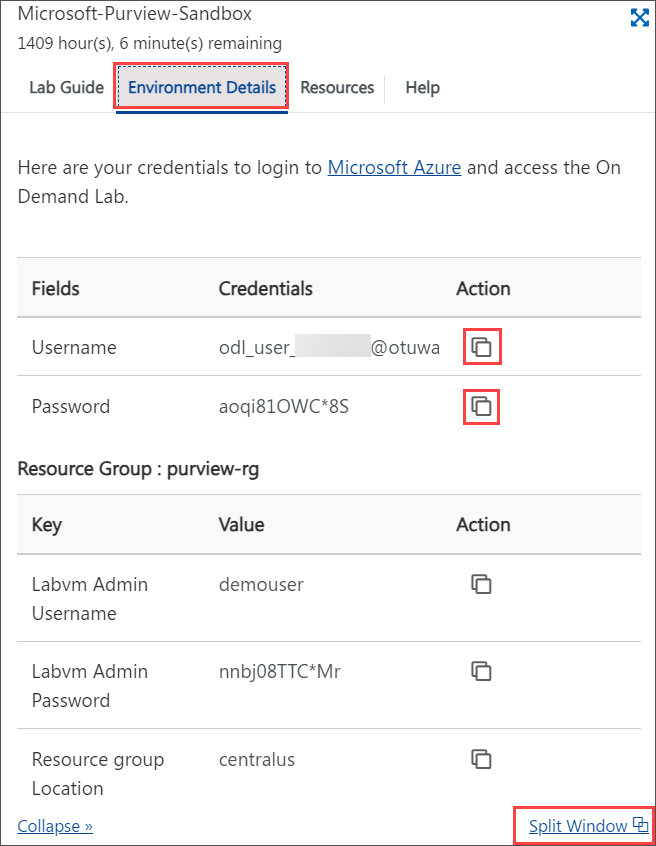
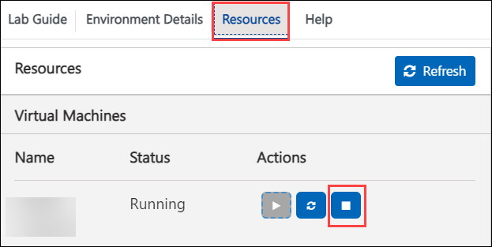

# Getting Started with the Lab
 

Welcome to your Data Security with Microsoft Purview Workshop on Data Governance! We've prepared a seamless environment for you familiarize yourself to explore and understand the capabilities of Microsoft Purview in managing and governing your data across diverse environments. Get ready to make the most of this experience as we delve into the intricacies of data governance with Microsoft Purview. Let's begin by making the most of this experience:

1. After the environment has been set up, your browser will load a virtual machine (JumpVM), use this virtual machine throughout the workshop to perform the lab. You can see the number on the bottom of the lab guide to switch to different exercises in the lab guide.

   
 
1. To get the lab environment details, you can select the **Environment Details** tab. Additionally, the credentials will also be emailed to your registered email address. You can also open the Lab Guide in a separate and full window by selecting the **Split Window** from the lower right corner. 

    

1. You can start, stop, and restart virtual machines from the **Resources** tab.

   

1. Ensure the timely deallocation of virtual machines from the Resources tab. When they are not actively in use, aiming to minimize costs.

   

## Let's Get Started with Admin Portal 

1. On your virtual machine, click on the Microsoft Edge icon

1. Log in to Admin portal **admin.microsoft.com**(https://admin.microsoft.com/).

1. You'll see the **Microsoft** window, enter your credentials:
 
   - **Email/Username:** <inject key="AzureAdUserEmail"></inject>

     

1. Next, provide your password:
 
   - **Password:** <inject key="AzureAdUserPassword"></inject>

     

1. Click "Next" from the bottom right corner to embark on your Lab journey!
 
   .png)
