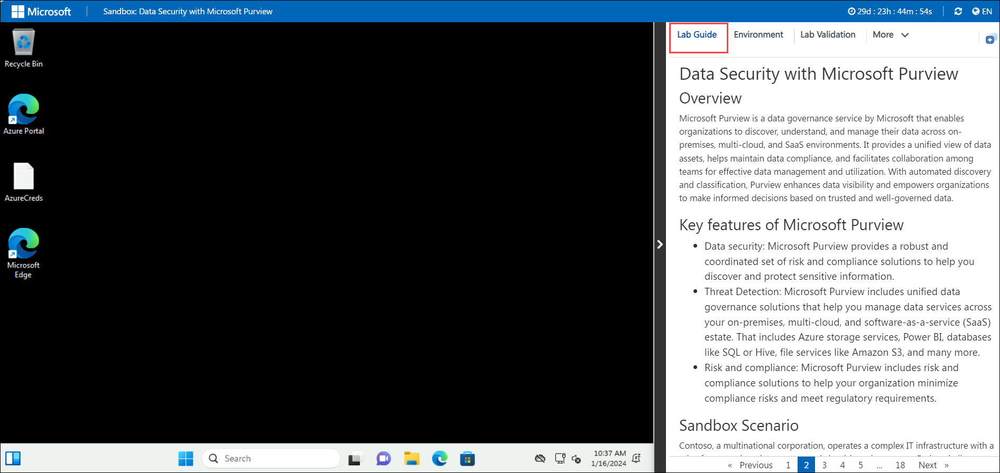
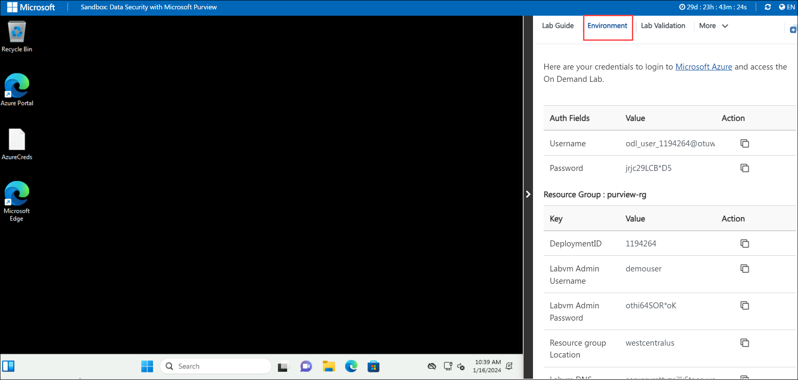
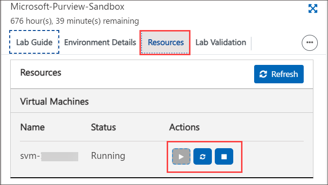
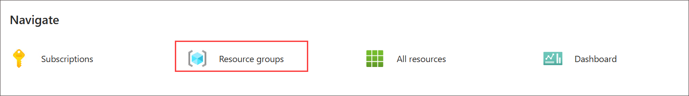

# Getting Started with the Lab
 

Welcome to your Data Security with Microsoft Purview Workshop on Data Governance! We've prepared a seamless environment for you familiarize yourself to explore and understand the capabilities of Microsoft Purview in managing and governing your data across diverse environments. Get ready to make the most of this experience as we delve into the intricacies of data governance with Microsoft Purview. Let's begin by making the most of this experience:

## Accessing Your Lab Environment
 
Once you're ready to dive in, your virtual machine and lab guide will be right at your fingertips within your web browser.

### Virtual Machine & Lab Guide
 
Your virtual machine is your workhorse throughout the workshop. The lab guide is your roadmap to success.

## Exploring Your Lab Resources
 
To get a better understanding of your lab resources and credentials, navigate to the **Environment Details** tab.

## Utilizing the Split Window Feature
 
For convenience, you can open the lab guide in a separate window by selecting the **Split Window** button from the Top right corner.

## Managing Your Virtual Machine
 
Feel free to start, stop, or restart your virtual machine as needed from the **Resources** tab. Your experience is in your hands!

## Let's Get Started with Azure Portal
 
1. On your virtual machine, click on the Azure Portal icon as shown below:

1. Log in to Admin portal [Microsoft 365 admin center](https://admin.microsoft.com/).

1. You'll see the **Sign into Microsoft Azure** tab. Here, enter your credentials:
 
   - **Email/Username:** <inject key="AzureAdUserEmail"></inject>

     

1. Next, provide your password:
 
   - **Password:** <inject key="AzureAdUserPassword"></inject>

     

1. If prompted to stay signed in, you can click "No."
 
1. If a **Welcome to Microsoft Azure** pop-up window appears, simply click "Maybe Later" to skip the tour.

1. From the Navigate select **Resource Group**.

   

1. Click "Next" from the bottom right corner to embark on your Lab journey!
 
   .png)
