# Lab 01 - Configure Sensitive Labels 

## Lab Overview 

Sensitivity labels are implemented to classify your organization’s data in a way that shows how sensitive the data is. This helps you reduce risks in sharing information that shouldn’t be accessible to anyone outside your organization or department. Applying sensitivity labels allows you to protect all your data easily.

## Lab scenario

In this lab, you'll configure Microsoft Purview Information Protection's Sensitivity labels which empower you to classify and secure your organization's data, ensuring that user productivity and collaboration remain unimpeded.

Microsoft Purview's Sensitivity labels are implemented to safeguard Project data. With labels like "Confidential-Finance" and "Highly-Confidential" employees effortlessly classify and share information securely. When a user mistakenly attempts to share a sensitive document, Purview intervenes, preventing potential data exposure. The organization thrives as Sensitivity labels balance robust data protection with seamless collaboration.

## Lab objectives

In this lab, you will complete the following tasks:

+ Task 1: Create sensitivity labels in Microsoft Purview

## Estimated timing: 40 minutes
  
## Architecture diagram

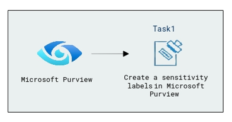

### Task 1: Create sensitivity labels in Microsoft Purview

In this task, the focus is on creating Sensitivity labels in Microsoft Purview, a crucial step in classifying and safeguarding organizational data. The process involves accessing the Microsoft 365 admin center, navigating to the Compliance center, and utilizing Purview to define and implement Sensitivity labels.

1. If you have not already logged in to the admin center, in the address bar of Microsoft Edge enter [Microsoft 365 admin center](https://admin.microsoft.com/).
   
1. In the Sign in window you will see a login screen, in that enter the following email/username and then click on **Ask Later**. 

    * Email/Username: <inject key="AzureAdUserEmail"></inject>

        

1. Now enter the password and click on **Sign in**.
   
   * Password: <inject key="AzureAdUserPassword"></inject>

        
  
1. When prompted to stay signed in, select **No**. This takes you to the Microsoft 365 admin center page.

1. From the left navigation pane of the Microsoft 365 admin center, select **Show all**.

    

1. Under Admin centers, select **Compliance**. A new browser page will open and navigate you to the Microsoft Purview welcome page.  

    
    
    

1. From the left navigation pane of the Microsoft Purview, under **Solutions**, Expand **Information protection (1)**, and in the dropdown select **Overview (2)** and review the information.

    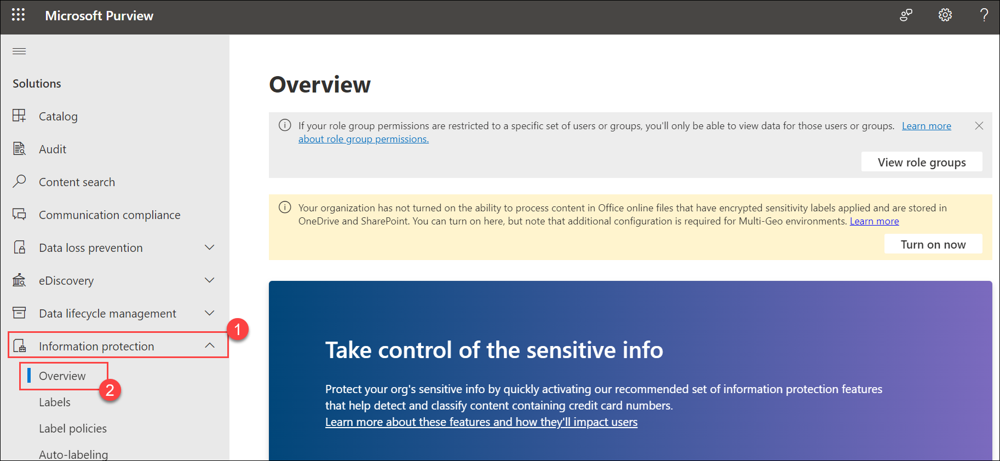

1. From the left menu select **labels (1)** and in the **yellow** information box, indicate that **Your organization has not turned on the ability to process content in Office online files that have encrypted sensitivity labels applied and are stored in OneDrive and SharePoint**. Select **Turn on now (2)**. Once you do this, there can be a delay for the setting to propagate through the system.

    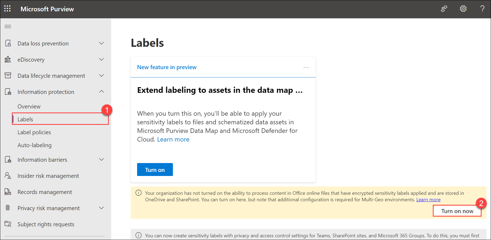

1. On **Labels (1)** page, select **+ Create a label (2)**.

    .png)

1. Provide a name and description for your label. Select **Next (4)** at the bottom of the page.

    | Setting | Action |
    | -- | -- |
    | **Name** | Enter **Confidential-Finance (1)** |
    | **Display name** | Enter **Confidential-Finance (2)** |
    | **Description for users** | Enter **Confidential-Finance Demo (3)** | 
     
    

1. Note the scope for this label. The scope is set to **Items**. Read the description but don’t change anything. Select **Next** at the bottom of the page.

      

1. On the Choose protection settings for labeled items select the **Apply or remove encryption (1)** and **Apply content marking (2)**, then select **Next (3)**.

    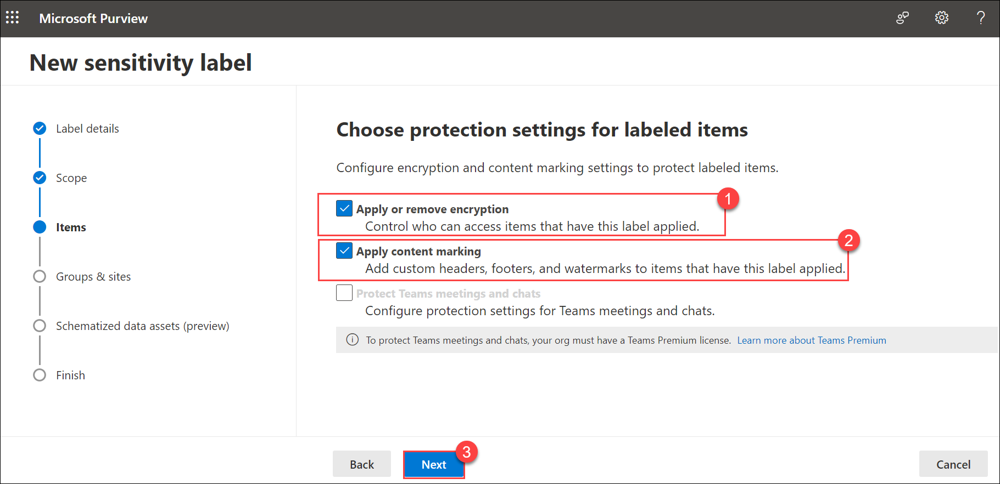
    
1. The Encryption window shows the configuration for the encryption settings. Review the information box under Configure encryption settings and review the configured settings. Notice how the user access to content is set to never expire. You can also assign permissions to specific users and groups By clicking on the **Assign permissions (1)**. On the **Assign permissions** blade, click on **+ Add users or groups (2)**.
    
    

1. On the **Add users or groups** window, select the user name **ODL_User <inject key="DeploymentID" enableCopy="false"/> (1)** and click on **Add (2)**.

    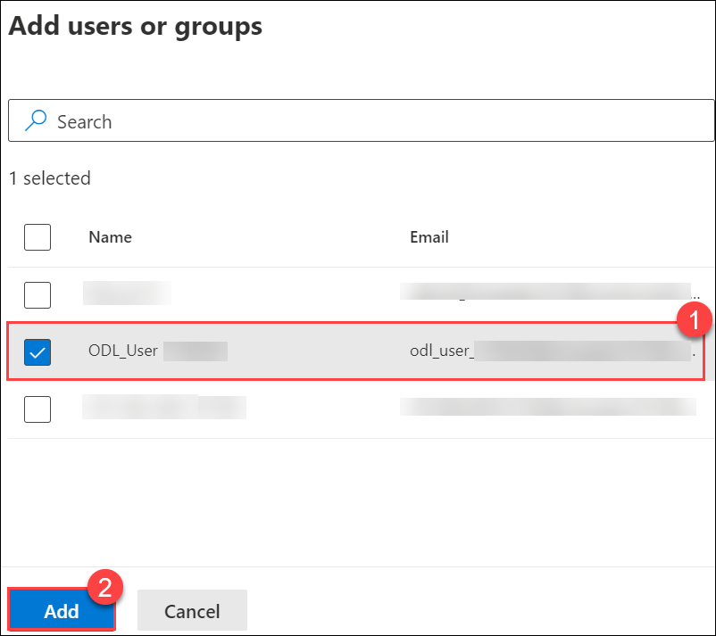

1. You will be redirected to the **Assign Permission** page. Verify that the **<inject key="AzureAdUserEmail"></inject> (1)** is selected and click on **Save (2)**.

    

   >**Note**: Only selected users can interact with content that has this label applied. Under users and groups, the tenant is defined so all users in your tenant can 
   view content that has this label.

1. Click **Next** on Encryption window.

   
   
1. On the content markings page, take note of the information box at the top of the page. Turn on the **Content Making (1)** and select the check box for **Add a watermark (2)**, **Add a header (3)** and **Add a footer (4)**.

    
   
1. Under **Add a watermark**, click on **Customize text (1)**. Under **Watermark text**, type **Confidential watermark text (2)** and click on **Save (3)**.

    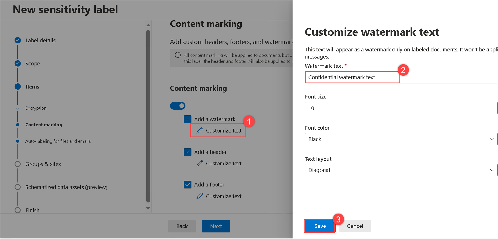
  
1. Under **Add a header**, click on **Customize text (1)**. Under **Header text**, type **Confidential Document (2)** and click on **Save (3)**.

    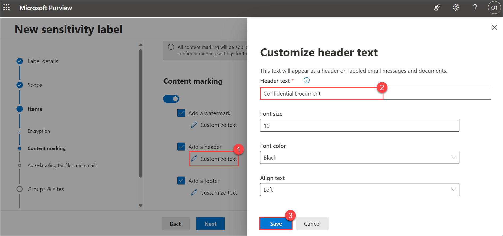

1. Under **Add a footer**, click on **Customize text (1)**. Under **Footer text**, type **Confidential Document (2)** and click on **Save (3)**.

    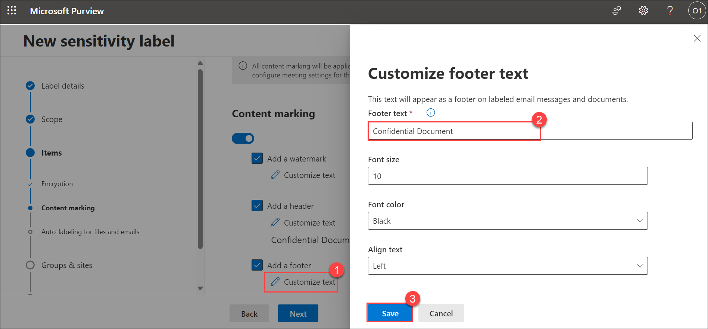

    >**Note:** Content markings will be applied to documents but only headers and footers will be applied to email messages. In other words, watermarks are not applied to emails.

1. The content marking associated with this label is a watermark. Select **Next** at the bottom of the page.

    
      
1. You are now in the Auto-labeling for files and emails window. Turn on the **Auto-labeling for files and emails (1)** and Read the description of auto-labelling on the top of the page and the information box below it and under **Detect content that matches these conditions** click on **+ Add condition (2)** from the drop-down select **Content contains (3)** then under **Group name** select **Add (4)** drop-down, select **Sensitive info type** and in **Sensitive info type (5)** window search for **Credit (6)** and select the **Credit card number (7)**, select **Add (8)** from the button, select **Next (9)** on the bottom of the page.

    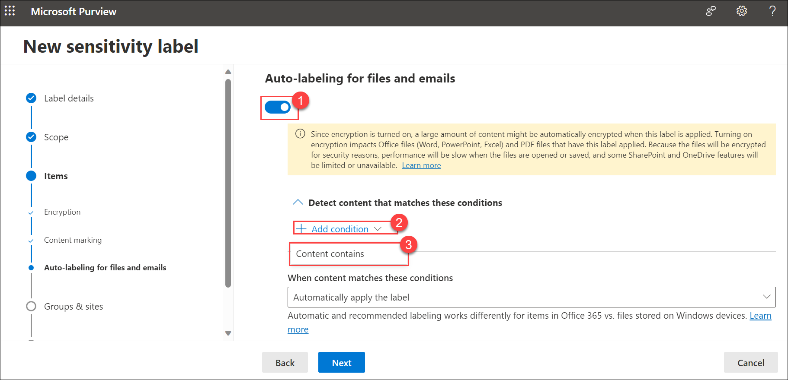

    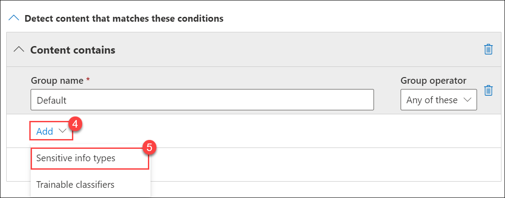

    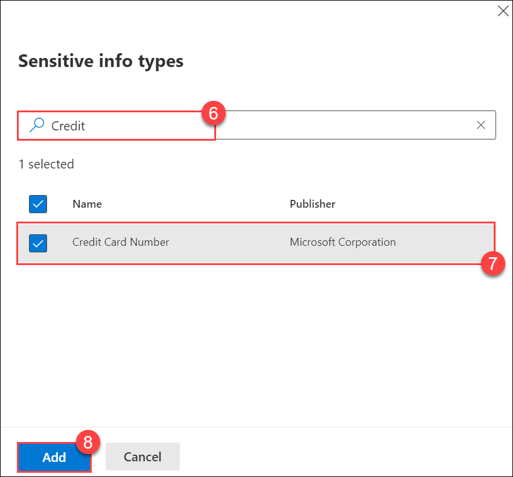

    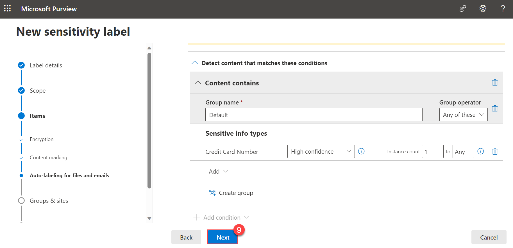

1. This next window defines protection settings for groups and sites that have this label applied. If this is not enabled, select **Next** at the bottom of the page.

      

1. This next window is a preview feature to automatically apply this label to Azure database columns (such as SQL, Synapse, and more) that contain the sensitive info types you choose.  This feature is not enabled. Select **Next** at the bottom of the page.

     
          
1. Review the settings and click on **Create label**.

   
      
1. On the 'Your sensitivity label that was created' blade, select **Don't create a policy yet (1)** and click **Done (2)**.

   

1. Back on the **labels** blade notice newly created sensitivity labels.

   

1. Repeat the same steps from 10-26 to create another sensitivity label with the name given below:

    | Setting | Action |
    | -- | -- |
    | **Name** | Enter **Highly-Confidential** |
    | **Display name** | Enter **Highly-Confidential** |
    | **Description for users** | Enter **Highly-Confidential Demo** | 
    |||

1. After creating the label, on the **Labels** page, observe the list of labels you have created.

     

    >**Note**: Creating Sensitivity labels is essential for maintaining a structured approach to data protection. It allows organizations to clearly define the sensitivity level of their data, enabling the implementation of tailored security measures. This proactive approach helps prevent unauthorized access and ensures compliance with data protection policies.

    >**Note**: Once you have created sensitivity labels in the next lab you'll configure label policies and then you can start using them and learn how to manage sensitivity labels. You'll also learn to apply sensitivity labels to emails and files in upcoming labs.

    > **Congratulations** on completing the task! Now, it's time to validate it. Here are the steps:
   > - Navigate to the Lab Validation Page, from the upper right corner in the lab guide section.
   > - Hit the Validate button for the corresponding task. If you receive a success message, you can proceed to the next task. 
   > - If not, carefully read the error message and retry the step, following the instructions in the lab guide.
   > - If you need any assistance, please contact us at labs-support@spektrasystems.com. We are available 24/7 to help you out.

### Conclusion
Creating sensitivity labels is that it empowers users and organizations to proactively manage and secure their data. By applying sensitivity labels, users can clearly classify information based on its level of sensitivity, enabling streamlined protection measures. This not only reduces the risk of unauthorized access but also fosters a culture of responsible data handling. The creation and implementation of sensitivity labels contribute significantly to enhancing data security, ensuring compliance, and promoting a structured approach to managing sensitive information within an organization.
      
### Review
During this lab, you've gained knowledge on creating and configuring sensitivity labels in Microsoft Purview.

## You have successfully completed the lab. Click on Next >>.
