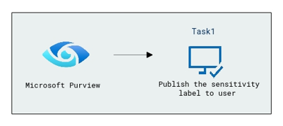
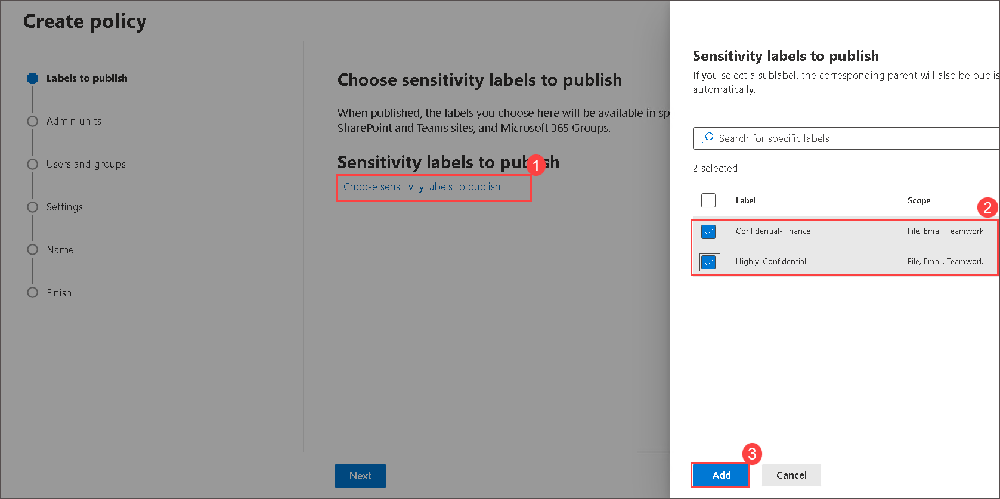
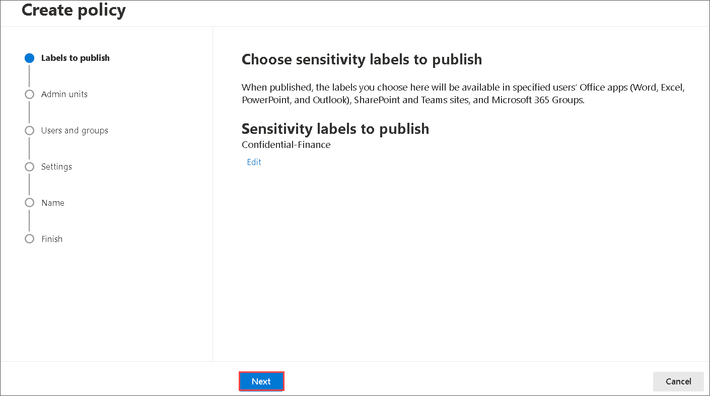
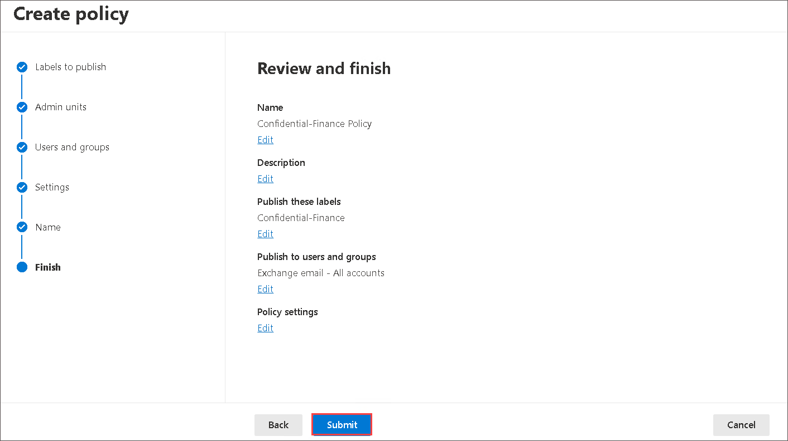

# Lab 02 - Publish sensitivity labels 

## Lab Overview 

The task aims to provide a streamlined method for publishing sensitivity labels to users. Users are guided through a series of steps within Microsoft Purview, specifically under Label policies. The objective is to make the selected labels, such as Confidential-Finance and Highly-Confidential, available to all users, ensuring consistent and standardized data protection measures.

## Lab scenario

In this lab, you need to publish labels to make them available to people and services in your organization.  After you create your sensitivity labels, The sensitivity labels can then be applied to Office documents emails, and other items that support sensitivity labels.

## Lab objectives

In this lab, you will complete the following tasks:

+ Task 1: Publish the sensitivity label to the user

## Estimated timing: 30 minutes  

## Architecture diagram

### Task 1: Publish the sensitivity label to the user

In this task, you'll focus on publishing existing sensitivity labels in Microsoft Purview. The process involves navigating through the Information Protection section and selecting specific labels to be published. This step is crucial for making the defined sensitivity labels accessible and applicable to all users within the organization.

1. On the [Microsoft Purview](https://compliance.microsoft.com/). portal, under Solutions, Expand **Information protection** and in the drop-down select **Label policies (1)** and click on **Publish label (2)**.

   
    
1. Select **Choose sensitivity labels to publish (1)**. A window opens that provides information about the policy. Select **Confidential-Finance (2)** and **Highly-Confidential (2)** from the label and select **Add (3)**.

        

1. Back on **Choose sensitivity labels to publish** blade, click on **Next**.

         
     
1. Under the Sensitivity labels to publish. Don’t change any settings. Select **Next** at the bottom of the page.
     
1. Click on **Next** on the Assign Admin Units page.

         

1. Read the description under **Publish to users and groups**. Notice that this label is available to all users. Don’t change any settings. Select **Next** at the bottom of the page.

       

1. Under the policy settings. Don’t change any settings. Select **Next** at the bottom of the page.

       

1. Under the **Apply a Default label to documents**. Don’t change any settings. Select **Next** at the bottom of the page.

       

1. Under the **Apply a Default label to emails**.Don’t change any settings. Select **Next** at the bottom of the page.

        
    
1. Under the **Apply a default label to meetings and calendar events**. Don’t change any settings. Select **Next** at the bottom of the page.    

      
    
1. Under the **Apply a default label to Fabric and Power BI content**. Don’t change any settings. Select **Next** at the bottom of the page.

        
    
1. The last configuration option is to name your policy. Enter the policy name as **Confidential-Policy (1)**. Select **Next (2)** on the bottom of the page to exit the policy configuration and return to the Information Protection page.

      
    
1. Review the settings and click on **Submit** and then select **Done**.

      
    
      

1. Back to **Label policies** blade and notice the newly published label.

      

   >**Note**: Publishing sensitivity labels is essential for ensuring uniform data protection across the organization. Finally, we could have published sensitivity labels and make these labels available to all users, so organizations can enforce consistent policies for handling sensitive information. This step contributes to a cohesive approach to data security and compliance, as it ensures that established sensitivity labels are effectively communicated and applied throughout the user base.

### Conclusion

The conclusion emphasizes the importance of publishing sensitivity labels as a critical step in the overall data protection strategy. By making labels available to all users, organizations can enforce standardized security measures, fostering a culture of responsible data handling. The conclusion also highlights the user's ability to review and confirm the published labels, ensuring the successful implementation of the publishing process.

### Review

During this lab, you've gained knowledge on the process of publishing sensitivity labels to users.

### You have successfully completed the lab

### Click on Next to continue with the next lab
