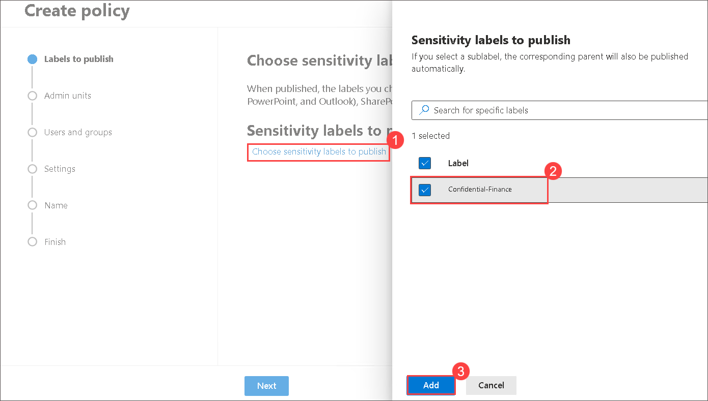
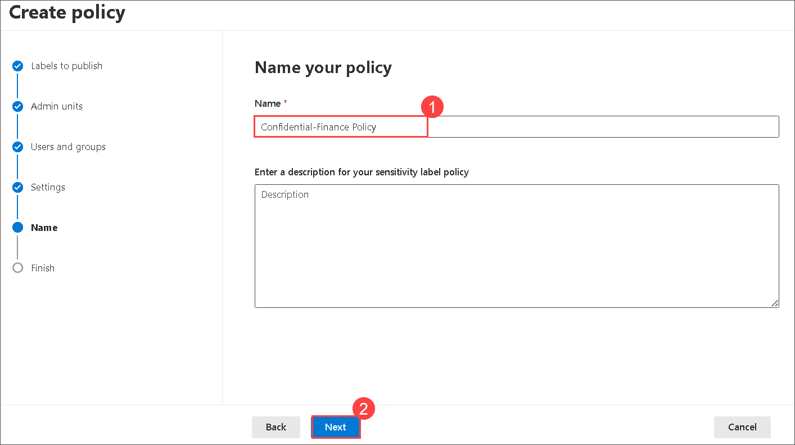
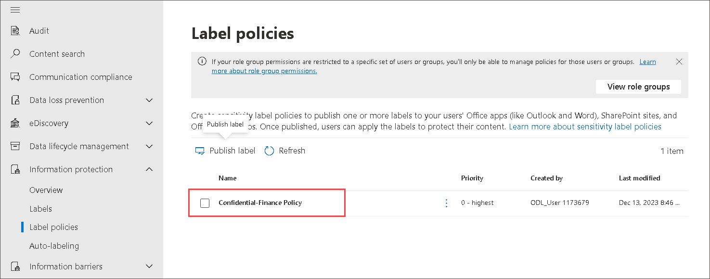

# lab02 - Creating Labeling Policies  

1. On the Microsoft Purview, under Solutions, Expand **Information protection** and in the dropdown select **Label policies** and click on **Publish label**.

       

    
1. Select **Choose sensitivity labels to publish**. A window opens that provides information about the policy. This policy serves to publish the IT-Department-Demo. Select **Confidential-Finance** from label and select **Add**

        

1. Back on **Choose sensitivity labels** blade, click on **Next**.

         
     
1. Under the Sensitivity labels to publish.  Don’t change any settings.  Select **Next** on the bottom of the page.

     
1. Click on **Next** on Assign Admin Units(Preview) page.

         

1. Read the description under “Publish to users and groups”.  Notice the this label is available to all users.  Don’t change any settings.  Select **Next** on the bottom of the page.

       

1. Under the policy settings.  Don’t change any settings.  Select **Next** on the bottom of the page.

       

1. Under the **Apply a Default label to documents**.  Don’t change any settings.  Select **Next** on the bottom of the page.

       

1. Under the **Apply a Default label to emails**.  Don’t change any settings.  Select **Next** on the bottom of the page.

        
    
1. Under the **Apply a default label to meetings and calendar events**.  Don’t change any settings.  Select **Next** on the bottom of the page.    

      
    
1. Under the **Apply a default label to Power BI content**.  Don’t change any settings.  Select **Next** on the bottom of the page.

        
    
1. The last configuration option is to name your policy. Enter the policy name as **Confidential-Finance Policy**.  Select **Next** on the bottom of the page to exit the policy configuration and return to the Information protection page.

      
    
1. Review the settings and click on **Submit** and then select **Done**.

      
    
      

1. Back to **Label policies** blade and notice newly publish label.

      

1. It can take up to 24 hours to publish the labels to the selected users apps

## Review
+ Explore on how to publish label.
