# Lab 03 - Configure Message Encryption  

## Lab Overview
The task guides users through the steps of creating an encryption rule using the Exchange admin center. Users are instructed to navigate to the Mail flow section, add a new rule, set rule conditions, and define actions for message security, including the application of Microsoft 365 Message Encryption and rights protection.

## Lab scenario

In this lab, you'll configure Microsoft Purview Message Encryption which enables organizations to securely share protected emails across any device. Users can send encrypted messages not only within Microsoft 365 organizations but also with external parties using services like Outlook.com, Gmail, and other email platforms.

## Lab objectives

In this lab, you will complete the following task:

+ Task 1: Create a Mail Flow Encryption Rule using the Exchange admin center
+ Task 2: Test and Review the Message Encryption  

## Estimated timing: 60 minutes

## Architecture diagram

### Task 1: Create a Mail Flow Encryption Rule using the Exchange admin center

In this task, you will create a Mail Flow Encryption Rule within the Exchange admin center to secure messages within the Exchange Online environment. The objective is to establish a rule that encrypts emails under specific conditions, contributing to enhanced data security.

1. Navigate back to the [Microsoft 365 admin center](https://admin.microsoft.com/) portal. 

1. From the left navigation pane select **Show all** and under **Admin centers** section select **Exchange**. This will open the Exchange admin center.

1. In the **Exchange admin center**, select **Mail flow (1)** > **Rules (2)** > **+ Add a rule (3)** > **Apply Office 365 Message Encryption and Writes Protection to messages (4)**.

     .png)

1. On the **Set rule conditions** window, in the **Name** box, enter **Encrypt mail** as the name of this rule.

    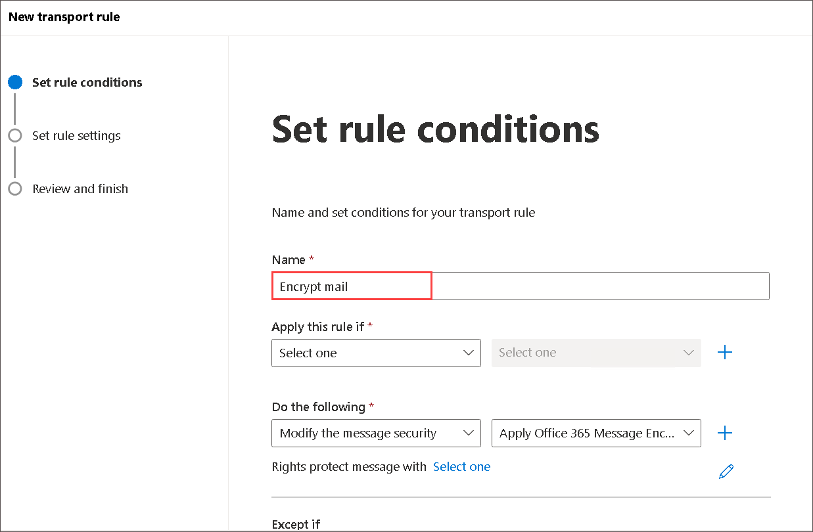

1. Select the drop-down arrow in the **Apply this rule if (1)** condition box. In the drop-down menu, select **The subject or body (2)** and from **Select one (3)** drop-down select **subject or body includes any of these words (4)**  and on **Specify words or phrases** window provide **Encrypted Document (5)** in box and click on **Add (6)** > **save (7)**.

   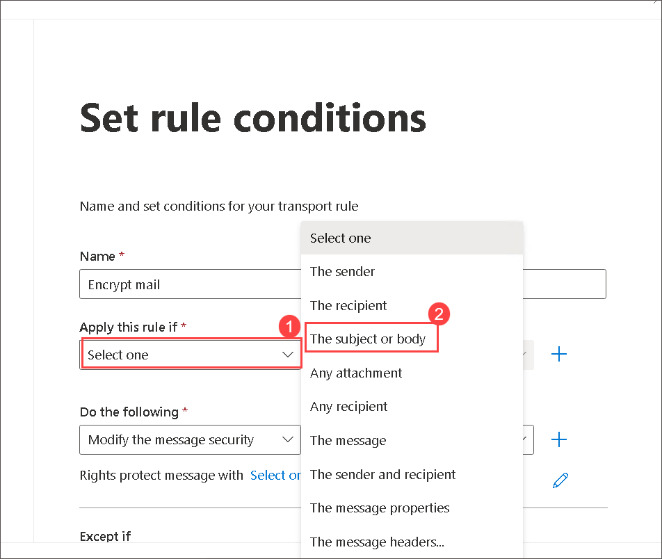

   .png)

   1.png)

1. Back on On the **Set rule conditions** window, you now need to define an action to perform when this rule is applied. Under **Do the following**, ensure **Modify the message security.** and **Apply Office 365 Message Encryption and rights protection** is selected then click on **select one** link and on **select RMS template** dialog box, select **Encrypt** > **Save**.
   
     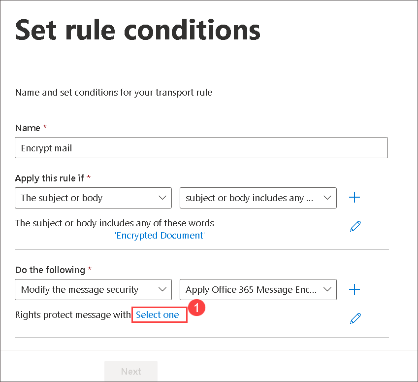

     .png)
   
1.  Back on **Set rule conditions** window and click **Next**.

    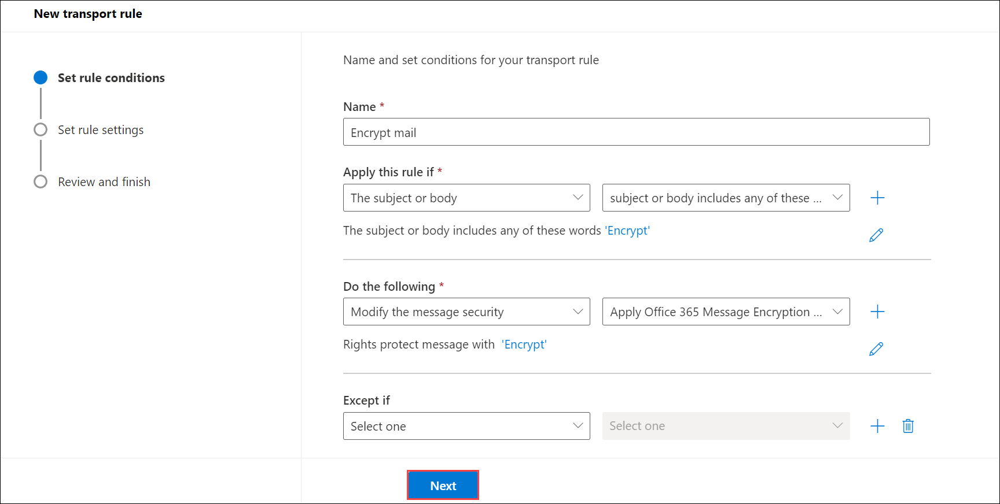

1. On the **Set rule settings** window, ensure Role mode is select as **Enforce**, then select **Severity** as **Medium** and click the checkbox next to **Activate this rule on**. That should automatically populate a date and time that will make the rule take effect immediately upon completion, Click **Next** 

    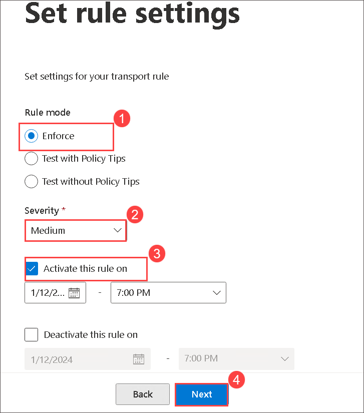

1. Click  **Finish** > **Done**.

1. In the **Rules** window, click the name of the rule under the **Rules** column. In the window that opens to the right, click the toggle under **Enable or disable rule** to **Enable** the rule.

   

1. Wait until you see **Rule status updated successfully** then close the window.

    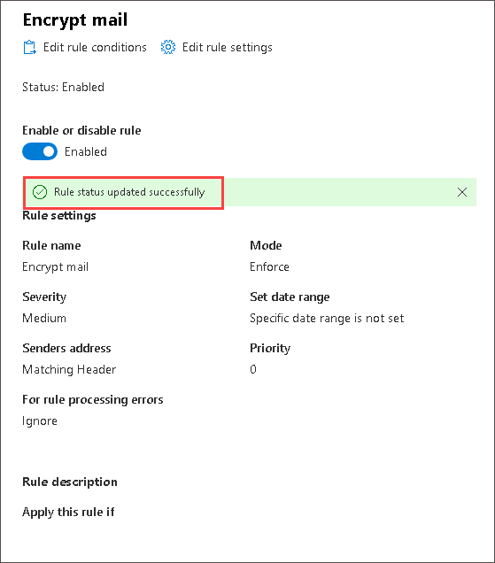

### Task 2 : Test and Review the Message Encryption  

In this task you'll test Message Encryption

1. From the start menu search for **Outlook (1)** and select **Outlook (2)**.

    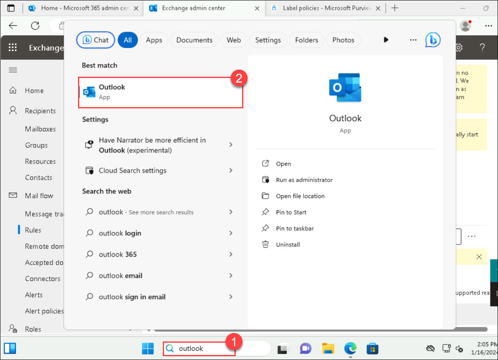

1. When **Sign in to get started with Office** prompted, select **Sign in or create account**, and use the following credential. 

    * Email/Username: <inject key="AzureAdUserEmail"></inject>

    * Password: <inject key="AzureAdUserPassword"></inject>

    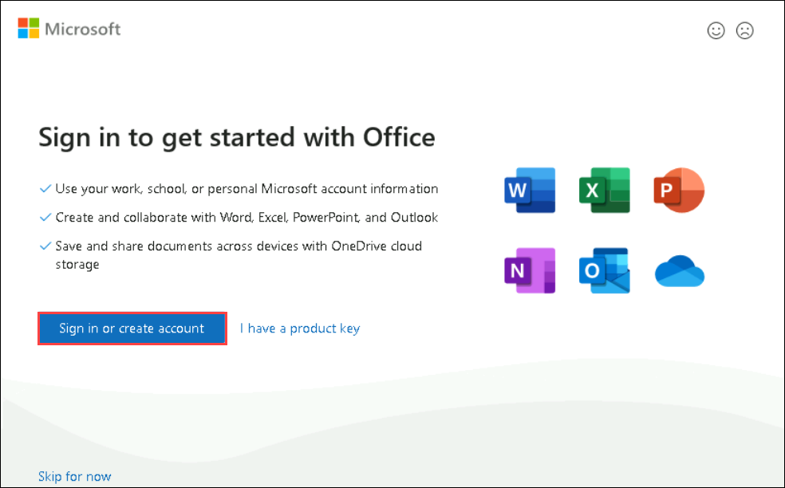

    >**Note**: If you face any error click on **Done** and enter email address and select **connect** > **Next**.

1. On **Stay signed in to all your apps** pop-up, select **No, sign in to this app only**.

    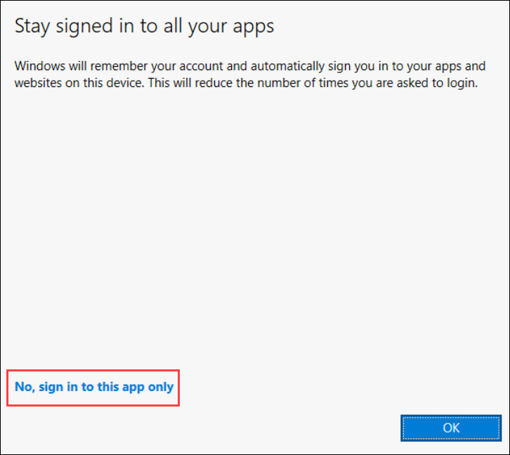

1. On the **Your privacy matters** page, select **Close**. 

    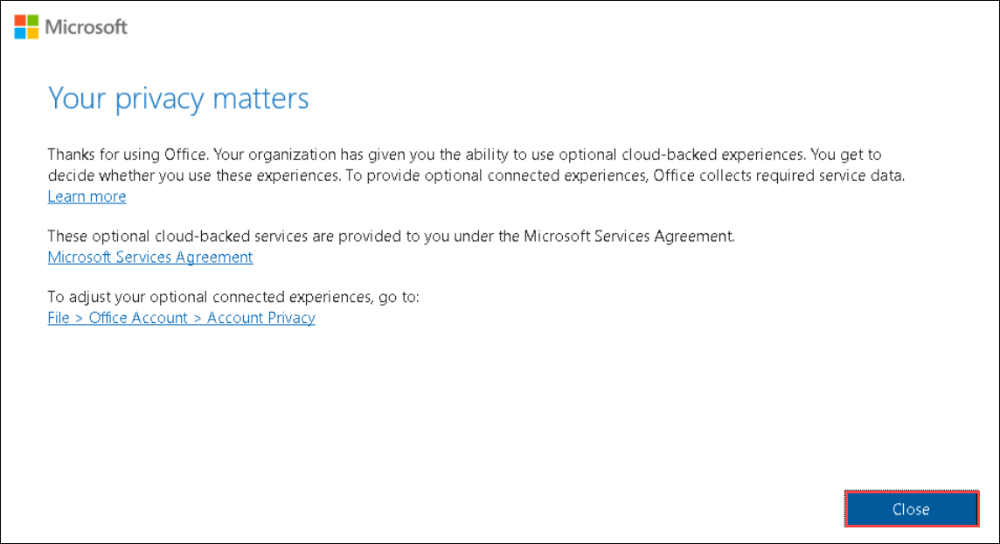

1. On the **Outlook** pop-up, enter the * Email address: **<inject key="AzureAdUserEmail"></inject> (1)**, and select **Connect (2)**.

    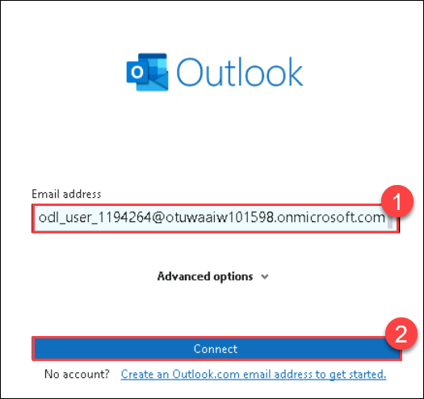

1. Once the account is added, select **Done**. Make sure to uncheck the box of **Set up Outlook Mobile on my phone, too**.

    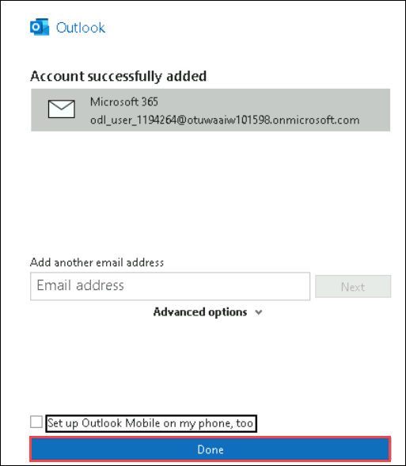

1. Choose **New Email** from the upper-left corner.

    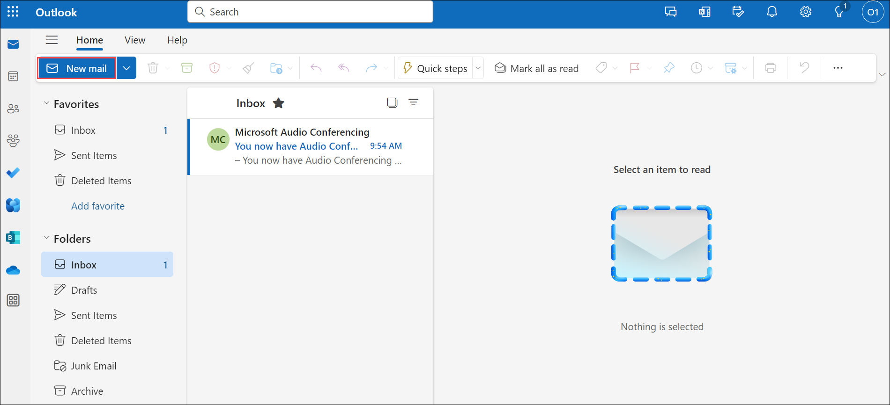

1. Specify the following details.

     | **Settings**        | **Values**   | 
     | ------------------- | ------------ |
     | **To**              | Enter your **Personal  Email (1)** address | 
     | **Subject**         | **Encrypted Document (2)** |                                  
     | **Boby**            | **This Email contains Encrypted Document to safeguard sensitive information. (3)**|                                                                 
   
     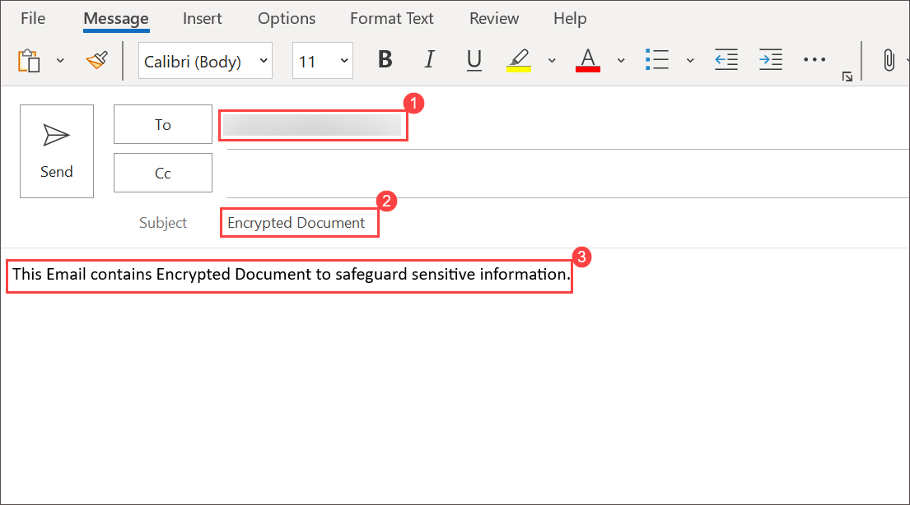
      
1. On top of the menu bar select **Option (1)** > **Encrypt (2)** then choose **Encrypt only (3)** from drop-down.

   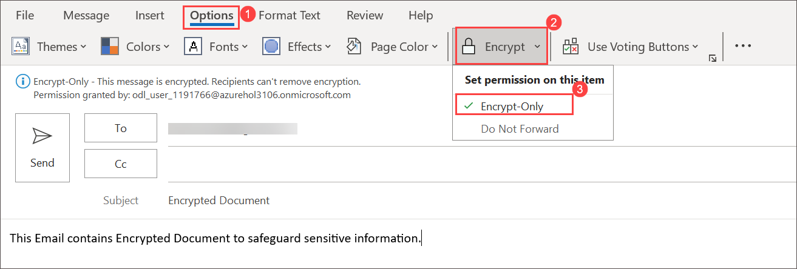

   >**Note:** If the **Encrypt only** option is not available, choose **Connect to Rights Management Servers and get templates**, then select **Encrypt only**.

1. Kindly notice **Encrypt message (1)** at the top and click on **Send (2)**.

    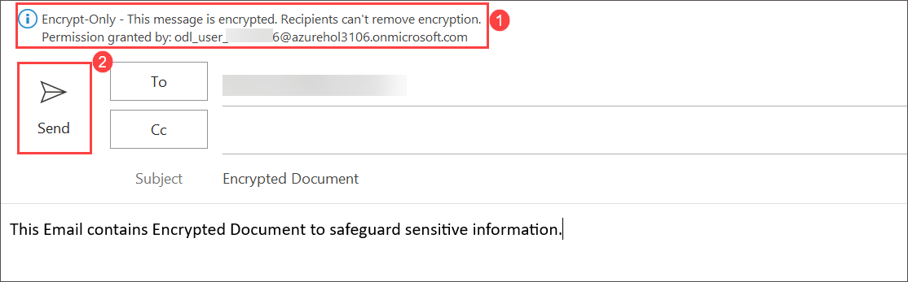

1. After sending the email, kindly open your personal email account.

1. Wait for 2 - 3 mins once you receive the message notice that the email is received is encrypted.

    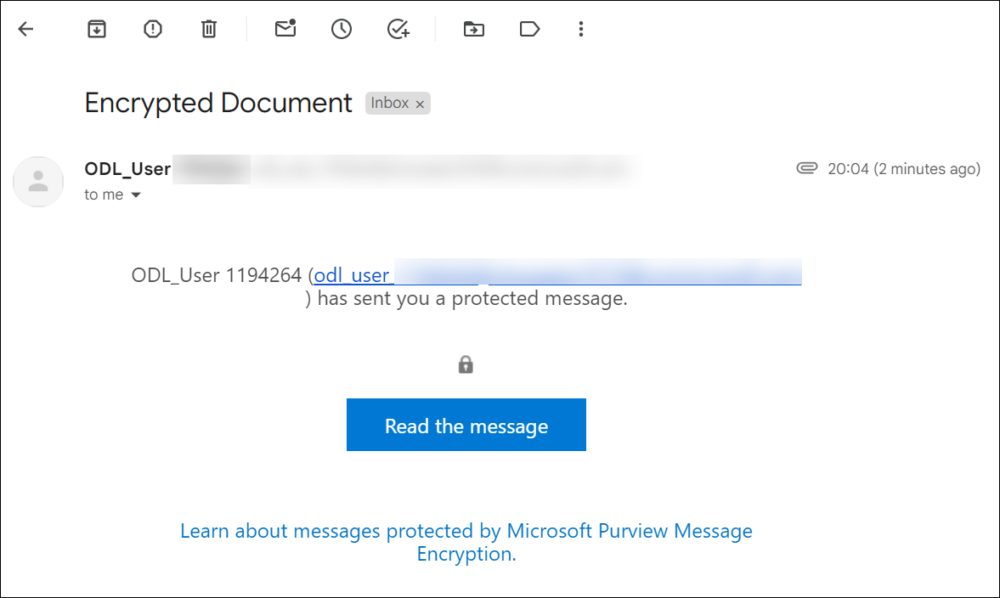

1. In order to access the email that you have received, follow the following steps:

   -  Select **Read the message**.

       .png)
      
   -  Click on Sign in with a one-time passcode.

       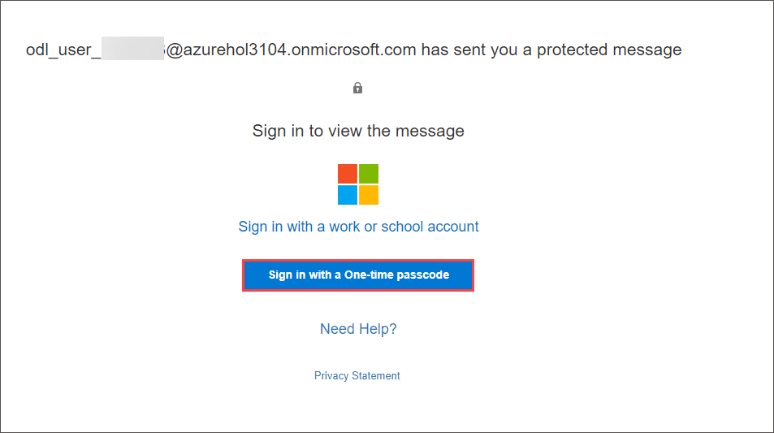
      
   -   Go to your personal email portal and open the message with subject Your one-time passcode to view the message and Copy the passcode.
         
   - Paste the passcode into the **One-time passcode (1)** field  and select **Continue (2)**.

       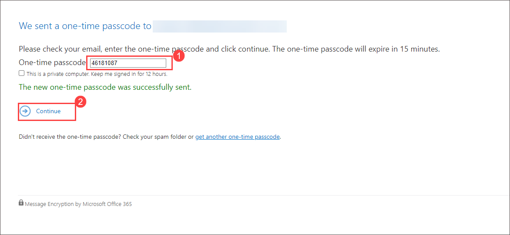
     
   -  Review the encrypted message.
  
        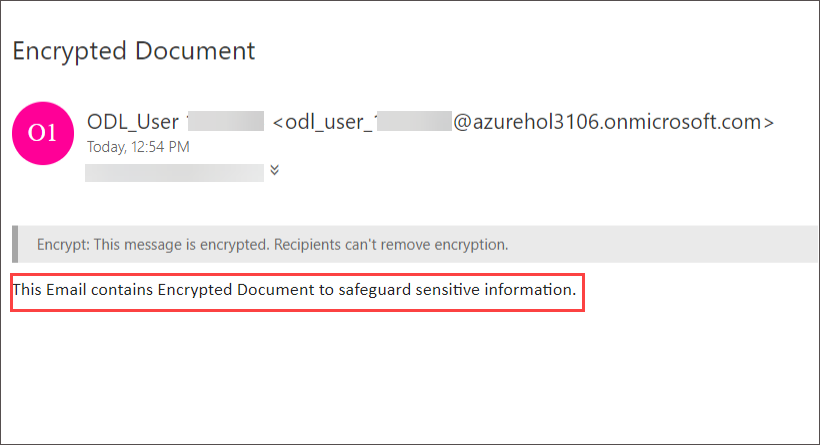

>**Note**: Creating a Mail Flow Encryption Rule is essential for organizations seeking to enhance the security of their email communication. By defining conditions and actions, such as encrypting messages for external recipients, organizations can safeguard sensitive information and ensure that communication remains confidential, especially when shared outside the organizational boundaries.

### Conclusion:
The conclusion emphasizes the completion of the Mail Flow Encryption Rule creation process. By activating the rule, organizations can immediately apply encryption to relevant messages, reinforcing their commitment to data protection. The conclusion also highlights the user's ability to enable or disable the rule as needed, providing flexibility in managing encryption policies.

### Review
In this lab, you have completed:

+ Create a Mail Flow Encryption Rule using the Exchange admin center

## You have successfully completed the lab. Click on Next >>.
