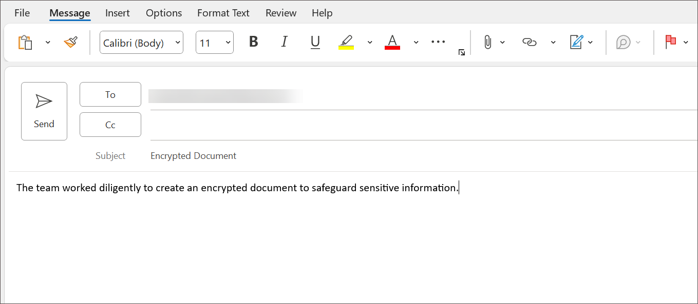
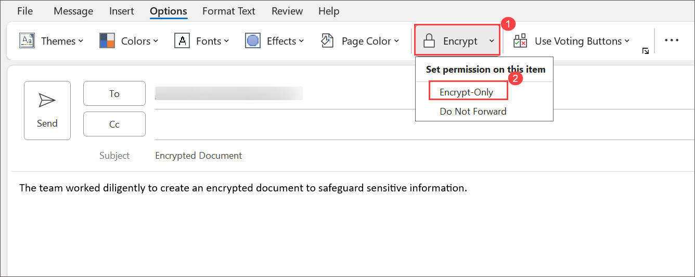

# Lab 03 - Configure Message Encryption  

## Lab Overview
The task guides users through the steps of creating an encryption rule using the Exchange admin center. Users are instructed to navigate to the Mail flow section, add a new rule, set rule conditions, and define actions for message security, including the application of Microsoft 365 Message Encryption and rights protection.

## Lab scenario

In this lab, you'll configure Microsoft Purview Message Encryption which enables organizations to securely share protected emails across any device. Users can send encrypted messages not only within Microsoft 365 organizations but also with external parties using services like Outlook.com, Gmail, and other email platforms.

## Lab objectives

In this lab, you will complete the following task:

+ Task 1: Create a Mail Flow Encryption Rule using the Exchange admin center

## Estimated timing: 60 minutes

## Architecture diagram

### Task 1: Create a Mail Flow Encryption Rule using the Exchange admin center

In this task, you will create a Mail Flow Encryption Rule within the Exchange admin center to secure messages within the Exchange Online environment. The objective is to establish a rule that encrypts emails under specific conditions, contributing to enhanced data security.

1. In the [admin microsoft com](https://admin.microsoft.com/) portal 

1. From the left navigation pane select **Show all** > **Exchange**. This will open the Exchange admin center.

1. In the **Exchange admin center**, select **Mail flow** > **Rules** > **+ Add a rule** > **Apply Office 365 Message Encryption and Writes Protection to messages.**.

     .png)

1. In the **Set rule conditions** window, in the **Name** box, enter **Encrypt mail** as the name of this rule.

    

1. Select the drop-down arrow in the **Apply this rule if** condition box. In the drop-down menu, select **The subject or body** and **subject or body includes any of these words** from **Select one** drop-down and on specify words or phrases window provide **Encrypted Document** in box and click on **Add** > **save**.

   

   .png)

   .png)

1. You now need to define an action to perform when this rule is applied. Under **Do the following…**, ensure **Modify the message security….** and **Apply Microsoft 365 Message Encryption and rights protection is selected then click on **select one** link and on **select RMS template** dialog box, select **Encrypt** > **Save**. Click **Next**.
   
     

     .png)
   

1. On the **Set rule settings** window, ensure Role mode is select as **Enforce** then select **Severity** as **Medium** and click the checkbox next to **Activate this rule on**. That should automatically populate a date and time that will make the rule take effect immediately upon completion, Click **Next** 

    

1. Click  **Finish** > **Done**.

1. In the **Rules** window, click the name of the rule under the **Rules** column. In the window that opens to the right, click the toggle under **Enable or disable rule** to enable the rule. Close the window.

   

### Task 2 : Testing

In this task 

1. From the start menu search and select **Outlook** > **New Email**.

2. In **To** enter your personal email address and for subject provide **Encrypted Document** and enter **The team worked diligently to create an encrypted document to safeguard sensitive information** in body.
   
    
      
3. From the menu bar select **Option** then choose Encrypt only from drop-down and send the email.

   

4. Once after sending a Email kindly check your personal email.
   
5. Once you recevie the email notice how the Email encrpted.

    .png)

6. 

     

   >**Note**: Creating a Mail Flow Encryption Rule is essential for organizations seeking to enhance the security of their email communication. By defining conditions and actions, such as encrypting messages for external recipients, organizations can safeguard sensitive information and ensure that communication remains confidential, especially when shared outside the organizational boundaries.

### Conclusion:
The conclusion emphasizes the completion of the Mail Flow Encryption Rule creation process. By activating the rule, organizations can immediately apply encryption to relevant messages, reinforcing their commitment to data protection. The conclusion also highlights the user's ability to enable or disable the rule as needed, providing flexibility in managing encryption policies.

### Review
In this lab, you have completed:

+ Create a Mail Flow Encryption Rule using the Exchange admin center

## You have successfully completed the lab
