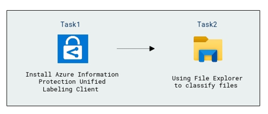
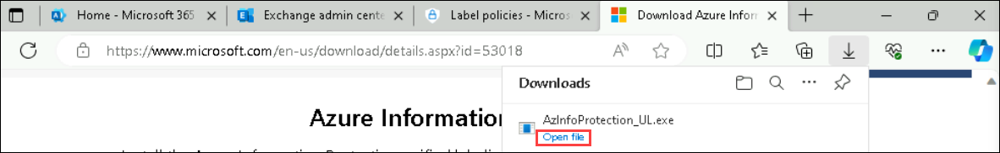
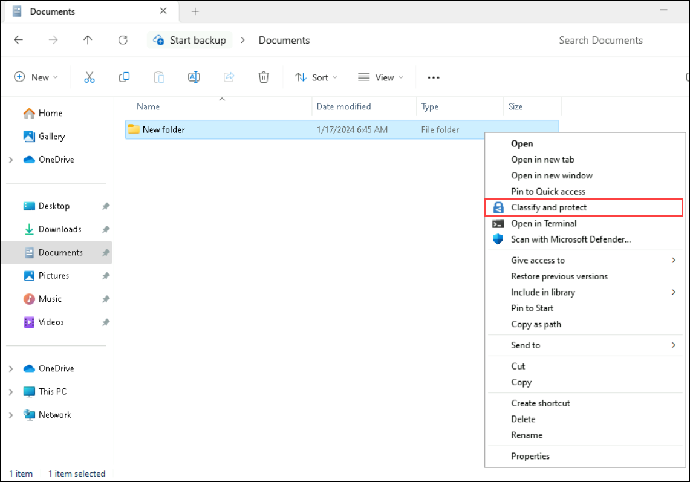
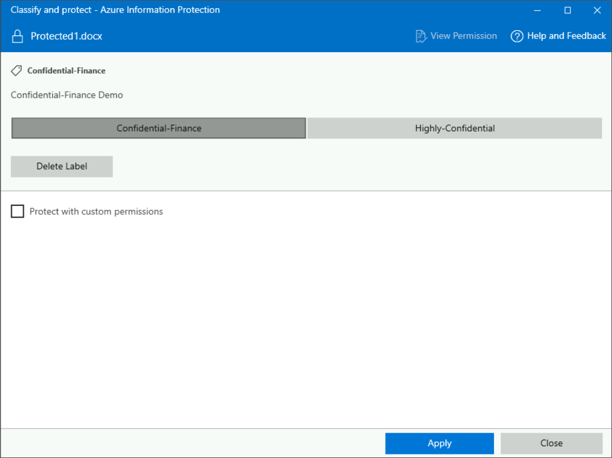

# Lab 04 - Install and Use Azure Information Protection Unified Labeling Client To Classify Files

## Lab Overview

This lab focuses on installing and utilizing the Azure Information Protection (AIP) Unified Labeling Client for Windows. The AIP client helps safeguard sensitive documents and emails by applying classification labels and Rights Management protection technology. 

## Lab scenario
In this lab, you'll install and use the Azure Information Protection unified labelling client for Windows to label classify and protect the single or multiple files and folders. The lab aims to provide hands-on experience in deploying the AIP Unified Labeling Client and classifying files using File Explorer.

## Lab objectives

In this lab, you will complete the following tasks:

+ Task 1: Install Azure Information Protection Unified Labeling Client
+ Task 2: Using File Explorer to classify files 

## Estimated timing: 30 minutes

## Architecture diagram

>**Note**: Edge is not needed for the DLP policy to apply to Edge. "The Microsoft Purview Extension can provide existing Endpoint DLP capabilities to non-native applications." Edge is native.

### Task 1: Install Azure Information Protection Unified Labeling Client 

In this lab, you'll install Azure Information Protection Unified Labeling Client 

1. Within **cvm-<inject key="DeploymentID" enableCopy="false"/>** RDP session, open a new tab in **Microsoft Edge** and browse for [Microsoft Download Center](https://www.microsoft.com/en-us/download/details.aspx?id=53018) to download AzInfoProtection_UL.exe.

1. On the **Azure Information Protection** page click on **Download**.

   

1. On the **Choose the download you want** pop-up, select **AZInfoProtection_UL.exe (1)** and click on **Download (2)**.

   

1. Once the file is downloaded, select **Open file**. Run the executable file that was downloaded, and if you are prompted to continue, click **Yes**.

   

1. On **Install the Azure Information Protection client** page, click **I agree** when you have read the license terms and conditions.

   

1. Click **Close**.

   

### Task 2: Using File Explorer to classify files 

In this task, you'll classify files by using File Explorer

1. From the bottom of the Lab-VM, open **File Explorer (1)**, select **Documents (2)**.

1. In the **Documents**, create one folder, right-click anywhere, select **New (1)** > **Folder (2)**, and name the folder as per your choice.

1. Now, right-click on the new folder, select **Show More options**. Select **Classify and protect**.

   

1. In the **Classify and protect - Azure Information Protection** dialog box, enter the * Email/Username: <inject key="AzureAdUserEmail"></inject>, select **Next**. Enter the * Password: <inject key="AzureAdUserPassword"></inject>, select **Sign in**, use the labels as you would do in an Office application, which sets the classification as defined by your administrator.
  
1. You can select any label, in which the file is labelled and click Apply and wait for the Work finished message to see the results. Then click **Close**.

   

1. If you change your mind about the label you chose, simply repeat this process and choose a different label.

1. The classification that you specified stays with the file, even if you email the file or save it to another location.

   >**Note**: Implementing Azure Information Protection is crucial for organizations to enhance data security and control access to sensitive information. The Unified 
    Labelling Client enables users to classify and protect files, ensuring that confidential data remains secure, even if documents are forwarded or saved in different 
    locations. This lab equips users with the skills to deploy the AIP client and apply classification labels to files.

    > **Congratulations** on completing the task! Now, it's time to validate it. Here are the steps:
   > - Navigate to the Lab Validation Page, from the upper right corner in the lab guide section.
   > - Hit the Validate button for the corresponding task. If you receive a success message, you can proceed to the next task. 
   > - If not, carefully read the error message and retry the step, following the instructions in the lab guide.
   > - If you need any assistance, please contact us at labs-support@spektrasystems.com. We are available 24/7 to help you out.

### Conclusion
By completing the tasks outlined in this lab, users gain practical knowledge of deploying the Azure Information Protection Unified Labeling Client and utilizing it to classify files. This knowledge is essential for organizations seeking to enhance their data protection strategies and ensure compliance with security and privacy requirements. The lab emphasizes the importance of incorporating AIP tools into the data management workflow.

### Review

During this lab, you've gained knowledge on the process of installing and Using Azure Information Protection Unified Labeling Client To Classify Files.

## You have successfully completed the lab. Click on Next >>.
