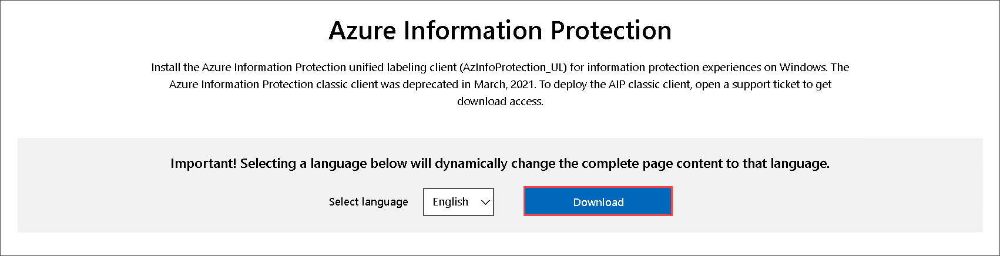
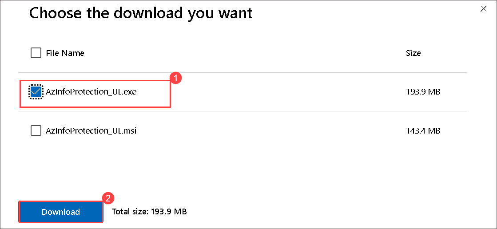
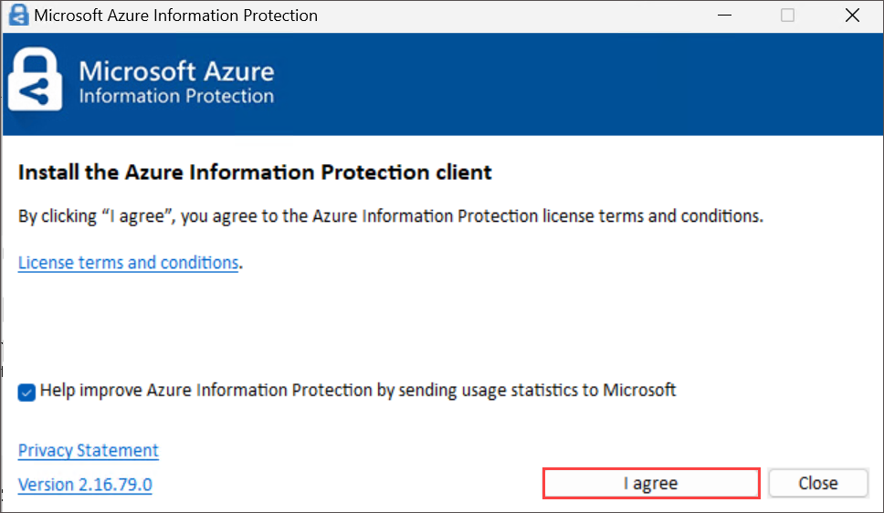
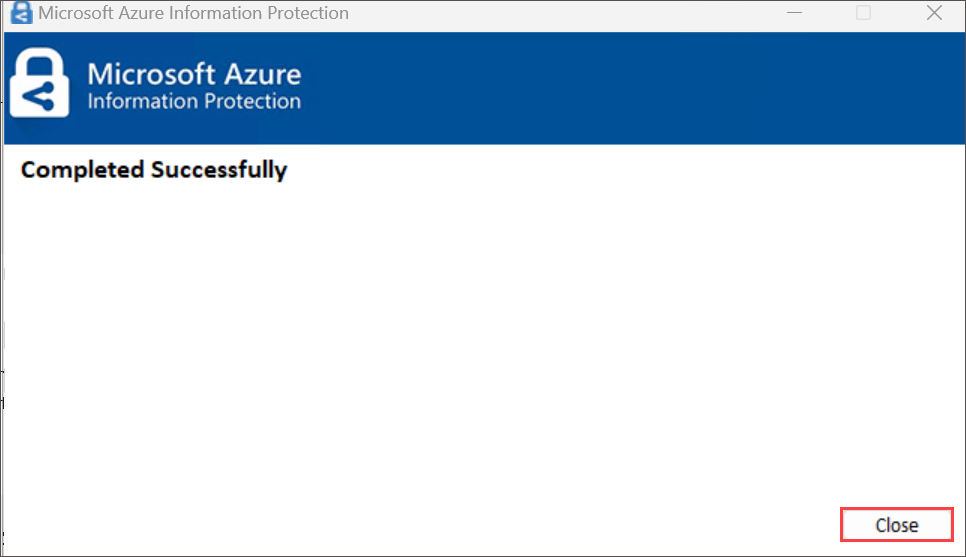

# Lab 04 - Install and Use Azure Information Protection Unified Labeling Client To Classify Files

## Lab scenario
The Azure Information Protection unified labeling client for Windows helps you keep important documents and emails safe from people who shouldn't see them, even if your email is forwarded or your document is saved to another location. You can also use this client to open documents that other people have protected by using the Rights Management protection technology from Azure Information Protection.

## Lab objectives

In this lab, you will complete the following tasks:

+ Task 1: Deploy AIP Unified Labeling Client

### Task 1: Install Azure Information Protection Unified Labeling Client 

1. Within LabVm open **Microsoft edge**.

1. Browse for Microsoft Download Center(https://www.microsoft.com/en-us/download/details.aspx?id=53018) to Download AzInfoProtection_UL.exe.

1. On Azure Information Protection page click on **Download**.

   

1. On Choose the download you want page, select **AZInfoProtection_UL.exe** and click on **Download**.

   

3. Run the executable file that was downloaded, and if you are prompted to continue, click Yes.

4. On the Install the Azure Information Protection client page, click I agree when you have read the license terms and conditions.

   

6. If you are prompted to continue, click Yes, and wait for the installation to finish.

7. Click Close.

   

### Task 2 : Using File Explorer to classify files 

In this task, you'll classify file 

1. To classify a file by using File Explorer
1. In File Explorer, select your file, multiple files, or a folder. Right-click, and select Classify and protect. For example:

1. File Explorer right-click Classify and protect using Azure Information Protection

1. In the Classify and protect - Azure Information Protection dialog box, use the labels as you would do in an Office application, which sets the classification as defined by your administrator.

1. If none of the labels can be selected (they appear dimmed): The selected file does not support classification. For example:

1. No labels available in the Classify and protect - Azure Information Protection** dialog box

1. If you selected a file that does not support classification, click Close. You cannot classify this file without also protecting it.

1. If you selected a label, click Apply and wait for the Work finished message to see the results. Then click Close.

1. If you change your mind about the label you chose, simply repeat this process and choose a different label.

1. The classification that you specified stays with the file, even if you email the file or save it to another location.
