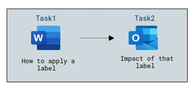
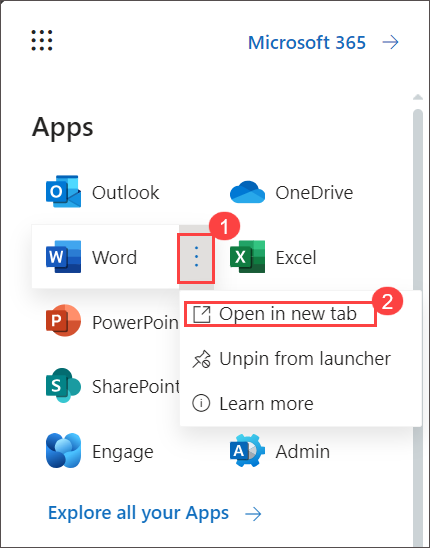
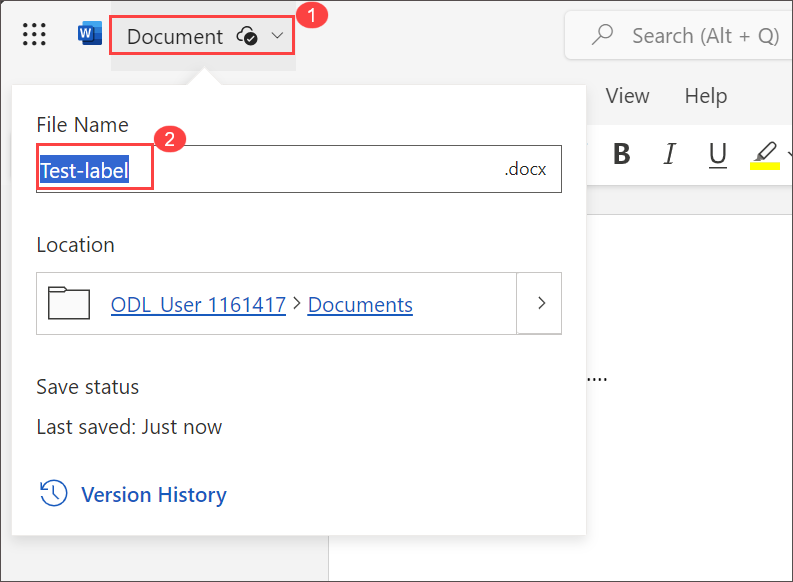
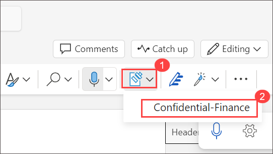
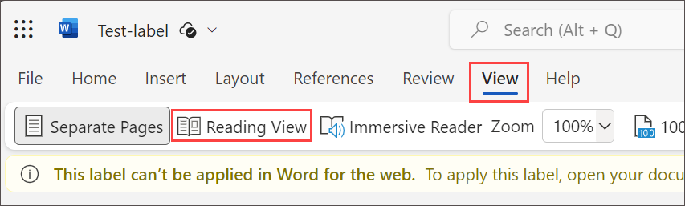
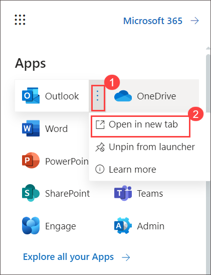

# Lab 05 - Use M365 Apps to Label data

## Lab scenario
In this lab, you will explore the capabilities of sensitivity labels.  You will go through the settings for existing sensitivity labels that have been created. Then you will see how to apply a label and the impact of that label, from the perspective of a user.

## Lab objectives

In this lab, you will complete the following tasks:

+ Task 1: How to apply a label
+ Task 2: Impact of that label

## Architecture diagram

### Task 1: How to apply a label

In this task, you will go through the process of applying a label from the perspective of the user (in this case the user is the admin) and view the content marking that is generated by the label.

1. From the Microsoft Purview home page, select the **app launcher icon**, and **right click on the Word icon** and select **Open in new tab**. 

    

1. Select **blank document**, then enter some text on the page.  On the blue bar on the top of the page, select the down-arrow, next to where it says DocumentXX - Saved, and in the File Name box enter, **Test-label**.

    

1. From the top menu bar, select **Sensitivity**.(**Note**: If the option is not available, it will take sometime to reflect Alternatively try refreshing the page or sign-out and sign-in again) From the drop down select **Confidential-Finance**

     

1. From the top menu bar, select **View**, then select **Reading view**.

            

1. Notice how the document includes the watermark.

     

1. Close the Microsoft Word tabs that are open on your browser to exit from Word.

### Task 2 : Impact of that label
In addition to content marking, the label protection setting was set for encryption. Per the permissions that were configured with this label, members of the finance group can co-author documents with this label applied and users in the Contoso tenant can view (or any document/email with the label applied).  In this task you will send this document to an email address to which you have access (ie., a personal email address) and that is NOT part of the WWLxZZZZ.OnMicrosoft.com domain and see what happens when you try to open the attachment.  

1. From the Microsoft Purview home page, select the **app launcher icon**, and **right click on the Outlook icon** and select **Open in new tab**.

       

1. Select **New Email** from the top left corner of the screen.  Enter an email address to which you have access and is not part of the WWLxZZZZ.OnMicrosoft.com domain and enter **Test** in the subject line.

1. Select **Attach**.

1. Select **One drive**.

1. From the list that shows up, select the document you created and to which you applied the label **Test-label**. Select **Next** and select **Attach as a copy**.  Press **Send**.

1. Check the email to which you sent the document.  Note, the email may be directed to your junk folder.  When you attempt to open the attached word file you will see a notification that you do not have permission to open the document.

1. Close the open browser tabs.

## Review
In this lab, you have completed:

+ How to apply a label
+ Impact of that label

## You have successfully completed the lab
