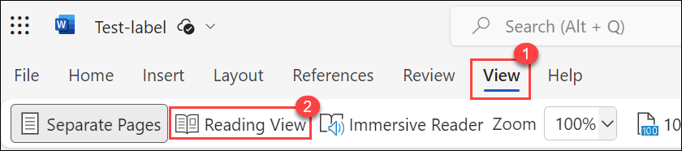

# Lab 05 - Use M365 Apps to Label data

## Lab Overview

In this lab, you learn to apply sensitivity labels to Word documents, witnessing their impact on content markings like watermarks. This practical guide involves creating a new document, selecting a label (e.g., Confidential-Finance), and observing the persistence of label information. And testing label impact by sending an encrypted document via email. It demonstrates protection settings and permissions, where only specific groups can co-author or view the document. Together, these tasks offer hands-on insights into the application and real-world implications of sensitivity labels in Microsoft 365, ensuring secure data handling and classification.

## Lab scenario
In this lab, you will explore the capabilities of sensitivity labels.  You will go through the settings for existing sensitivity labels that have been created. Then you will see how to apply a label and the impact of that label, from the perspective of a user.

## Lab objectives

In this lab, you will complete the following tasks:

+ Task 1: How to apply a Sensitivity label to word document 
+ Task 2: Testing Sensitivity Label Impact by Sending and Checking an Encrypted Document

## Architecture diagram

### Task 1: How to apply a Sensitivity label to word document 

In this task, you'll use a Word document to go through the process of applying a sensitivity label. You will observe how the sensitivity label functions from the perspective of the user (in this case, the user is the admin) and view the content markings generated by the label.

>**Note**: Applying sensitivity labels to your content enables you to keep your data secure by stating how sensitive certain data is in your organization. It also abstracts the data itself, so you use labels to track the type of data, without exposing sensitive data on another platform.

1. From the Microsoft Purview home page, select the **app launcher icon**, and **right click on the Word icon** and select **Open in new tab**. 

    

1. Select **blank document**, then enter some text on the page.  On the blue bar on the top of the page, select the down-arrow, next to where it says DocumentXX - Saved, and in the File Name box enter, **Test-label**.

   

   >**Note**: In this step, we are creating a new Word document that will be utilized for applying a sensitivity label.

1. From the top menu bar, select **Sensitivity**.(**Note**: If the option is not available, it will take sometime to reflect Alternatively try refreshing the page or sign-out and sign-in again) From the drop down select **Confidential-Finance**

    

   >**Note**: The sensitivity bar makes easy for you to see what label is applied to your file, and to apply or change a label whenever you need to, including when saving the file. Just select the sensitivity bar in the save dialog to see the labeling options for this file.

1. From the top menu bar, select **View**, then select **Reading view**.

            

   >**Note**:  Reading view allows you to observe how the document includes a watermark, a visual indication of the document's sensitivity level.

1. Notice how the document includes the watermark.

     

1. Close the Microsoft Word tabs that are open on your browser to exit from Word.

   >**Note**: When you apply Sensitivity label, the label information will persist with your file or email, even as it is shared between devices, applications, and cloud services. 
     Applying a sensitivity label may also result in changes to your file or email according to your organization's configuration, such as A header or footer may appear in your file or 
     email and  watermark may appear in your file

   >**Note**: In summary, this task guides the user can actively test and see the Sensitivity label in action, gaining a practical understanding of how the label affects document content and visibility.

### Task 2 : Testing Sensitivity Label Impact by Sending and Checking an Encrypted Document

In addition to content marking, the label protection setting was set for encryption. Per the permissions that were configured with this label, members of the finance group can co-author documents with this label applied and users in the Contoso tenant can view (or any document/email with the label applied).  In this task you will send this document to an email address to which you have access (ie., a personal email address) and that is NOT part of the WWLxZZZZ.OnMicrosoft.com domain and see what happens when you try to open the attachment.  

>**Note**: These steps demonstrate the practical impact of the sensitivity label, showcasing how protection settings and permissions affect the opening of the document in a real-world scenario.

1. From the Microsoft Purview home page, select the **app launcher icon**, and **right click on the Outlook icon** and select **Open in new tab**.

       

1. Select **New Email** from the top left corner of the screen.  Enter an email address to which you have access and is not part of the WWLxZZZZ.OnMicrosoft.com domain and enter **Test** in the subject line.

1. Select **Attach**.

1. Select **One drive**.

1. From the list that shows up, select the document you created and to which you applied the label **Test-label**. Select **Next** and select **Attach as a copy**.  Press **Send**.

1. Check the email to which you sent the document.  Note, the email may be directed to your junk folder.  When you attempt to open the attached word file you will see a notification that you do not have permission to open the document.

1. Close the open browser tabs.

>**Note**: For example, applying a sensitivity label ‘confidential finance’ to a document that contains credit card numbers helps you identify the sensitivity of the document without knowing the actual data in the document.

>**Note**: In summary, applying a sensitivity label to a Word document and outlook it triggers a series of security and access controls, ensuring that the document is treated and protected according to its sensitivity level. This is part of a broader strategy for data classification and protection within the Microsoft 365 ecosystem.

## Review
In this lab, you have completed:

+ How to apply a Sensitivity label to word document 
+ Testing Sensitivity Label Impact by Sending and Opening an Encrypted Document

## You have successfully completed the lab
