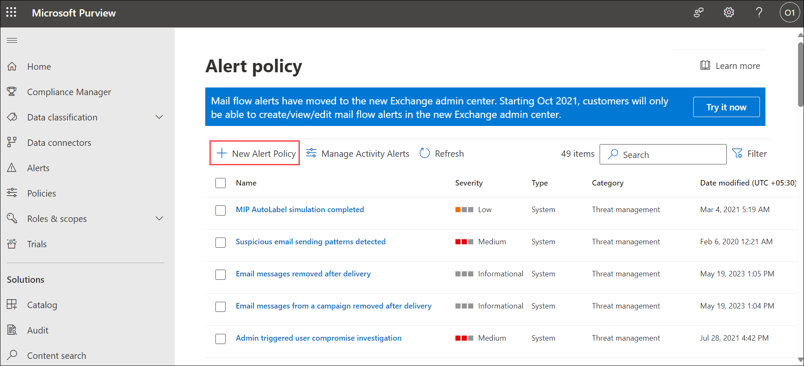
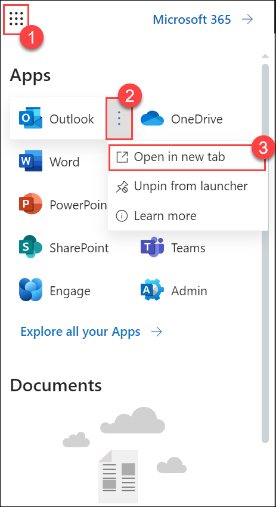

# Lab 06 - Create a Data Loss Prevention (DLP) policy

## Lab Overview

This lab is designed to guide users through the process of creating a Data Loss Prevention (DLP) policy in the Microsoft Purview portal. The DLP policy aims to protect sensitive data, specifically Credit Card information, from being shared by users. The policy is configured to notify users when attempting to share such information. This lab provides hands-on experience in setting up a customized DLP policy tailored to the organization's data protection needs.

## Lab scenario

In this lab, you will create a Data Loss Prevention policy in the Microsoft Purview portal to protect sensitive data from being shared by users.

In Microsoft Purview, you implement data loss prevention by defining and applying DLP policies. With a DLP policy, you can identify, monitor, and automatically protect sensitive items across:

- Microsoft 365 services such as Teams, Exchange, SharePoint, and OneDrive
- Office applications such as Word, Excel, and PowerPoint
- Windows 10, Windows 11, and macOS (Catalina 10.15 and higher) endpoints
- Non-Microsoft cloud apps
- On-premises file shares and on-premises SharePoint

## Lab objectives

In this lab, you will complete the following tasks:
+ Task 1: Create a Data Loss Prevention (DLP) policy
+ Task 2: Create Alert Policy 
+ Task 3: Add user to a Microsoft Purview built-in role group
+ Task 4: Demonstrating Data Loss Prevention (DLP) Policy

## Estimated timing: 60 minutes

## Architecture diagram

### Task 1: Create a Data Loss Prevention (DLP) policy

In this task, you will create a Data Loss Prevention policy in the Microsoft Purview portal to protect sensitive data from being shared by users.

1. Navigate back to the **[Microsoft Purview](https://compliance.microsoft.com/)** home page.

1. In the **Microsoft Purview** portal, in the left navigation pane, expand **Data loss prevention (1)** and select **Policies (2)**.

   

1. On the **Policies** page, select **+ Create policy** to start the wizard for creating a new data loss prevention policy.

    

1. On the **Start with a template or create a custom policy** page, scroll down and select **Custom (1)** under **Categories** and **Custom policy (2)** under **Regulations**. By default, both  options should already be selected, select **Next (3)**.

   
   
1. On the **Name your DLP policy** page, type **Credit card policy (1)** in the **Name** field and type **Protect credit card numbers from being shared. (2)** in the Description field. Select **Next (3)**.

   

1. On the Assign admin units page, click **Next**.

   

1. On the **Choose where to apply the policy** page, select only **Exchange email (1)** and uncheck other option and click **Next (2)**. 

     
   
1. On the **Define policy settings** page, select **Create or customize advanced DLP rules** and select **Next**.

   

1. On the **Customize advanced DLP rules** page, select **+ Create rule**.

    

1. On the **Create rule** page, type **Credit card information** in the **Name** field.

1. Under **Conditions**, select **+ Add Condition (1)** and then select **Content contains (2)** from the drop-down menu.

   

1. In the new **Content contains** page, select **Add (1)** and select **Sensitive info types (2)** from the drop-down menu. On the Sensitive info types page, search **Credit (3)**, select **Credit Card Number (4)** and select **Add (5)**.

   

1. Under **Actions**, click **Add an actions (1)** and select **Restrict access or encrypt the content in Microsoft 365 locations (2)** from the drop-down menu.

    

1. Under the **Restrict access or encrypt the content in Microsoft 365 locations**, select **Block everyone**.

    

1. Under **User notifications** select toggle for Use notifications to inform your user and help educate them on the proper use of sensitive info is **On (1)** and enable the check box for **Show the policy tip as a dialog for the end user before send (2)**.

   

1. Under **Incident reports** select **severity level** as **Medium (1)** click on the toggle for under **send an alert to admins when a rule match occurs (2)** and click on **Save (3)**.

    

1. Back on **Customize advanced DLP rules** page, and click on **Next**.

    

1. On **Policy mode** select **Turn the policy on immediately (1)** and click **Next (2)**.

   
  
1. On the Review and finish review the information click **Submit**. Select **Done** on the **New policy created** page.

     

   >**Note**: You have now created a DLP policy that scans for Credit Card numbers in Microsoft Outlook.

   >**Note**: Data Loss Prevention policies are critical for organizations to prevent inadvertent sharing of sensitive information. In this scenario, the focus is on protecting Credit Card numbers. The lab ensures that users are informed and prompted before sharing such data. This proactive approach helps in securing sensitive information and ensures that users are aware of the policy requirements.

   > **Congratulations** on completing the task! Now, it's time to validate it. Here are the steps:
   > - Navigate to the Lab Validation Page, from the upper right corner in the lab guide section.
   > - Hit the Validate button for the corresponding task. If you receive a success message, you can proceed to the next task. 
   > - If not, carefully read the error message and retry the step, following the instructions in the lab guide.
   > - If you need any assistance, please contact us at labs-support@spektrasystems.com. We are available 24/7 to help you out.

### Task 2 : Create Alert Policy  

In this task you'll create Alert policy 

1. Navigate back to the **[Microsoft Purview](https://compliance.microsoft.com/)** home page.

1. In the **Microsoft Purview** portal, in the left navigation pane, select **Policies (1)** > **Alert policies (2)**.

      .png)
   
1. On the **Alert Policy** window, select **New Alert Policy**.

   

1. On **Name your alert**  window, specify the following and click **Next (4)**.
        
      | **Settings**        | **Values**   | 
      | ------------------- | ------------ | 
      | **Name**            | Enter  **DLP-Alert_Policy (1)** | 
      |  **Severity**       | Select **Medium (2)**        |
      |  **Category**       | Select **Information governance (3)**        |  
      |||

      

1. On **Create alert settings** window, specify the following and click **Next (3)**.
        
      | **Settings**                                        | **Values**   | 
      | -------------------                                 | ------------ | 
      | **Activity is**                                     | Select **DLP policy match (1)** | 
      |  **How do you want the alert to be tiggered**       | Select **Every time an activity matches the rule (2)** |
      ||| 
     
      

1.  On **Set your recipients** window, specify the following and click **Next (2)**.

      | **Settings**                                        | **Values**   | 
      | -------------------                                 | ------------ | 
      | **Email recipients**                                | Select **<inject key="AzureAdUserEmail"></inject> (1)** | 
      ||| 

      

1.  On **Review your settings** window, specify the following and click **Submit (2)**.

      | **Settings**                                        | **Values**   | 
      | -------------------                                 | ------------ | 
      | **Do you want to turn the policy on right away?**   | Select **Yes, turn on right away (1)** | 
      ||| 

      

1. Click on **Done**.
 
### Task 3 : Add user to a Microsoft Purview built-in role group

In this task you will actively engage in the process of adding user to a predefined role group within Microsoft Purview.

1. In the **Microsoft Purview** portal, in the left navigation pane, expand and select **Roles & scopes (1)** > **Permissions (2)** and under **Microsoft purview solutions** select **Roles (3)**

        

1. On **Role groups for Microsoft Purview solutions** window, search and select **Security Administrator** then at the top select **Edit**.

     

1. On the **Edit members of the role group** window, select **Choose users (1)** then on **Choose users** blade click on **<inject key="AzureAdUserEmail"></inject> (2)** > **Select (3)**.

    

 1. Click on **Next** > **Save** > **Done**.  

 1. Repeat the above 1 - 4 steps for assign the following **Role Group** permission to user:

      - Compliance Administrator

      - Security Reader

      - Information Protection

      - Information Protection Investigators

      - Information Protection Analysts

      - Information Protection Admins

1. In the **Microsoft Purview** portal, in the left navigation pane, under **Solution** select **Audit**.

   
  
1. On the Audit page, select the blue bar at the top page which says **Start recording and admin  activity**, on the pop-up select **Yes**.

   

   

1. Select **Start (1)** and **End (2)** date under **Data and time range (UTC)** and for **Users** provide **<inject key="AzureAdUserEmail"></inject> (3)** and click on **Search (4)**. 

   

   >**Note**: Please anticipate a delay of *two-three* hours for the allocation of the required permissions to the user. This process necessitates time and effort before we can proceed with the following task. 

### Task 4 : Demonstrating Data Loss Prevention (DLP) Policy

In this task, you'll Compose an email containing sensitive information that matches the conditions specified in the DLP policy. For example, include credit card numbers in the email body.

1. Navigate back to the [Microsoft Purview](https://compliance.microsoft.com/) home page, select **App launcher icon (1)**, on the **Outlook** select **Open context menu (2)** and select **Open in new tab (3)**.

       

1. Select **New Email** from the top left corner of the screen.

   

1. Enter your **personal email address (1)** and provide the subject as **Sending credit card number (2)**, enter **multiple demo credit card numbers (3)** and click on **Send (4)**.

     

   >**Note**: Browse for test credit card numbers and copy/paste them when executing this step, you can use this website for accessing demo credit card number 
     [Test Credit Card Numbers.](https://support.bluesnap.com/docs/test-credit-card-numbers)

1. Repeat the last step for at least 4 to 5 times to in order to trigger the alerts. until you receive the **Severity alert** mail from office 365.
 
    

1. Observe that email is blocked by the policy, and you'll receive a message as demonstrated below.

     

1. Navigate back to the **Microsoft Purview** portal. In the left navigation pane, expand **Data loss prevention (1)** and select **Alert (2)**.

   >**Note** Generating alerts will require some time, allowing you to move on to the next lab; however, it's essential to monitor the alerts.

     

   >**Note**: Alerts can be sent every time an activity matches a rule, which can be noisy or they can be aggregated based on the number of matches or volume of items over a set period.
   
   >**Note**: Ensure that the DLP policy is configured to block everyone for the specified actions. When the sensitive content triggers the DLP rule, the email should be blocked from being sent.

### Conclusion

Creating a Data Loss Prevention (DLP) policy is a fundamental step in safeguarding sensitive data from unintentional sharing within an organization. In this task, a DLP policy named "Credit Card Policy" was established using the Microsoft Purview portal to specifically protect credit card numbers from being shared via Microsoft Outlook.

### Review
During this lab, you've gained knowledge on the process of creating and Demonstration of Data Loss Prevention

## You have successfully completed the lab. Click on Next >>.
