# Lab  07 - Implementing Microsoft Purview extension for Chrome

## Lab Overview

This implementation involves creating a Chrome extension that enhances the functionality of Microsoft Purview within the Chrome browser. DLP allows you to monitor onboarded Windows 10, and Windows 11 and onboarded macOS devices running any of the three latest released versions. Once a device is onboarded, DLP detects when sensitive items are used and shared. This gives you the visibility and control you need to ensure that they're used and protected properly and to help prevent risky behaviour that might compromise them.

## Lab scenario

In this lab, you'll be implementing the Microsoft Purview extension for Google Chrome in a controlled lab environment to secure the data. The primary objective is to fortify the data security measures, particularly by safeguarding against the uploading of data from unauthorized or unapproved browsers.

>**Note**: Edge is not needed for the DLP policy to apply to Edge. "The Microsoft Purview Extension can provide existing Endpoint DLP capabilities to non-native applications." Edge is native.

## Lab objectives

In this lab, you will complete the following tasks:

+ Task 1: Prerequisites
+ Task 2: Create a Data Loss Prevention policy
+ Task 3: Updating Endpoint settings
+ Task 4: Test the Extension

## Estimated timing: 120 minutes

## Architecture diagram

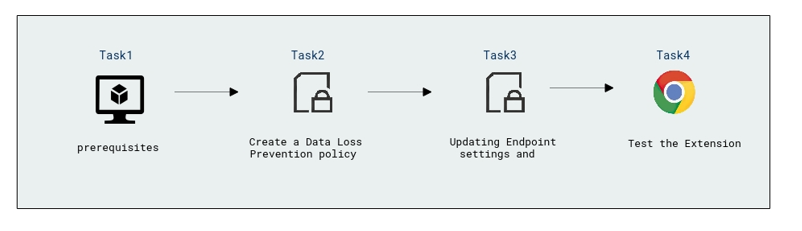

### Task 1: Prerequisites

### Task 1.1: Configure the proxy server manually using "netsh" command

>**Note**: If you're onboarding Windows 10 or Windows 11 devices, we need to make sure that the device can communicate with the cloud DLP service.

1. From Start menu type **cmd (1)**, right-click on **Command prompt (2)** and select **Run as administrator (3)**.

     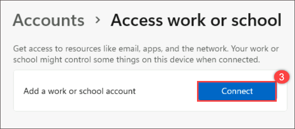
   
1. Enter the following command and press Enter:
    ```
    netsh winhttp set proxy 10.0.0.6:8080
    ```

   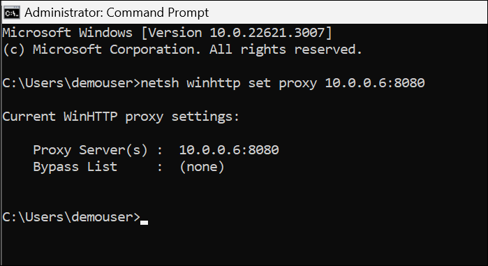
   
   >**Note**: This will affect all applications including Windows services which use WinHTTP with default proxy.

### Task 1.2: Join device to Microsoft Entra

1. Select the Start menu and type **settings (1)**, then choose **Settings (2)** from the search results.

   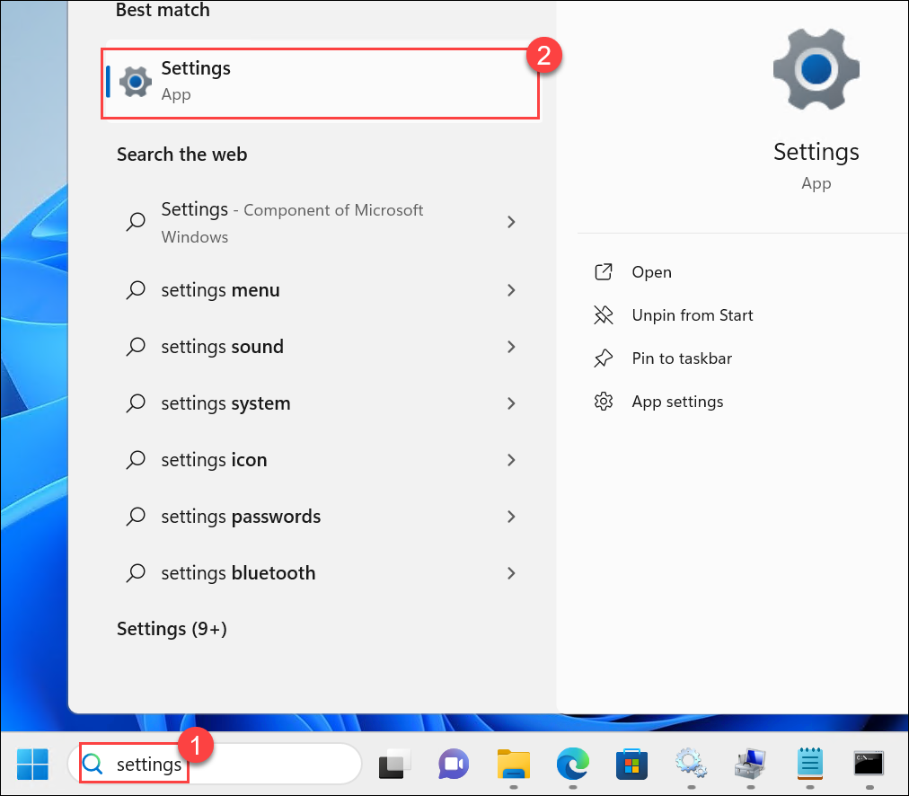
   
1. From the left menu select **Accounts (1)** > **Access work or school (2)** and click on **Connect** button.

   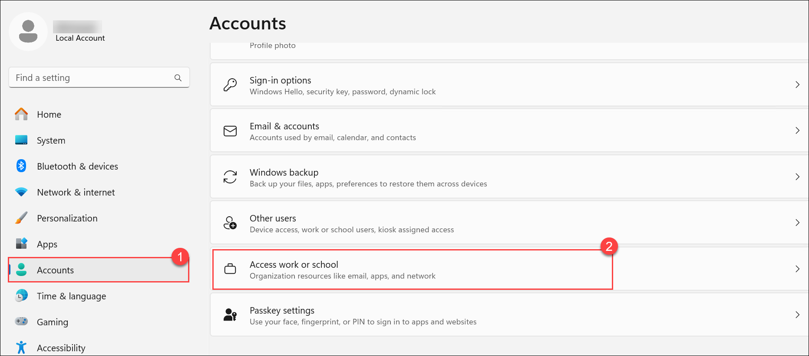
   
1. On the **Set up a work or school account**, select **Join this device to Microsoft Entra ID** and sign in with the following credential, select **Join** on the **Make sure this is your organization**. Select **Done**.

   * Email/Username: <inject key="AzureAdUserEmail"></inject>
   
   * Password: <inject key="AzureAdUserPassword"></inject>

   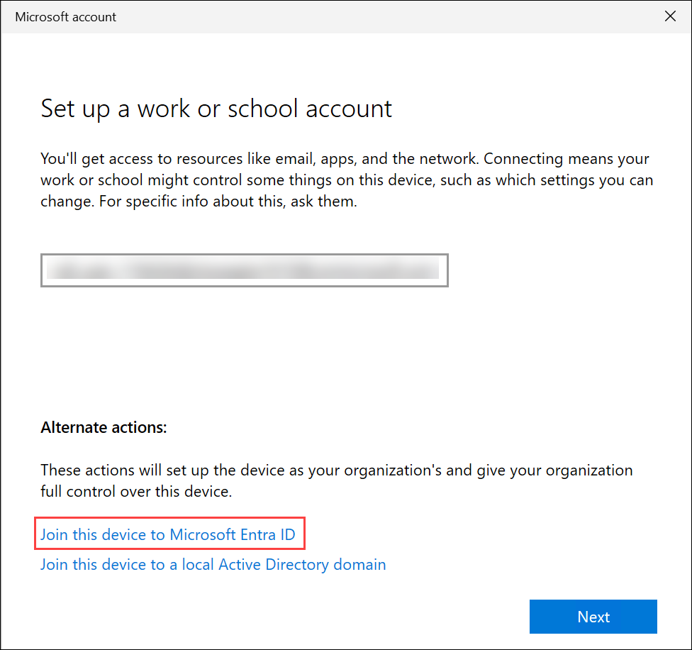

   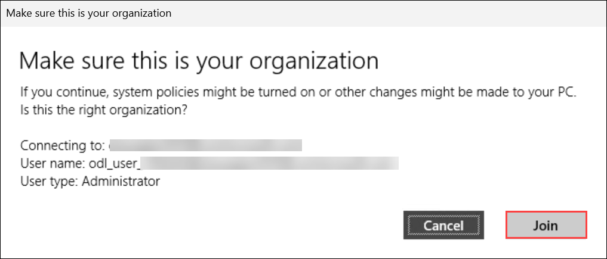
  
### Task 1.3: Onboard Windows 11 devices into Microsoft 365

1. Navigate back to the **[Microsoft Purview](https://compliance.microsoft.com/)** home page.

1. Choose **Settings (1)** > **Device onboarding (2)**. 

    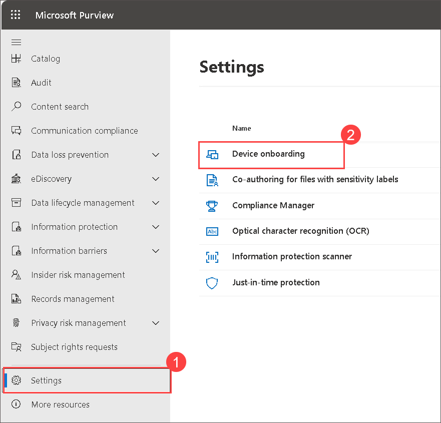

1. Select **Devices (1)** on **Device Onboarding**, window and choose **Turn on device onboarding (2)**. Select **OK**, on the **Turn on device onboarding** pop-up. On the **Device monitoring is being turned on**, select **OK**.

   >**Note**: Wait for a few minutes for the device to turn on, and refresh the page.

   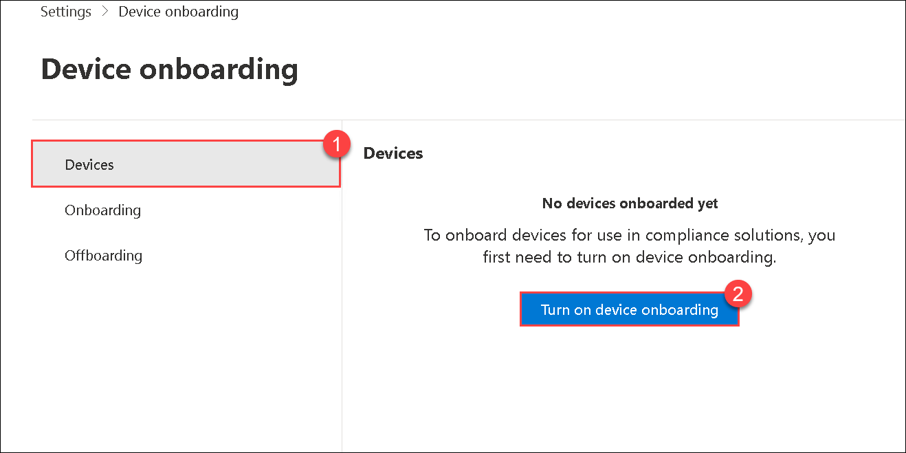

1. Select **Onboarding (1)** to start the onboarding process and follow the steps below:

   - Select operating system to start onboarding process: **Windows 10 (2)**

   - Deployment method: **Local script (for up to 10 machines) (3)**

   - Click **Download package (4)**

      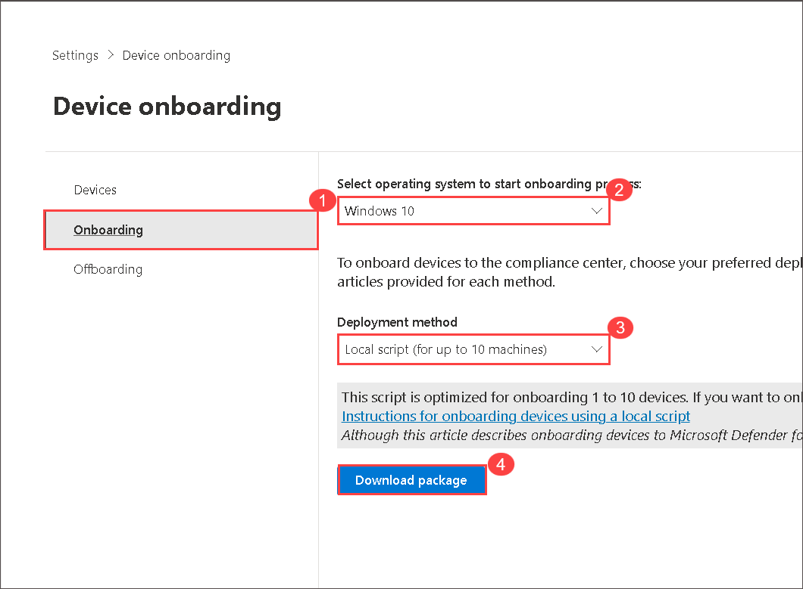

1. Once downloading is completed, click on the **show on folder** icon.

   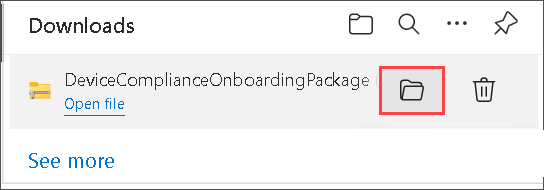

1. On File Explorer, right-click on the **DeviceComplianceOnboardingPackage (1)** file and select **Extract All (2)**.

   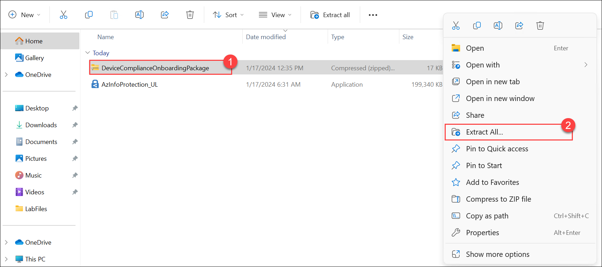

1. On the Extract Compressed zip folder, window with the default location click on **Extract**.   

   >**Note**: You must enable device monitoring and onboard your endpoints before you can monitor and protect sensitive items on a device. Both of these actions are done in the Microsoft Purview compliance portal.

   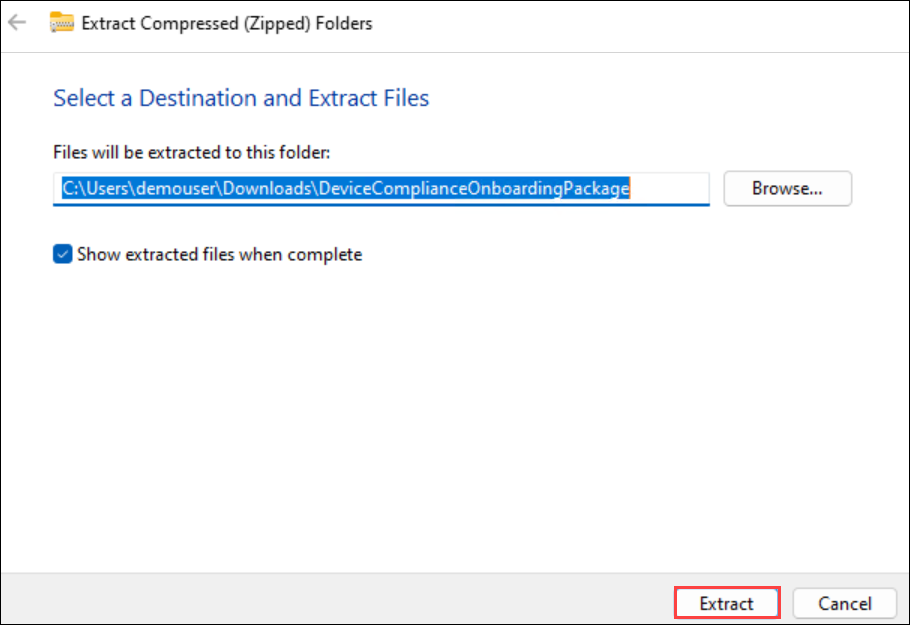

1. Right-click on the extracted file **DeviceComplianceLocalOnboardingScript.cmd (1)** and select **Properties (2)**. Select the **Unblock (3)** checkbox in the bottom right of the Properties windows and select **OK (4)**.

   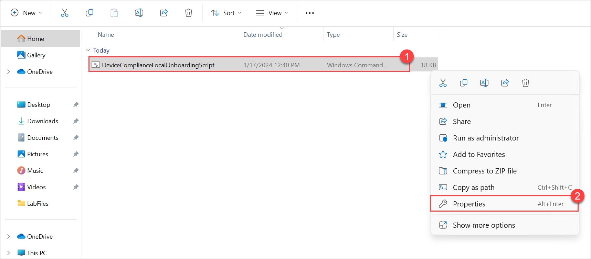

   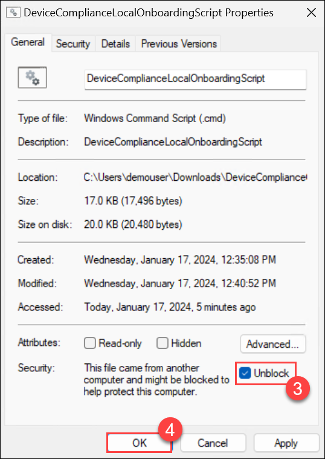

1. Right-click on the extracted file **DeviceComplianceLocalOnboardingScript.cmd (1)** again and choose **Run as Administrator (2)**.

   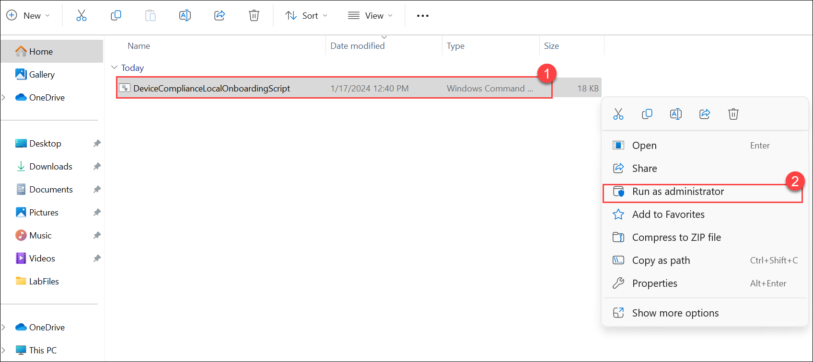

1. Enter **Y** to the question presented by the script and press **Enter**. When complete you should see a message in the command screen that says **Successfully onboarded machine to Microsoft Defender for Endpoint**.

   
   
1. Press any key to continue. This will close the Command Prompt window.

1. Navigate back to the **Microsoft Edge**, open a new browser tab,  and open [Microsoft Defender](https://security.microsoft.com/homepage?tid=49b4a46f-7815-4223-bfbd-d4f380dc082d) portal in your browser.

   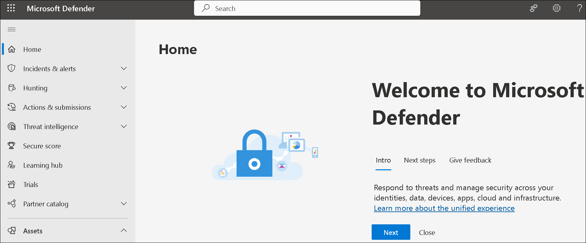

1. Select **Settings (1)** from the left menu bar, then from the Settings page select **Endpoints (2)**.

   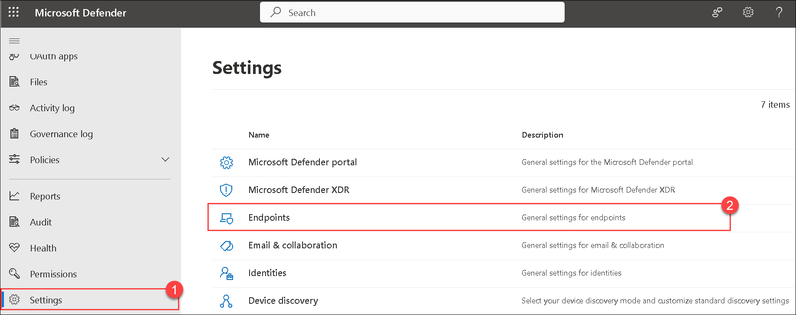

1. Scroll down, under **Device management** select **Onboarding (1)**. On the Onboarding page, under "2. Run a detection test", copy the detection test script by selecting the **Copy (2)** button.

   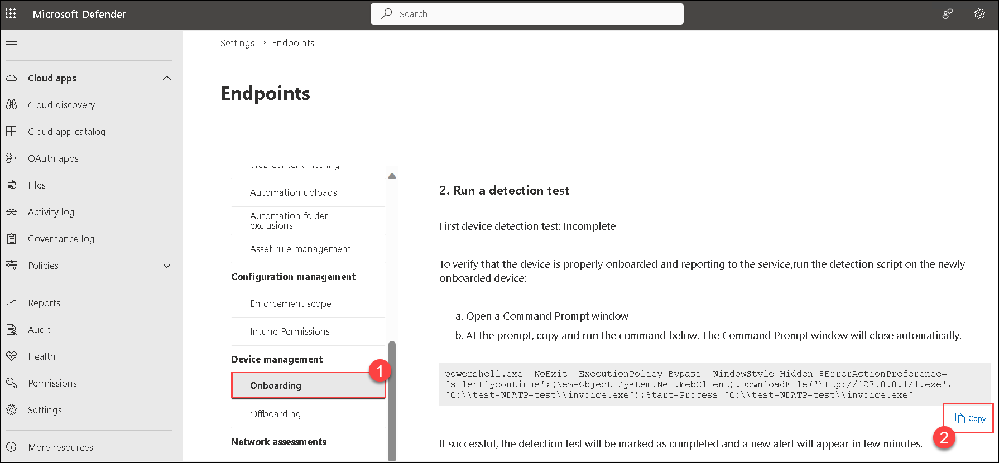

1. In the Windows search bar of the virtual machine, type **CMD (1)**, on the right pane of the **Command prompt (2)** choose **Run as Administrator (3)**. 

   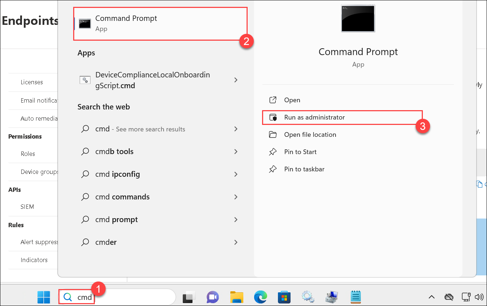

1. Paste the script by right-clicking in the **Administrator: Command Prompt** windows and press **Enter** to run it.

   >**Note**: The window closes automatically after running the script.

1. Navigate back to the **[Microsoft Purview](https://compliance.microsoft.com/)** home page. In the purview portal, in the left-hand menu, select **Settings (1)**, select **Devices (2)**. The device will be displayed (3). if the device isn't displayed, please wait for a while.

    >**Note**: If you have completed the onboarding process and don't see devices in the Devices list after an hour, it might indicate an onboarding or connectivity problem.

    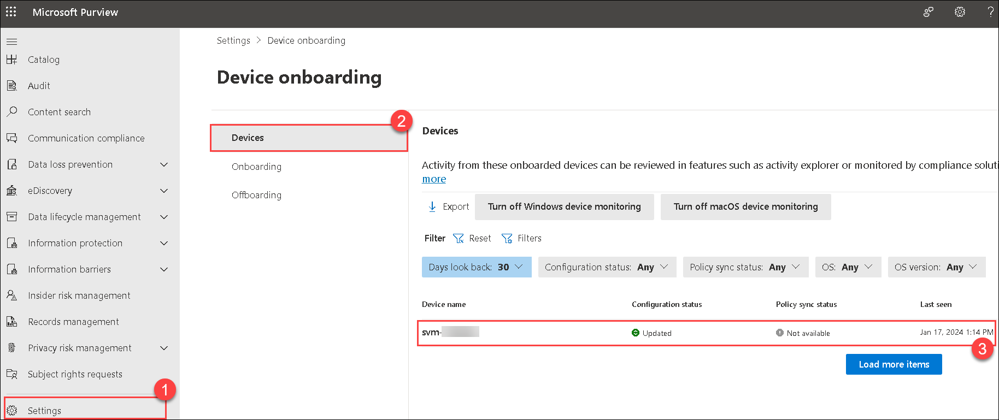

### Task 1.4: Install the extension for Chrome on your Windows devices

1. Open Microsoft Edge and go to **[Microsoft Purview Extension](https://chromewebstore.google.com/detail/microsoft-purview-extensi/echcggldkblhodogklpincgchnpgcdco)**

1. On **Switch to Chrome?** click on **Yes (1)**. Select **Download Chrome (2)**.

   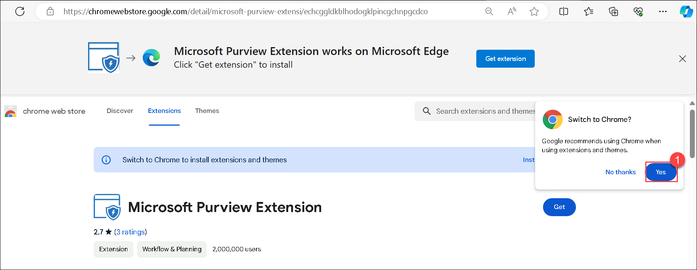  

   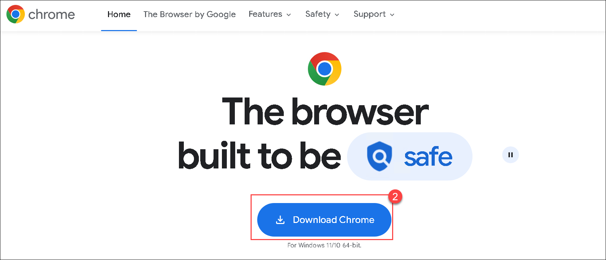 

1. Once the file get downloaded, select **Open file**, it will start the downloading process, and once the download completes select **Close**.

   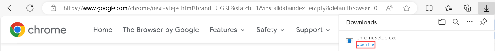

   >**Note:** On the **Enhanced ad privacy in Chrome** select **Got it**.    

### Task 2: Create a Data Loss Prevention policy

1. Open **Microsoft Edge**. Navigate back to the **[Microsoft Purview](https://compliance.microsoft.com/)** home page. 

1. In the **Microsoft Purview** portal, in the left navigation pane, expand **Data loss prevention (1)** and select **Policies (2)**.

   

1.  On the **Policies** page, select **+ Create policy** to start the wizard for creating a new data loss prevention policy.

    

1. On the **Start with a template or create a custom policy** page, scroll down and select **Custom (1)** under **Categories** and **Custom policy (2)** under **Regulations**. By default, both options should already be selected, select **Next (3)**.

   
   
1. On the **Name your DLP policy** page, type **Endpoint-dlp-policy (1)** in the **Name** field and select **Next (2)**.

   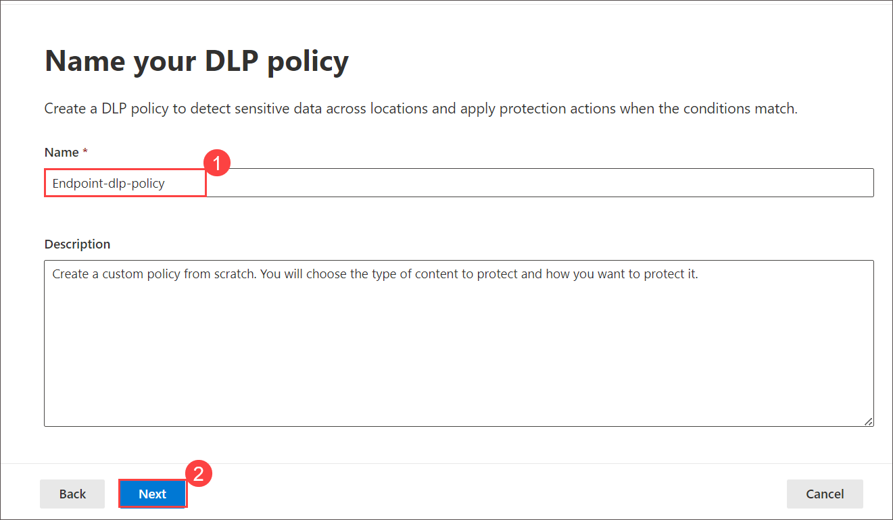

1. On the Assign admin units page, click **Next**.

   

1. On the **Choose where to apply the policy** page, select only **Devices (1)** and uncheck other option and click **Next (2)**. 

     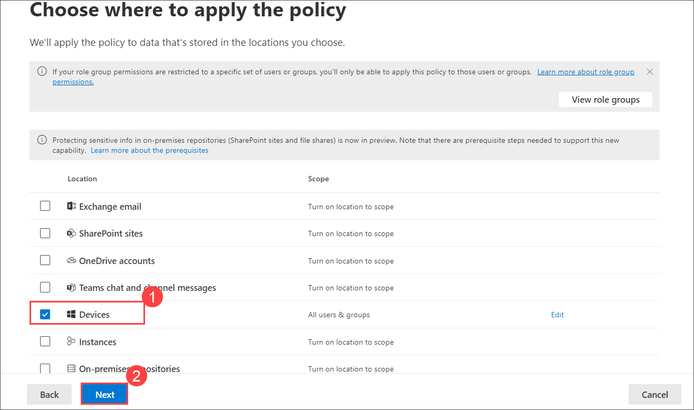
   
1. On the **Define policy settings** page, select **Create or customize advanced DLP rules** and select **Next**.

   

1. On the **Customize advanced DLP rules** page, select **+ Create rule**.

    

1. On the **Create rule** page, type **Endpoint-rule** in the **Name** field.

1. Under **Conditions**, select **+ Add Condition (1)** and then select **Content contains (2)** from the drop-down menu.

     

1. In the new **Content contains** area, select **+ Add** and select **Sensitive info types** from the drop-down menu. On the **Sensitive info types** page, type **credit (3)**, select **Credit Card Number (4)** and select **Add (5)**.

     

1. Back on **Edit Rule** page, select **Add (1)** from drop-down choose **Sensitivity labels (2)** then on **Sensitivity labels** window select **Confidential-Finance (3)** and 
   **Highly-Confidential (3)** labels, click on **Add (4)**.

    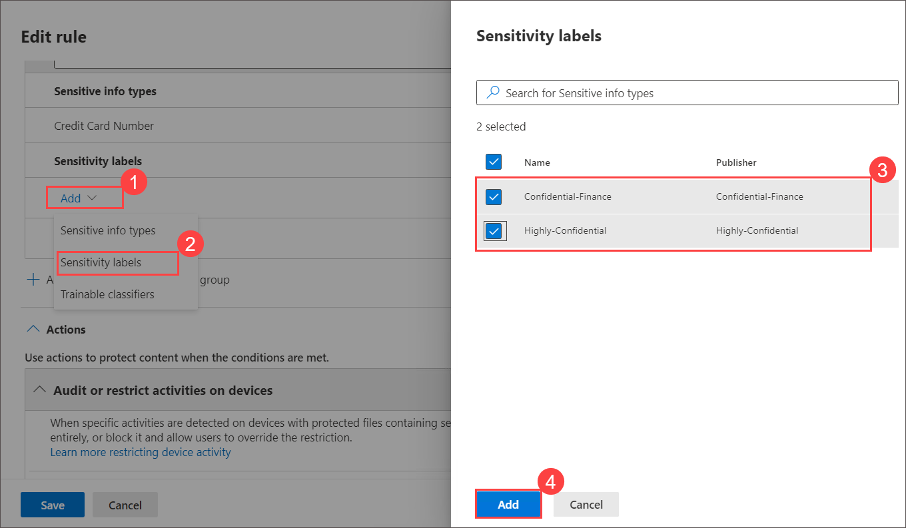

1. Under **Action** click **Add an action (1)** and select **Audit or restrict activities on devices (2)** from the drop dowm menu.

   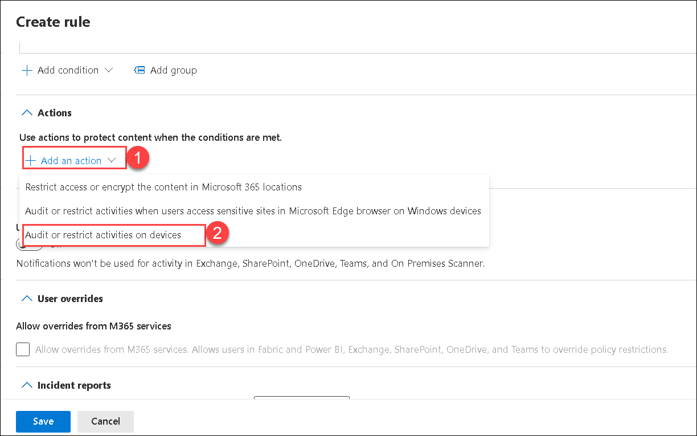

1. Under **Service Domain and Browser Activities**, select the checkbox for **Upload to a restricted Cloud Service domain or access from an unallowed browser (1)** and from the drop-down select **Block (2)**.

    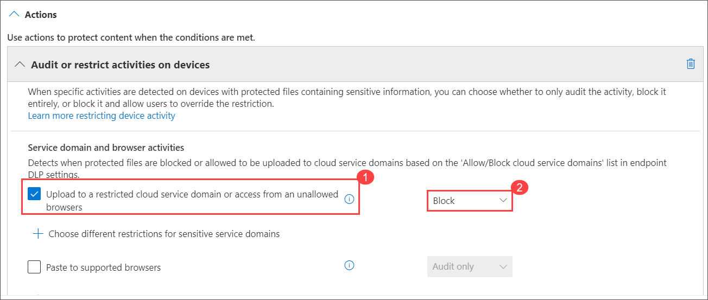

1. For **Files activities for all apps**, select **Apply restriction to specific activities** and from the drop-down select **Block** for all. 

    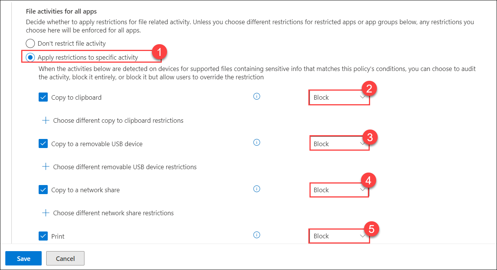

1.  Under the Incident report, select the severity to **Medium (1)** and turn on the toggle for **Send an alert to admin when rule match occurs (2)** and select **Send alert every time an alert on an activity matches the rule (3)** and click on **Save (4)**.

      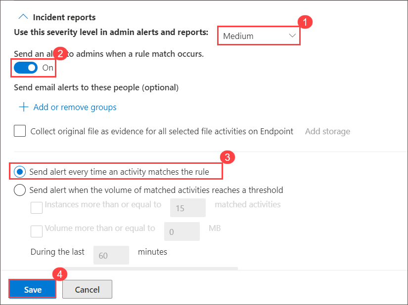

1. Back on **Customize advanced DLP rules** page, and click on **Next**.

   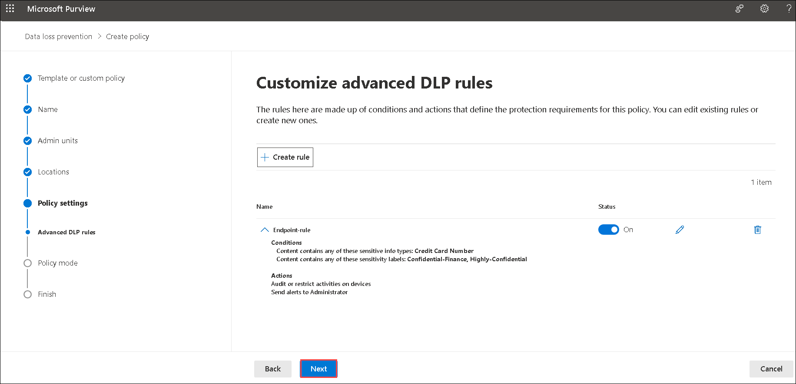

1. On **Policy mode** select **Turn the policy on immediately (1)** and click **Next (2)**.
  
   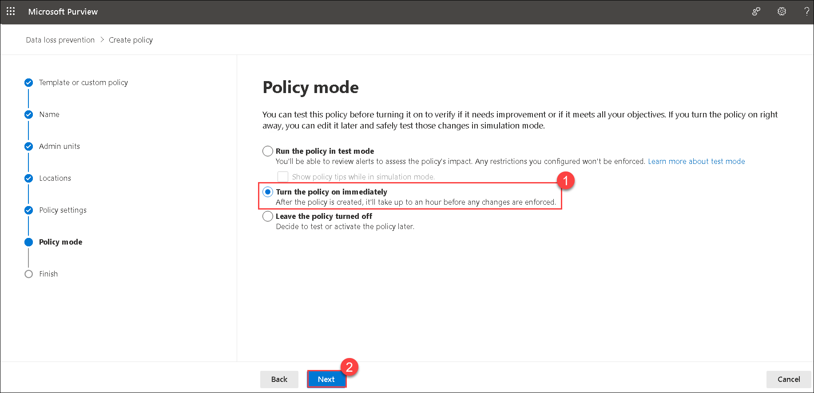

1. On the Review and finish review the information and click **Submit**. Select **Done**.

   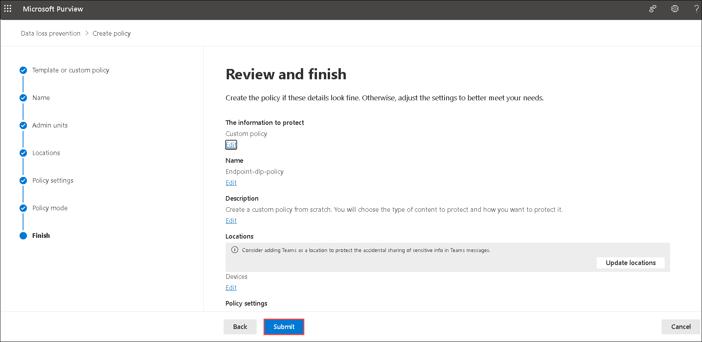

### Task 3: Updating Endpoint settings

In this task, you'll configure Browser and domain restrictions to sensitive data

1. Navigate to the Policies page and choose the Settings icon located in the top-right corner of the page.

   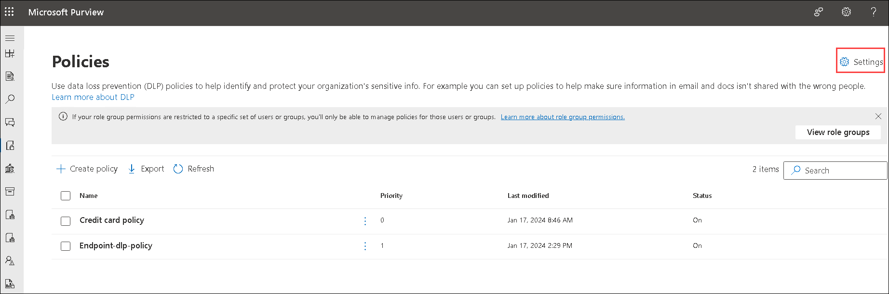

1. From the left menu select **Endpoint settings (1)** and expand **browser and domain restriction to sensitive data**, under **Unallowed browsers** click on **+ Add or Edit unallowed browsers (2)**, and select **Google Chrome (3)** then click on **Save (4)**.

     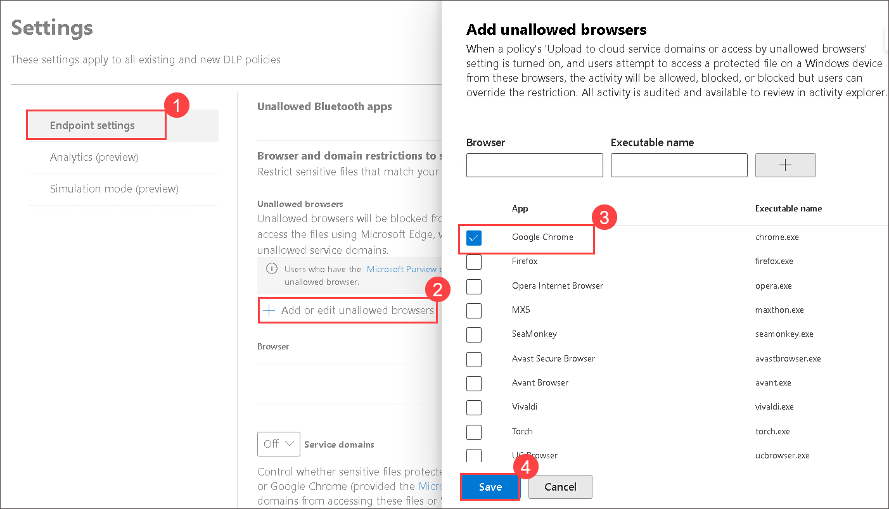

   >**Note**: Unallowed browsers will be restricted from reaching files protected by your policies. When access is denied, users will receive a prompt to use Microsoft Edge, allowing interaction with the content but preventing uploads to unauthorized service domains.

### Task 4: Test the Extension

In this task, you'll assess the implementation of the Microsoft Purview extension for Chrome and observe how the policy restricts activities that violate the established guidelines.

1. From start menu search and select **Word** and select Blank document then select **Sensitivity (1)** icon from menu bar then select **Confidential-Finance (2)** label  and 
   add some text into a Word document and save the file as **Confidential-document**.

    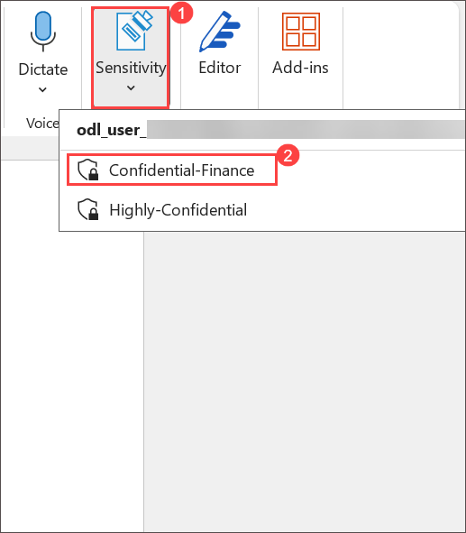

1. Search for **Google Chrome (1)** and select **Google Chrome (2)** from the start menu copy the link of a Word document containing sensitive information, and then try to paste it into Google Chrome. Observe the notification indicating a lack of permission to access the file.

    >**Note**: The policy will take *one to two* hours to take effect. Please proceed with the next **Exercise** and return to complete this task afterwards.

   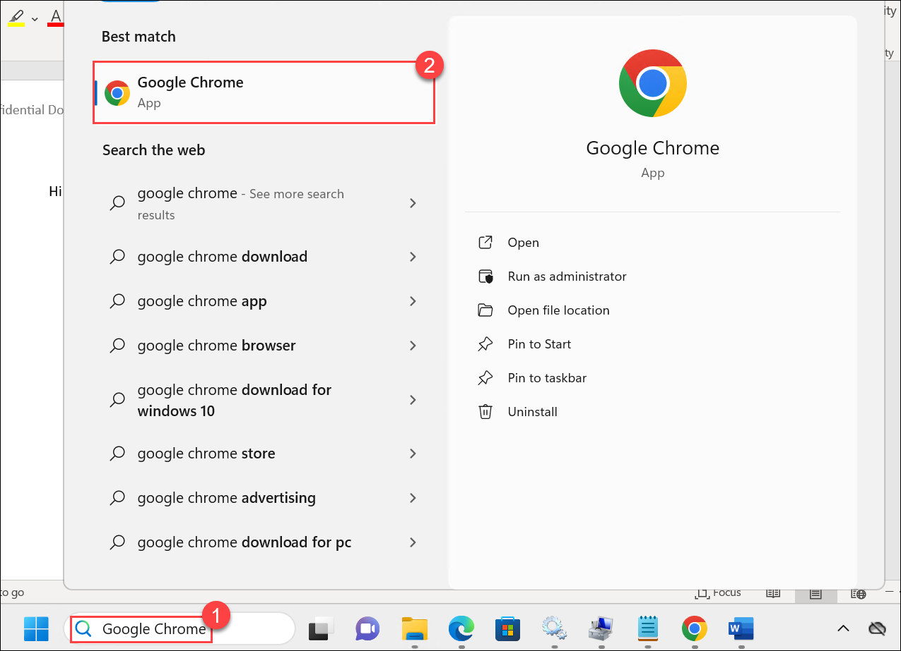

1. Open another tab in Google Chrome and browse for (https://www.virustotal.com/gui/home/upload) and upload the **Confidential-document** document where sensitivity
   label is applied and notices how policy is blocked from uploading protected files from unallowed browsers Cloud Egress.

    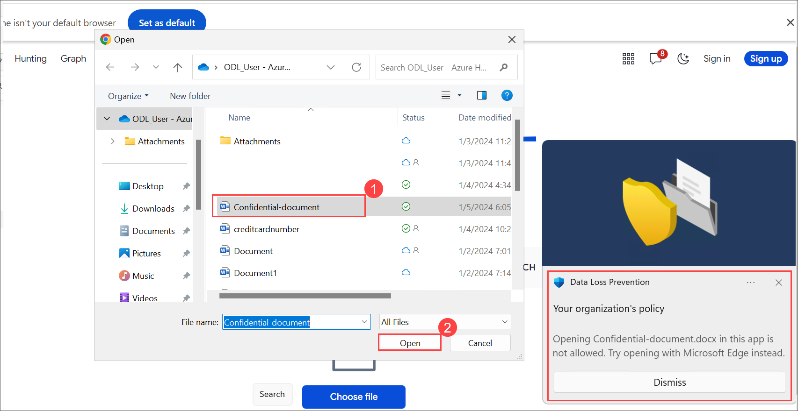

   >**Note**: By successfully implementing the Microsoft Purview extension for Google Chrome, you have enhanced data discovery capabilities, allowing for more effective management and protection of sensitive information across web pages and documents. This integration supports a proactive approach to data governance within your organization.

   > **Congratulations** on completing the task! Now, it's time to validate it. Here are the steps:
   > - Navigate to the Lab Validation Page, from the upper right corner in the lab guide section.
   > - Hit the Validate button for the corresponding task. If you receive a success message, you can proceed to the next task. 
   > - If not, carefully read the error message and retry the step, following the instructions in the lab guide.
   > - If you need any assistance, please contact us at labs-support@spektrasystems.com. We are available 24/7 to help you out.

### Conclusion
By completing this lab, users gain practical experience in implementing the Microsoft Purview extension for Chrome. The extension enhances data discovery, classification, and protection capabilities, contributing to a comprehensive data governance strategy. The lab emphasizes the importance of configuring policies and endpoint settings to enforce security measures effectively.

### Review
During this lab, you've gained knowledge on the process: 

+ Prerequisites
+ Create a policy
+ Updating Endpoint settings
+ Test the Extension

## You have successfully completed the lab. Click on Next >>.
