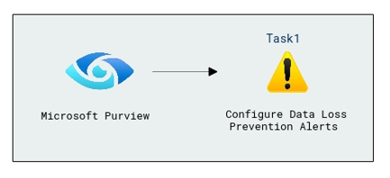
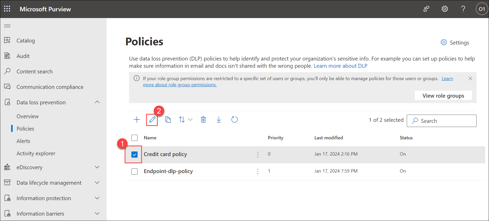
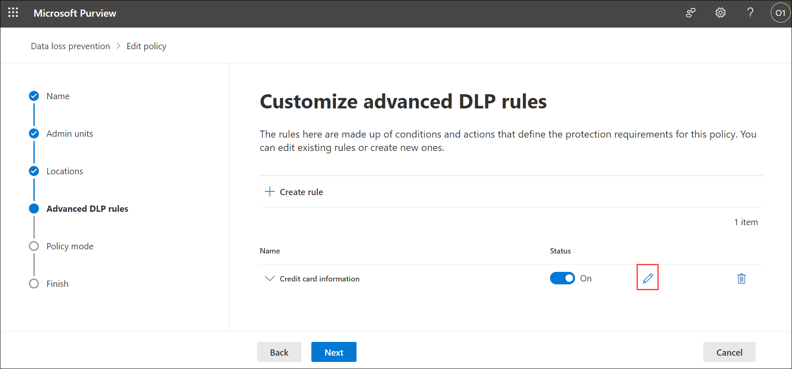
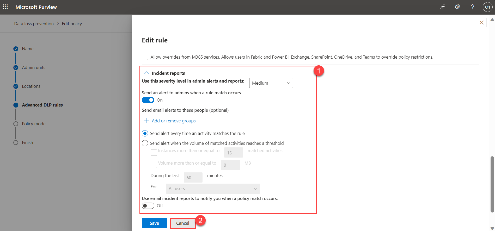

# Lab 08 - Configure Data Loss Prevention Alerts

## Lab Overview
Data Loss Prevention (DLP) policies in Microsoft Purview and explore the settings related to DLP alerts. By creating DLP policies and adjusting alert configurations, users will gain practical experience in securing sensitive information and responding to potential policy violations.

## Lab scenario

In this lab, you'll explore the DLP policy which triggers an alert if a user takes an action that aligns with a DLP policy, and explore on which you have configured Incident reports to generate alerts. The alert is then posted in the DLP Alerts dashboard for further investigation.

## Lab objectives

In this lab, you will complete the following tasks:
+ Task 1: Configure Data Loss Prevention Alerts

## Estimated timing: 60 minutes

## Architecture diagram

### Task 1: Configure Data Loss Prevention Alerts

In this task, you'll create a dlp policy in Microsoft purview

1. Within **cvm-<inject key="DeploymentID" enableCopy="false"/>** RDP session, in **Microsoft Edge**, navigate back to the **[Microsoft Purview](https://compliance.microsoft.com/)** home page. 

1. In the **Microsoft Purview** portal, in the left navigation pane, expand **Data loss prevention (1)** and select **Policies (2)**.

   

1. Select the **Credit card policy (1)** checkbox, and click **Edit (2)**.

   

1. Select **Next** for three times, and navigate to **Customize advanced DLP rules** page and select **Edit** icon.

   

1. Under **Incident reports (1)** notice the setting and here you can change Severity on alerts as per your requirement.

   Two types of alerts can be configured in DLP policies.

   - Single-event alerts are typically used in policies that monitor for highly sensitive events that occur in a low volume, like a single email with 10 or more customer credit card numbers being sent outside your organization. you'll see these options when you create or edit a DLP policy. Use this option **Send alert when the volume matches the rule** to create an alert that's raised every time a DLP rule match happens.

   - Aggregate-event alerts are typically used in policies that monitor for events that occur in a higher volume over some time.  Use this option **Send alert when the volume of matched activities reaches a threshold** For example, an aggregate alert can be triggered when 10 individual emails each with one customer credit card number are sent outside your org over 48 hours.

     This configuration allows you to set up a policy to generate an alert:

     - every time an activity matches the policy conditions
     - when the defined threshold is met or exceeded
     - based on the number of activities
     - based on the volume of exfiltrated data
     
1. For now keep it as it is and select **Cancel (2)**. Select **Cancel** on **Customize advanced DLP rules** page.
   
    >**Note**: This configuration allows you to see these options when you create or edit a DLP policy. Use this option to create an alert that's raised every time a DLP rule match happens.

   

### Conclusion
In this lab, you configured DLP policies and explored alert settings in the Microsoft Purview portal. Users learn to customize the severity of alerts based on different scenarios, allowing for effective monitoring of potential data loss incidents. The practical demonstration reinforces the importance of DLP policies in preventing unauthorized sharing of sensitive information and highlights the role of alerts in incident response.

### Review
During this lab, you've gained knowledge on the process of Configuring Data Loss Prevention Alerts

## You have successfully completed the lab. Click on Next >>.
