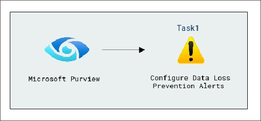
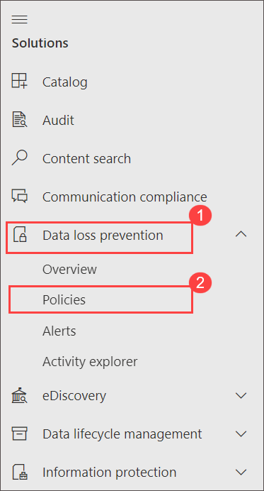
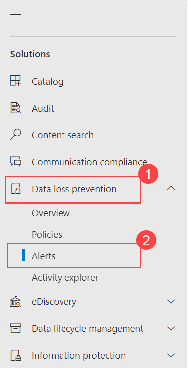
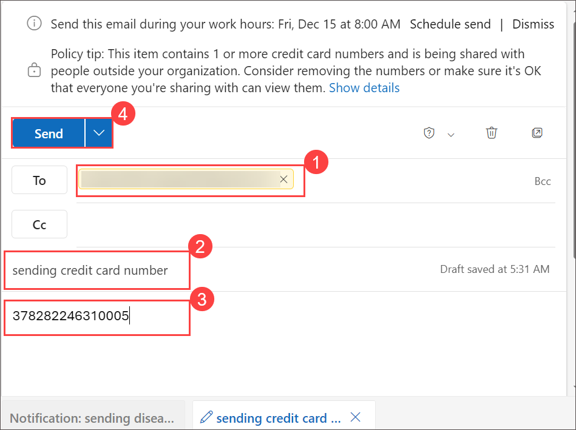
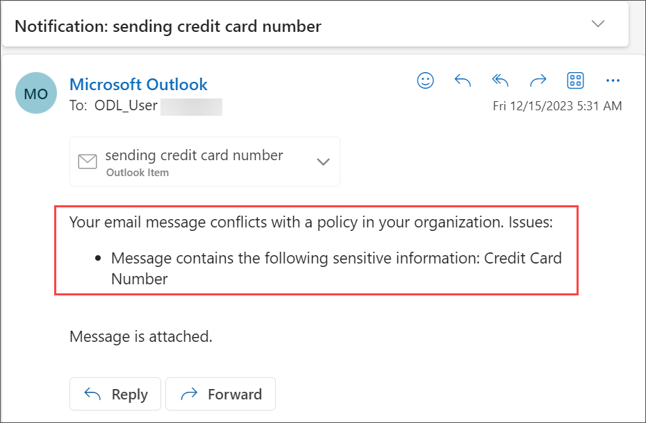

# Lab 08 - Configure Data Loss Prevention Alerts

## Lab scenario

DLP triggers an alert if a user takes an action that aligns with a DLP policy, and you have configured Incident reports to generate alerts. The alert is then posted in the DLP Alerts dashboard for further investigation.

## Lab objectives

In this lab, you will complete the following tasks:

## Architecture diagram

### Task 1 : create a dlp policies 

In this task you'll create dlp policy in Microsoft purview

1. In **Microsoft Edge**, navigate to **https://compliance.microsoft.com** 

1. In the **Microsoft Purview** portal, in the left navigation pane, expand **Data loss prevention** and select **Policies**.

   

1. Select the **Credit card policy** and click **Edit**.

1. Navigate to **Customize advanced DLP rules** page and select **Edit** icon.

1. Under **Investigate** notice the setting and here you can change Severity on alerts as per your requirement.

   - Single-event alerts are typically used in policies that monitor for highly sensitive events that occur in a low volume, like a single email with 10 or more customer credit card numbers being sent outside your organization.

   - Aggregate-event alerts are typically used in policies that monitor for events that occur in a higher volume over a period of time. For example, an aggregate alert can be triggered when 10 individual emails each with one customer credit card number is sent outside your org over 48 hours.

1. For now keep as it is and select cancel.
   
    >**Note**: This configuration allows you to see these options when you create or edit a DLP policy. Use this option to create an alert that's raised every time a DLP rule match happens.

1. In the **Microsoft Purview** portal, in the left navigation pane, expand **Data loss prevention** and select **Alerts**.

   

1. From the Microsoft Purview home page, select the **app launcher icon**, and **right click on the Outlook icon** and select **Open in new tab**.

    

1. Select **New Email** from the top left corner of the screen.

1. Enter an email address to which you have access and is not part of the WWLxZZZZ.OnMicrosoft.com domain and provide subject, enter some demo credit card number and try to send this mail.
   

   >**Note**: Notice policy tip.

1. Observe that email is restricted by the policy, and you'll receive a message as demonstrated below.
    
      

Alerts can be sent every time an activity matches a rule, which can be noisy or they can be aggregated based on number of matches or volume of items over a set period of time. There are two types of alerts that can be configured in DLP policies.
