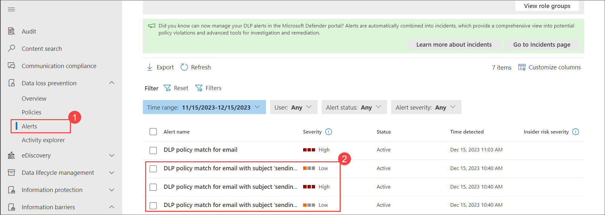
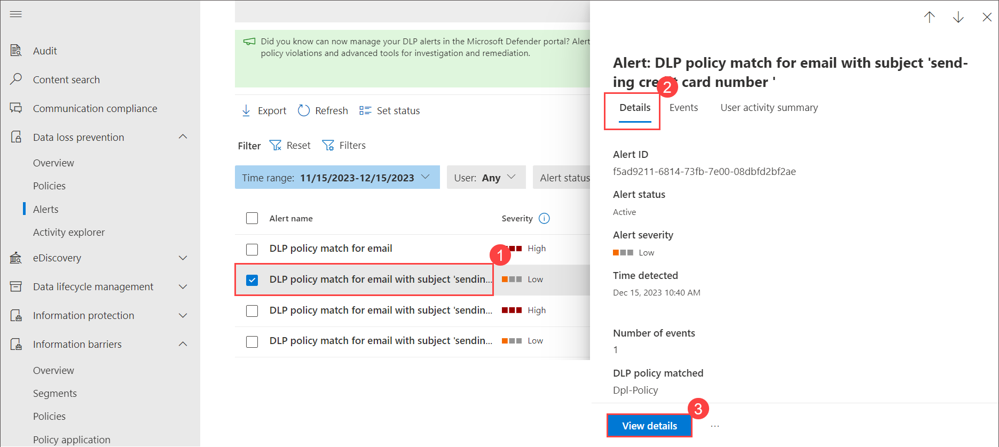
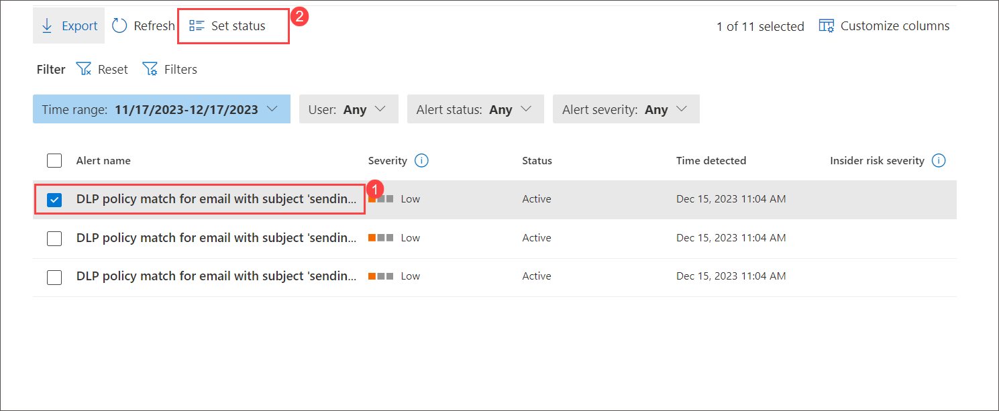

# Lab 09 - Investigation of  Data Loss Prevention Alerts 

## Lab scenario

The main goal of the investigation stage is for the assigned owner to correlate evidence, determine the cause and full impact of the alert and decide on a remediation plan. The assigned owner is responsible for deeper investigation and remediation of the alert. The primary alert investigation tools are the Microsoft 365 Defender portal and the DLP alert management dashboard. You might also use Activity explorer to investigate alerts. You can also share alerts with other users in your organization.

## Lab objectives

In this lab, you will complete the following tasks:

+ Task 1 : Investigation of  Data Loss Prevention Alerts

### Task 1 : Investigation of  Data Loss Prevention Alerts

In this task you'll explore on investigating dlp alerts in Microsoft Purview.

1. In **Microsoft Edge**, navigate to **https://compliance.microsoft.com** 

1. In the **Microsoft Purview** portal, in the left navigation pane, expand **Data loss prevention** and select **Alerts** and notice alerts have been genarated you can view details for each alerts

   

1. Choose filters to refine the list of alerts. Choose Customize columns to list the properties you want to see. You can also choose to sort the alerts in ascending or descending order in any column.

1. In preview, you see severity column with the values of Low, Medium, High and None.

1. Select any one alerts and review information and click on **View details** to verify the alerts.

     

1. Select the Events tab to view all of the events associated with the alert. You can choose a particular event to view its details. For a list of some of the available event details, select one alert to check the details.

1. Select  **Overview** tab page for the alert. The overview page provides a summary:

   - of what happened
   - who performed the actions that caused the policy match
   - information about the matched policy, and more

1. Select **Events** tab and access the following tab to review the details:

   - Event Details
   - Classifiers that detected a match
   - Metadata associated with the event

1. Back on **Alerts** page and click on one of the alerts and select the User activity summary tab to see all of the exfiltration activities the user has engaged in up to the past 120 days.

   >**Note**: Users must be in scope of an insider risk management policy policy to see the User activity summary tab.

1. After you investigate the alert, After you take the required action for the alert, set the status of the alert to Resolved.

    

    .png)

You Investigated the alert in the DLP alert management dashboard and also explored on  Activity explorer to investigate alerts. You can also share alerts with other users in your organization.
