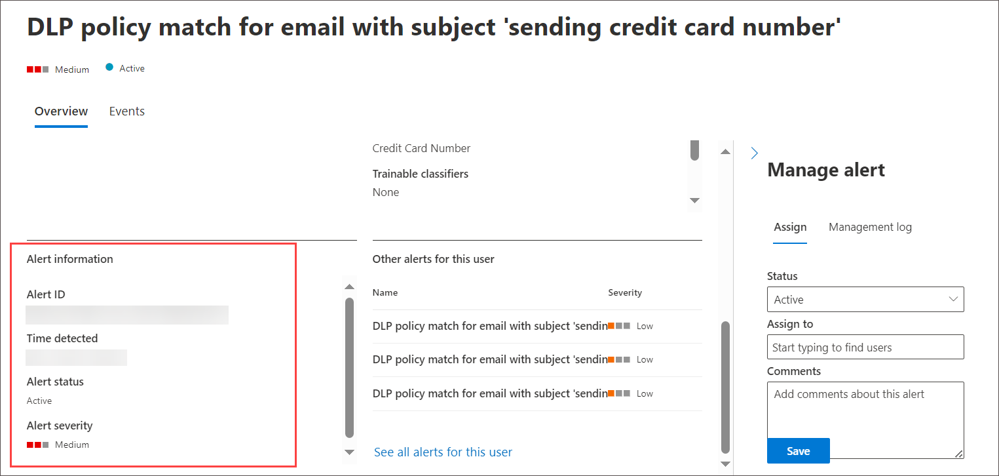
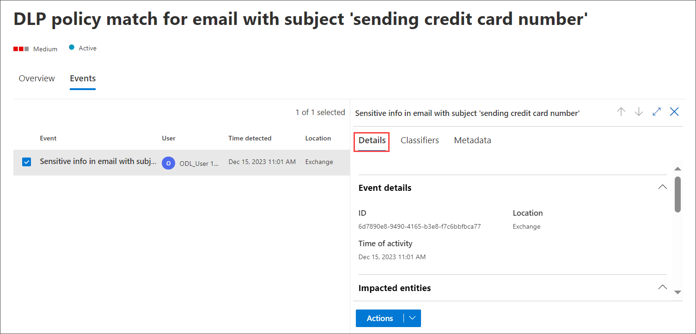
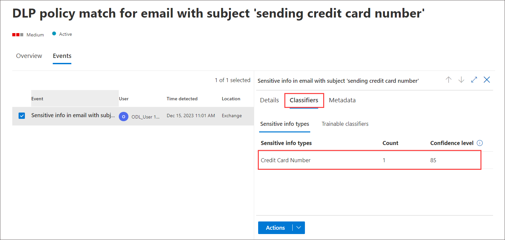
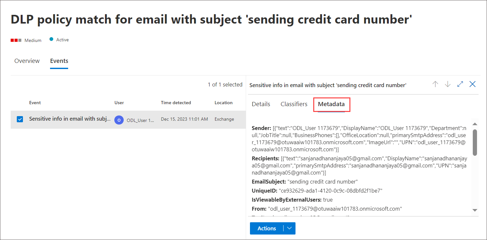
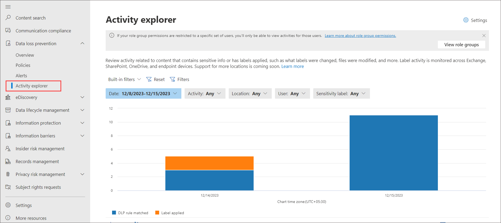

# Configure DLP Alerts

In this exercise, you will create a Data Loss Prevention policy in the Microsoft Purview portal to protect sensitive data from being shared by users. The DLP Policy that you create will inform your users if they want to share content that contains Credit Card information and allow them to provide a justification for sending this information. The policy will be implemented in test mode because you do not want the block action to affect your users yet.

1. In **Microsoft Edge**, navigate to **https://compliance.microsoft.com** 

1. In the **Microsoft Purview** portal, in the left navigation pane, expand **Data loss prevention** and select **Alerts** and notice alerts have been genarated you can view details for each alerts

   

1. Select any one alerts and review information and click on **View details** to verify the alerts.

     

1. On the Overview tab you can find and try to investigate the alerts 
    
1. If you scroll down you can find alert information

    

1. Click on **Event** tab and review each of the tab notice the details of alerts   

   

   
   
   

1. Click on Activity Explorer menu, here you can view activity of user by hover your mouse on bar chat.
   
