# Lab 10 - Configure Safe breach simulation

## Lab Overview
The task outlines the steps to launch a simulated phishing attack through the Microsoft Defender portal. Users are instructed to navigate to the Attack simulation training section, access the Simulations tab, and initiate the new simulation wizard. The process involves configuring various settings such as simulation name, payload selection, target users, training assignments, and launch details.

## Lab scenario
In this lab, you will explore how the simulations are benign cyberattacks that you run in your organization. These simulations test your security policies and practices, as well as train your employees to increase their awareness and decrease their susceptibility to attacks.

## Lab objectives

In this lab, you will complete the following task:

+ Task 1: Create Attack Simulation

## Estimated timing: 60 minutes

## Architecture diagram

### Task 1: Create an Attack Simulation

In this task, you'll create an attack simulation, specifically a simulated phishing attack, using the Microsoft Defender portal. The objective is to guide users through the process of launching a simulated phishing attack for training and awareness purposes within the organization.

1. Within **cvm-<inject key="DeploymentID" enableCopy="false"/>** RDP session, in **Microsoft Edge**, open a new browser, and navigate to the [Microsoft Defender](https://security.microsoft.com) portal.

1. From the left navigation menu expand **Email & collaboration (1)** and select **Attack simulation training (2)**. 

   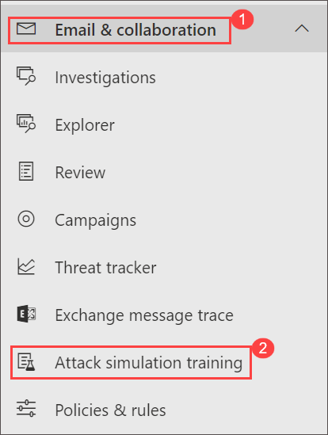

   >**Note**: Close welcome to attack simulation training window.

1. On the Attack simulation training blade, select the **Simulations** tab.

   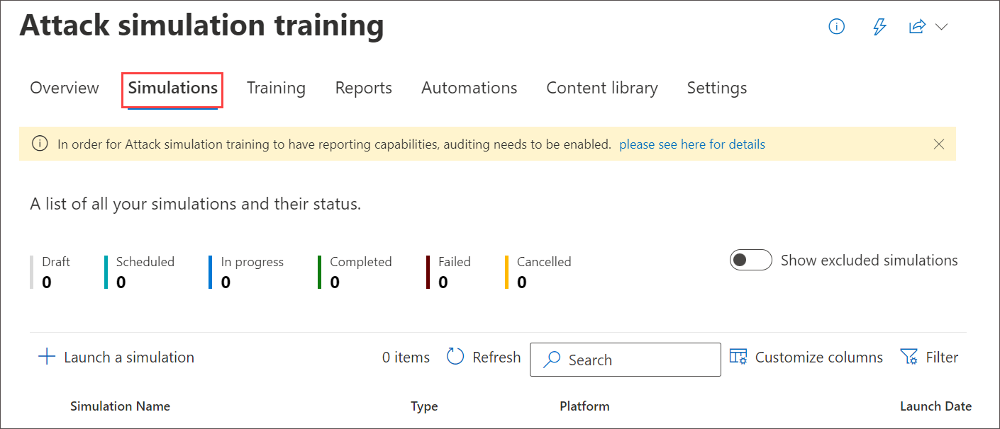
   
1. On the Simulations tab, select **+ Launch a simulation** to start the new simulation wizard.

   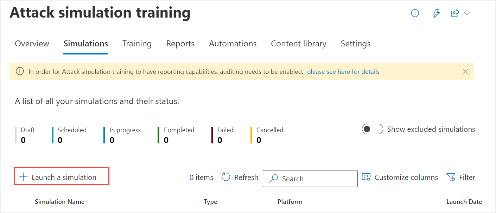
   
1. Select the social engineering technique you want to use with this simulation and click on **Next**.

    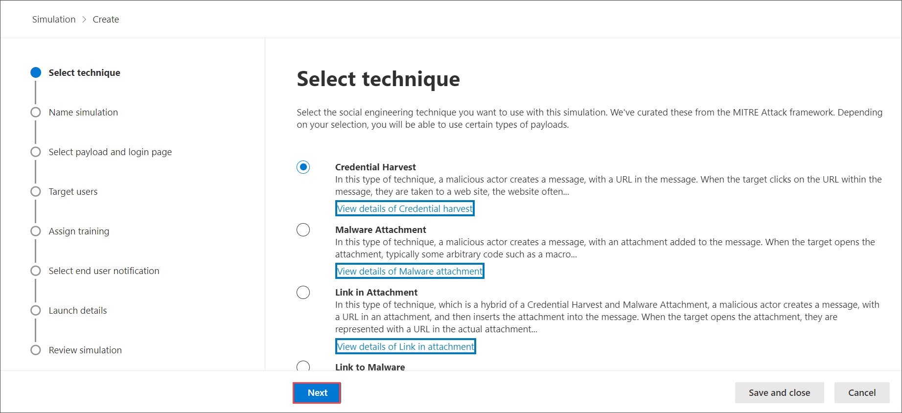
   
1. On the **Name simulation** page, configure the following settings and click on **Next (3)**.

      - **Name (1)**: Enter a unique, descriptive name for the simulation.

      - **Description (2)**: Enter an optional detailed description for the simulation.

        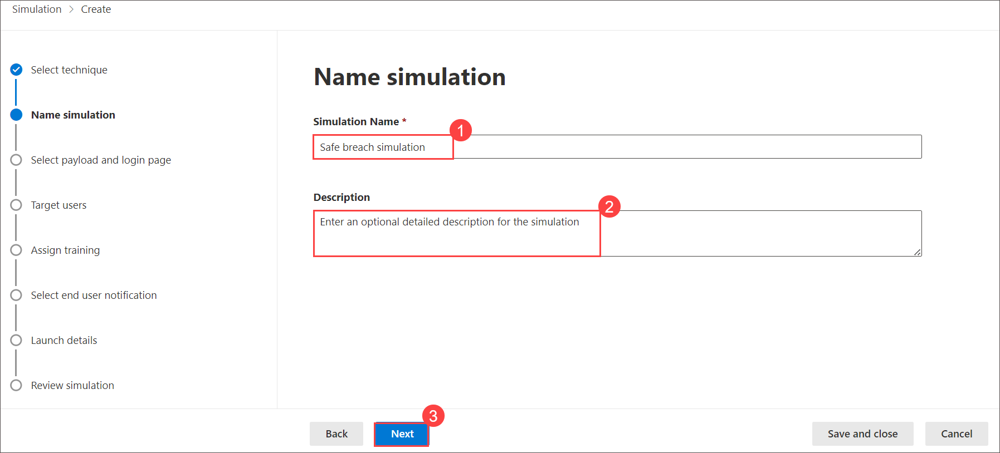
   
1. On **Select payload and login page** blade select **Renew Office 365 subscription (1)** and click on **Next (2)**.

    >**Note**: For built-in payloads, the value is **Global**. For custom payloads, the value is **Tenant**.
   
    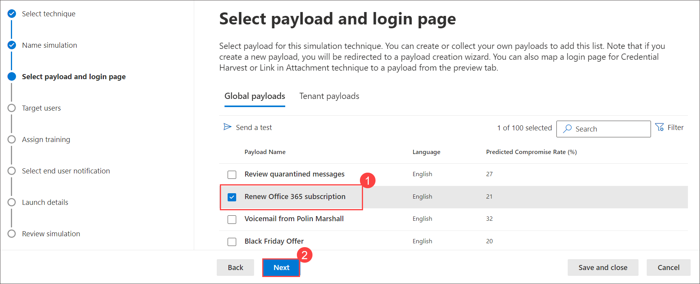

1. On the **Target users** page, select who receives the simulation. Use the following options to select users
   
     - **Include all users in my organization**: The unmodifiable list of users is shown in groups of 10.
     - **Include only specific users and groups**: At first, no users or groups are shown on the Targeted users page.
     - To add users or groups to the simulation, choose one of the following options, now select **Include all users in my organization (1)** and click on **Next (2)**.

        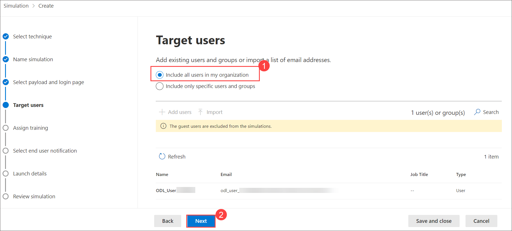

1. Don't change anything, select **Next** on **Exclude users** page.

    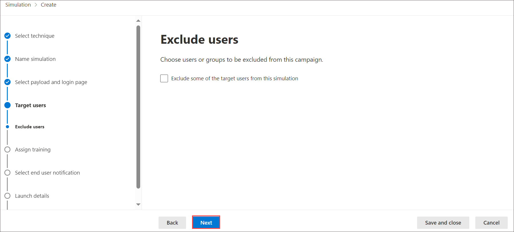
   
1. On the **Assign training** page, make sure **Microsoft training experience (Recommended) (1)** is selected from the dropdown and select **Assign training for me (Recommended) (2)**. Select the Training Due Date for the Simulation and click on **Next (3)**.

    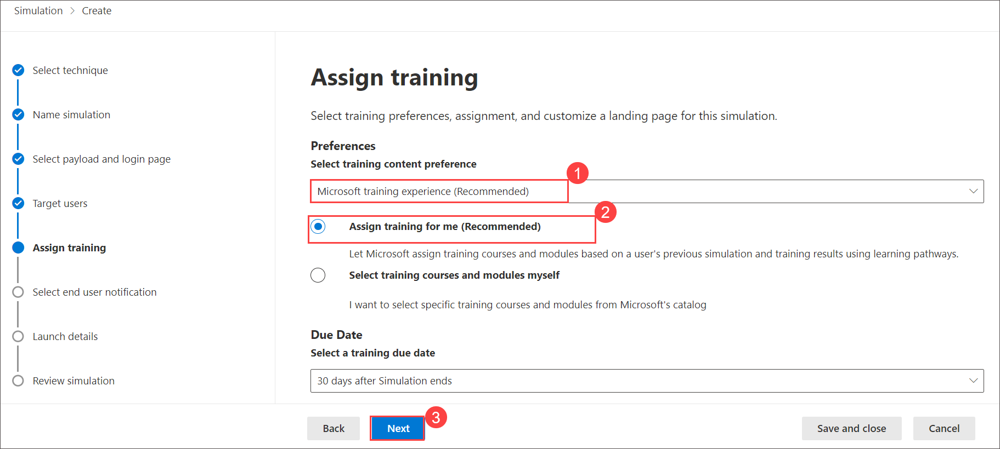

1. On the **Selecting phish landing** page, you configure the web page that users are taken to if they open the payload in the simulation.

   - Select **Use landing pages from library (1)**
     
   - **Payload indicators (2)**: Select the checkbox of the **Add payload indicators to email to help users learn how to identify phishing email**.

   - Select **Microsoft Landing page Template 1 (3)** and click on **Next (4)**.

      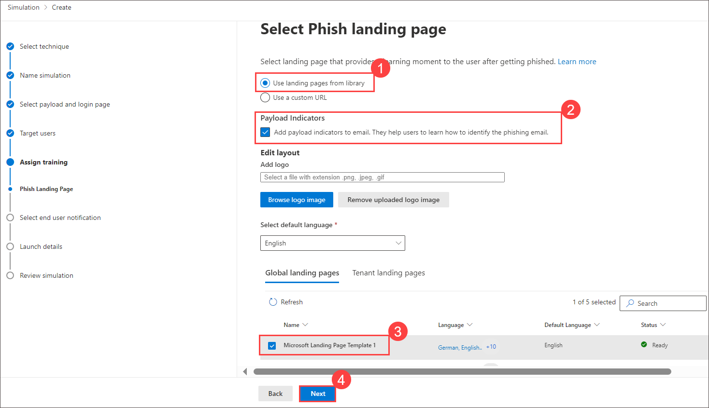
   
        >**Note**: This setting is not available if you selected Malware Attachment or Link to Malware on the Select a social engineering technique 
      page.

1. On the **Select end user notification** page, select **Microsoft default notification (recommended) (1)**: The notifications that users will receive are shown on the page select the following option.

   - Microsoft default positive reinforcement notification: **Deliver during Simulation (2)**
   
   - Microsoft default training assignment notification: **Not Applicable (3)**
   
   - Microsoft default training reminder notification: **Twice A Week (4)**

   - Click on **Next (5)**

        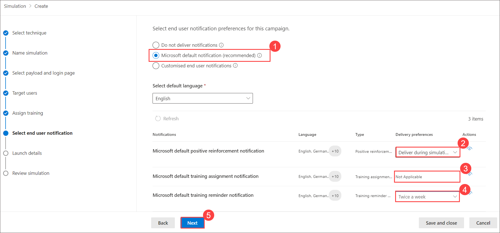

1. On the **Launch details page**, you choose when to start and end the simulation. We'll stop capturing interaction with this 
   simulation after the end date you specify.
   - Choose one of the following values:
       - **Launch this simulation as soon as I'm done**

       - **Schedule this simulation to be launched later**: This value has the following associated options to configure:
       
       - **Select launch date**
       
       - **Select launch time hour**
       
       - **Select launch time minute**
       
       - **Select time format: Select AM or PM**
   
   - The default value for Configure number of days to end simulation after is 2 days, which is also the minimum value. The maximum value is 30 days.

   - If you select **Enable region aware timezone delivery**, the simulated attack messages are delivered to users during their regional 
   working hours.

1. When you're finished on the **Launch details page**, select **Next**.

    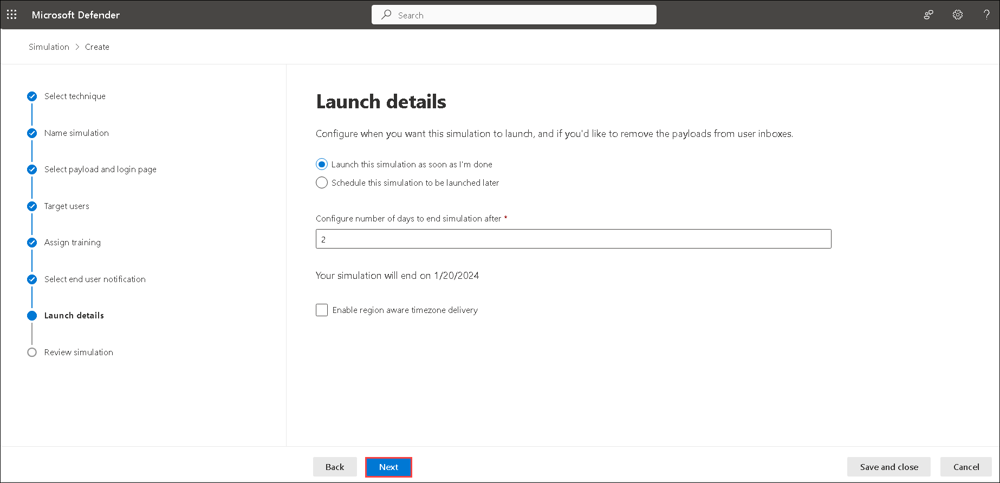

1. On the **Review simulation page**, you can review the details of the simulation.

    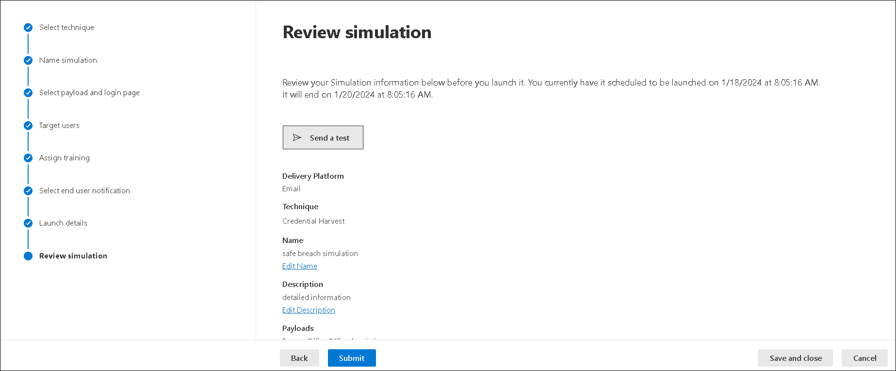

1. Select the  **Send a test** button to send a copy of the payload email to yourself (the currently logged-in user) for inspection.

    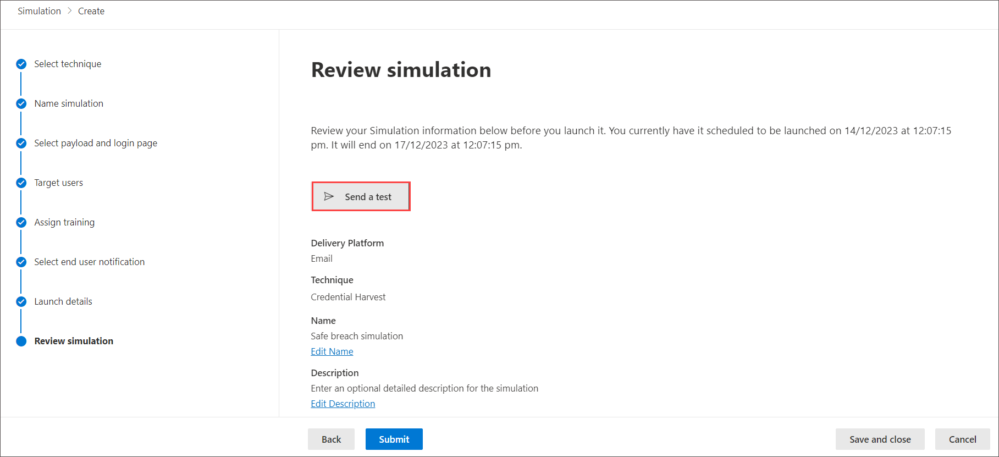

    >**Note**: You can select Edit in each section to modify the settings within the section. Or you can select Back or the specific page in the 
   wizard to modify the settings.

1. On the Send Test Email pop-up, click on **Confirm**. Close the **Send Test Email** pop-up.

    

    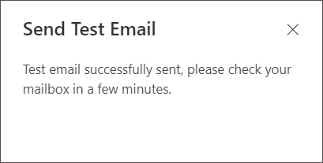

1. From the Microsoft Purview home page, select **App launcher icon (1)**, on the **Outlook** select **Open context menu (2)** and select **Open in new tab (3)**.

     

1. Check the Email you received.

    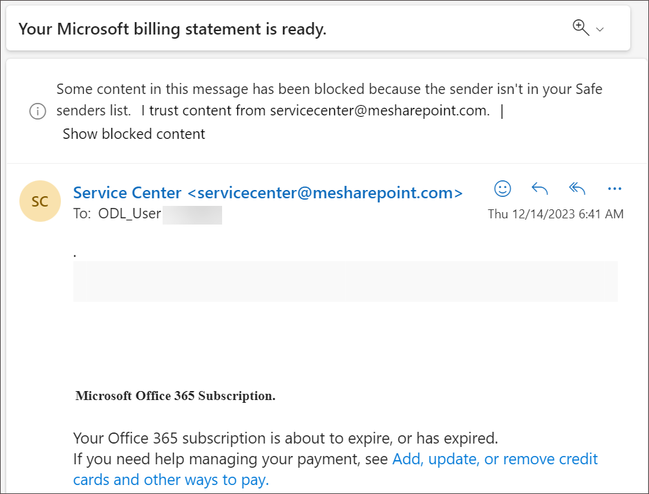

1. Navigate back to the **Microsoft Purview** portal, when you're finished on the Review simulation page, select **Submit**.

    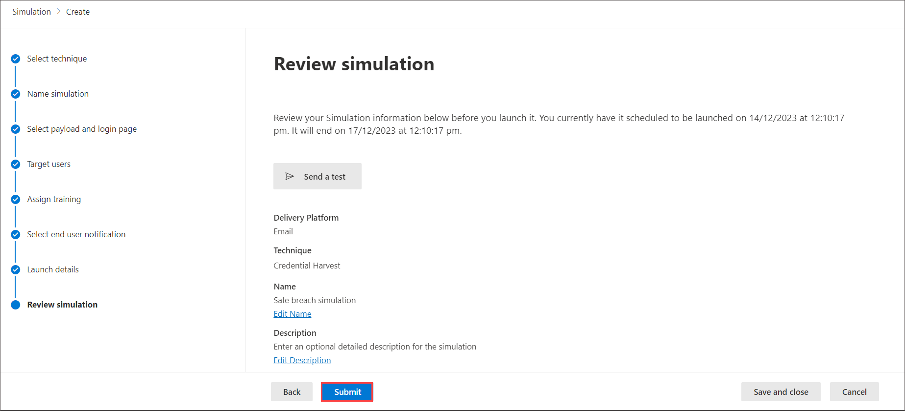

1. Click on **Done**.

1. Back on the **Attack simulation training** page notice the newly created Simulation.

     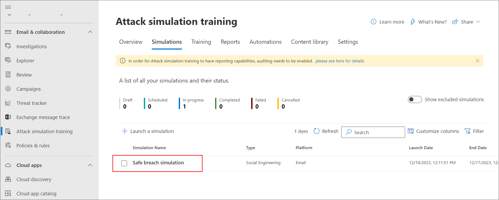

    >**Note**: Launching a simulated phishing attack is a proactive measure to enhance cybersecurity awareness and readiness within an organization. By simulating real-world phishing scenarios, users can be trained to recognize and respond appropriately to potential threats. This contributes to the overall security posture of the organization by empowering users with the knowledge and skills needed to identify and avoid phishing attacks.

    > **Congratulations** on completing the task! Now, it's time to validate it. Here are the steps:
   > - Navigate to the Lab Validation Page, from the upper right corner in the lab guide section.
   > - Hit the Validate button for the corresponding task. If you receive a success message, you can proceed to the next task. 
   > - If not, carefully read the error message and retry the step, following the instructions in the lab guide.
   > - If you need any assistance, please contact us at labs-support@spektrasystems.com. We are available 24/7 to help you out.

### Conclusion:
The conclusion emphasizes the completion of the attack simulation creation process. Users are directed to review the simulation details, send a test email for inspection, and submit the simulation for execution. The acknowledgement of the newly created simulation signifies readiness for training and testing against simulated phishing attacks.

### Review
During this lab, you've gained knowledge on the process of Creating an Attack Simulation

## You have successfully completed the lab. Click on Next >>.
