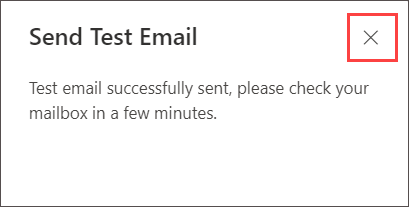

# Lab 10 - Configure Safe breach simulation

## Lab Overview
The task outlines the steps to launch a simulated phishing attack through the Microsoft Defender portal. Users are instructed to navigate to the Attack simulation training section, access the Simulations tab, and initiate the new simulation wizard. The process involves configuring various settings such as simulation name, payload selection, target users, training assignments, and launch details.

## Lab scenario
In this lab, you will explore how the simulations are benign cyberattacks that you run in your organization. These simulations test your security policies and practices, as well as train your employees to increase their awareness and decrease their susceptibility to attacks.

## Lab objectives

In this lab, you will complete the following task:

+ Task 1: Create Attack Simulation

## Architecture diagram

### Task 1: Create Attack Simulation

In this task you'll create an attack simulation, specifically a simulated phishing attack, using the Microsoft Defender portal. The objective is to guide users through the process of launching a simulated phishing attack for training and awareness purposes within the organization.

1. In the Microsoft Defender portal at **https://security.microsoft.com**, Expand **Email & collaboration** and select **Attack simulation 
   training**  **Simulations tab**. 

   

   >**Note**: Close welcome to attack simulation training window.

1. On the Attack simulation training blade, select **Simulations** tab.

   
   
1. On the Simulations tab, select  **+ Launch a simulation** to start the new simulation wizard.

   
   
1. Select the social engineering technique you want to use with this simulation and click on **Next**.

    
   
1. On the **Name simulation** page, configure the following settings and click on **Next**.

      **Name**: Enter a unique, descriptive name for the simulation.
      **Description**: Enter an optional detailed description for the simulation.

    
   
1. On **Select payload and login page** blade select **Renew Office 365 subscription** and click on **Next**.

    >**Note**: For built-in payloads, the value is **Global**. For custom payloads, the value is **Tenant**.
   
    

1. On the **Target users** page, select who receives the simulation. Use the following options to select users
   
     - **Include all users in your organization**: The unmodifiable list of users is show in groups of 10.
     - **Include only specific users and groups**: At first, no users or groups are shown on the Targeted users page.
     - To add users or groups to the simulation, choose one of the following options, now select **Include all users in your organization** and click on **Next**.

        

1. Don't change anything select **Next** on **Exclude user** page.

    
   
1. On the **Assign training** page, make sure **Microsoft training experience (Recommended)** is selected in dropdown and select **assign training for me (Recommended)**.

    

1. Select the Training Due Date for the Simulation and click on **Next**

1. On the **Selecting phish landing page**, you configure the web page that users are taken to if they open the payload in the simulation.

   - Select **Use landing pages from library**
     
   - **Payload indicators**: Select Add payload indicators to email to help users learn how do identify phishing email.

   - Select **Microsoft Landing page Template 1** and click on **Next**.

      
   
    **Note**: This setting is not available if you selected Malware Attachment or Link to Malware on the Select a social engineering technique 
      page.

1. On the **Select end user notification** page, select **Microsoft default notification (recommended)**: The notifications that users will receive are shown on the page select the following option.

   - **Microsoft default positive reinforcement notification** - **Deliver During Simulation**
   
   - **Microsoft default training assignment notification** - **Not Applicable**
   
   - **Microsoft default training reminder notification** - **Twice A Week**

   - Click on **Next**

    

1. On the **Launch details page**, you choose when to start and end the simulation. We'll stop capturing interaction with this 
   simulation after the end date you specify.
   - Choose one of the following values:
       - **Launch this simulation as soon as I'm done**
       - **Schedule this simulation to be launched later**: This value has the following associated options to configure:
       - **Select launch date**
       - **Select launch time hour**
       - **Select launch time minute**
       - **Select time format: Select AM or PM**
   
   - The default value for Configure number of days to end simulation after is 2 days, which is also the minimum value. The maximum value is 30 days.

   - If you select **Enable region aware time zone delivery**, the simulated attack messages are delivered to users during their regional 
   working hours.

1. When you're finished on the **Launch details page**, select **Next**.

1. On the **Review simulation page**, you can review the details of the simulation.

1. Select the  **Send a test** button to send a copy of the payload email to yourself (the currently logged in user) for inspection.

    

    **Note**: You can select Edit in each section to modify the settings within the section. Or you can select Back or the specific page in the 
   wizard to modify the settings.

1. On Send Test Email pop up click in **Confirm**.

    

    

1. In another tab browser for (https://security.microsoft.com) select app launcher and select outlook.

    

1. Check the Email you received

    

1. When you're finished on the Review simulation page, select **Submit**.

    

1. Click on **Done**.

1. Back on **Attack simulation training** page notice newly created Simulation.

     

>**Note**: Launching a simulated phishing attack is a proactive measure to enhance cybersecurity awareness and readiness within an organization. By simulating real-world phishing scenarios, users can be trained to recognize and respond appropriately to potential threats. This contributes to the overall security posture of the organization by empowering users with the knowledge and skills needed to identify and avoid phishing attacks.

### Conclusion:
The conclusion emphasizes the completion of the attack simulation creation process. Users are directed to review the simulation details, send a test email for inspection, and submit the simulation for execution. The acknowledgment of the newly created simulation signifies readiness for training and testing against simulated phishing attacks.

### Review
In this lab, you have completed:
+ Create Attack Simulation

## You have successfully completed the lab

