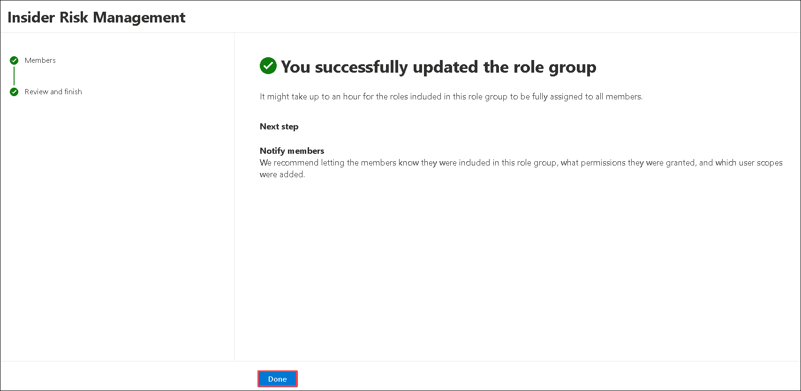
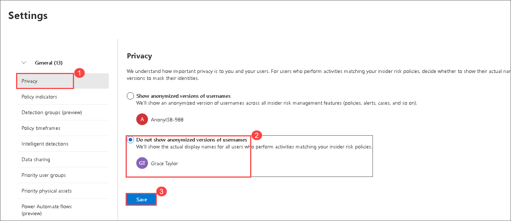
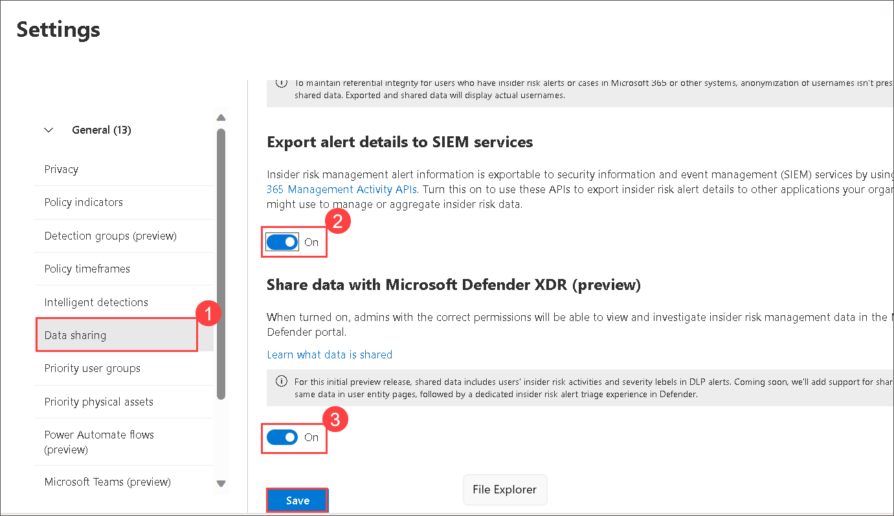
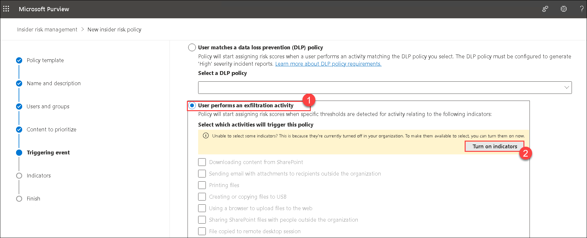
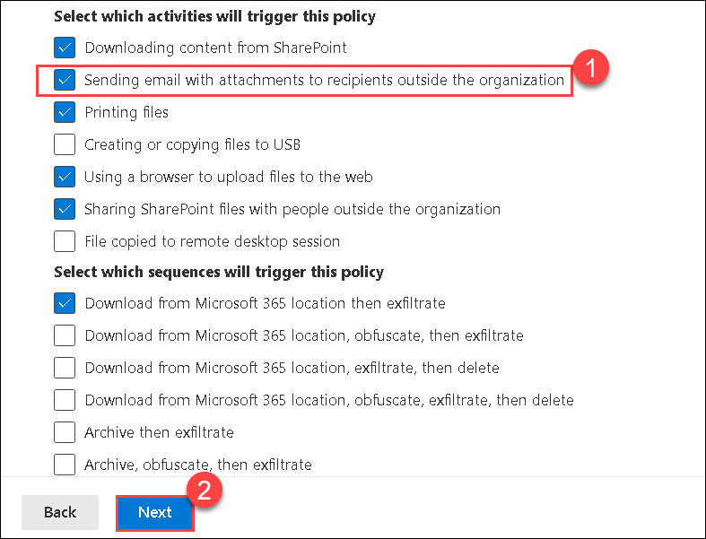
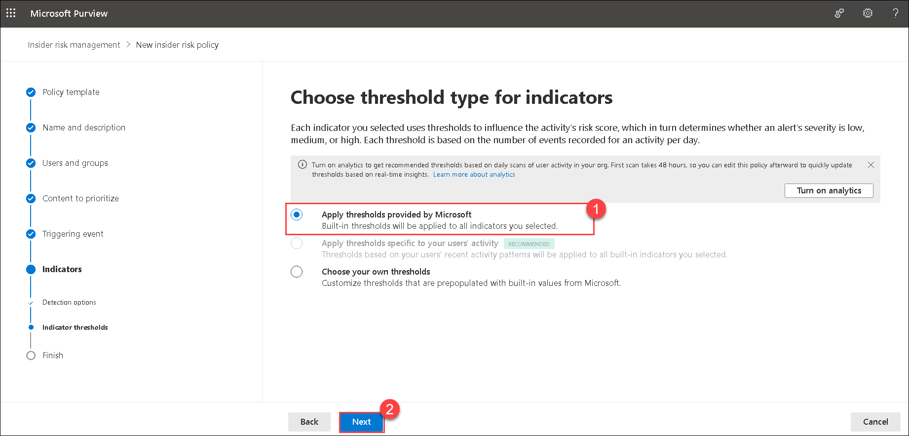

# Lab 11 - Configure Insider Risk Management Policies in Microsoft Purview

## Lab Overview

Enabling permissions for Insider Risk Management by adding users to the Insider Risk Management role group. This step ensures that designated users have access to and can effectively manage insider risk management features. It's important to note that the application of role group permissions may take up to 30 minutes to propagate across the organization. This process grants the necessary authority to oversee and respond to potential insider risks, such as IP theft and data leakage, enhancing the organization's security posture.

## Lab scenario
In this lab, you will explore the capabilities of Insider Risk Management to identify, mitigate, and respond to potential risks posed by individuals within the organization

## Lab objectives

In this lab, you will complete the following tasks:

+ Task 1: Process of setting up an insider risk policy
+ Task 2: Apply to all insider risk management policies
+ Task 3: Create policy
  
## Estimated timing: 60 minutes

## Architecture diagram

### Task 1: Process of setting up an insider risk policy

In this task, you as the global administrator, will enable permissions for Insider Risk Management. Specifically, you will add users to the Insider Risk Management role group to ensure that designated users can access and manage insider risk management features. It may take up to 30 minutes for the role group permissions to apply to users across the organization. 

1. Within **cvm-<inject key="DeploymentID" enableCopy="false"/>** RDP session, in **Microsoft Edge**, open a new browser, and navigate to the [Microsoft 365 admin center](https://admin.microsoft.com/#/homepage).

    >**Note:** If it asks you for the **Sign in**, enter the following * Email/Username: **<inject key="AzureAdUserEmail"></inject>** and then click on **Next**. On **Enter Password** blade, enter the following * Password: **<inject key="AzureAdUserPassword"></inject>** and then click on **Sign in**.

1. From the left navigation pane of the **Microsoft 365 admin center**, select **Show all**.

    

1. Under Admin centers, select **Security**, and a new browser page opens to the welcome page of the Microsoft Defender portal.

    

1. From the left navigation pane of the Microsoft 365 Defender portal, select **Permissions**. You may need to scroll down to see this option.

    

1. From the Permissions page, under **Email & collaboration roles** select **Roles**.

    

1. In the search bar, type **Insider risk (1)** and press enter. Notice the roles that show up. Each of these has different access levels. Select **Insider Risk Management (2)**.

    

1. In the window that opens, next to where it says Members, select **Edit**. You may need to scroll to find it.

     

1. On **Edit members of the role group** page, to add members to this role group, click on **Choose users (1)**, select **ODL_User <inject key="DeploymentID" enableCopy="false"/> (2)** and then click on **Select (3)**.

     

1. Back on **Edit members of the role group** page, click **Next**.
   
    

1. Verify the added member are correct then select **Save**.

    

1. From the bottom of the Insider Risk Management window, click on **Done**.

    

1. Close all the tabs except the **[Microsoft 365 admin center](https://admin.microsoft.com/#/homepage)** and then sign out from the admin center page and sign-in back again to reflect the permissions added for users faster.

### Task 2: Apply to all insider risk management policies

In this task, you will walk through the settings associated with the Insider Risk Management solution. Insider risk management settings apply to all insider risk management policies, regardless of the template you choose when creating a policy. 

1. In **Microsoft Edge**, open a new browser, and navigate to the [Microsoft Purview](https://compliance.microsoft.com/insiderriskmgmt).

1. From the left navigation pane under Solutions, select **Insider risk management (1)**.

1. Before getting started with setting up a policy, some settings need to be configured. From the Insider Risk Management page, select the **Settings (2)** icon on the top-right corner of the page to access **Insider risk settings**.

     
   
    - **Privacy tab**: For users who perform activities matching your insider risk policies, this setting will determine whether to show their actual names or use anonymized versions to mask their identities. Select **Do not show anonymized versions of usernames** then select **Save**. Select the **Policy indicators** tab.

      
    
    - **Policy indicators tab**: Once a policy triggering event occurs, activities that map to the selected indicators are used in determining the risk score, for the user. Policy indicators selected here are included in the Insider risk policy templates. Scroll to view all the indicators available and any associated information. Under **Office indicators**, select **Select all**, scroll down and then select **Save**.  Select the **Policy timeframes** tab.

      
   
   - **Policy timeframes tab**: The timeframes you choose here go into effect for a user when they trigger a match for an insider risk policy. The Activation window determines how long policies will actively detect activity for users and is triggered when a user performs the first activity matching a policy. Past activity detection Determines how far back a policy should go to detect user activity and is triggered when a user performs the first activity matching a policy. Leave the default values. Select the **Intelligent detections** tab.

      
   
    - **Intelligent detections tab (1)**:  Review the options here. scroll down and under **Alert Volume (2)** move slide bar to **More alerts (3)**.
         
         >**Note**: The domain settings and how they relate to the indicators.

      .png)

    - **Data sharing (1)** tab : turn on toogle for **Export alert details to SIEM services (2)** and **Share data with Microsoft Defender XDR (preview) (3)**.
        
       
  
    - **Admin notification (1)**:  Review the settings and turn on all **Check boxs** **(2)** and select **Save** button from the buttom of the page.

       
       
    - Other items listed in the settings are in preview. Explore these at will and note that as a preview, they are subject to change.

1. To return to the Insider risk management overview, select **Insider risk management** from the top-left corner of the page, above where it says Settings.

    

1. Keep this browser tab open, as you will use it in the next task.

### Task 3: Create a policy

In this task, you will walk through the creation of a policy.

1. You should be on the Insider risk management page. If not already there, open the browser tab labeled, **Insider risk management - Microsoft 365 compliance (1)**.

1. From the Insider risk management overview page, select the **Policies (2)** tab then select **+ Create policy (3)**. Configure each of the following policy tabs.

    

1. Policy template:  From the list of categories, select **Data leaks (1)**. Read the details associated with this template, then select **Next (2)**.

    
    
1. On the **Name your policy** page, enter **InsiderRiskPolicy (1)**, then select **Next (2)**.

    
    
1. On the **Choose users and groups** page, select **Include all users and groups (1)** and click on **Next (2)**.

   
         
1. On the **Decide whether to prioritize content** page, read the description and select **I don't want to prioritize content right now (1)**, then select **Next (2)**.

   
               
1. On the **Choose triggering event for this policy** page, select **User performs an exfiltration activity (1)**, select **Turn on indicators (2)**, on the **Turn on indicators for your organization** pop-up, select **Turn on all**.

    

1. Under **Select which activities will trigger this policy**, select **Sending email with attachments to recipients outside the organization (1)**, and click **Next (2)**.

   
   
   >**Note**: Triggering event: Review the detailed information. The policy is triggered by either the user performing an exfiltration activity as defined (select the information icons for each bullet point for more detailed information) OR a match to an existing Data Loss Prevention (DLP) policy. Select **User performs an exfiltration activity**. Scroll down to see what is automatically selected. Note that the policy indicators you enabled in the previous task are checked. Recall that these indicators will only be activated once the policy is triggered and any activities that map to these indicators  will be used in calculating a risk score for the user. In addition, Sequence detection is enabled. If a sequence of activities, as defined, is detected then it suggests greater risk. Select the information icon for detailed information on which indicators are required. This selection requires that certain indicators be selected and that devices be onboarded. Scroll down and leave the defaults.

1. On **Choose thresholds for triggering events** page, select **choose your own thresholds** then for each field modify the **Total number of activities** as **1** in each section and click **Next**.

   

   >**Note**: Make sure that you modified each field value as 1 for all the sections.
   
   >**Note**: Triggering Thresholds: here you can specify default or custom thresholds associated with the indicators.  Recall the indicators are activated only after the policy trigger occurs so these thresholds do not influence when the policy is triggered. Select **choose your own thresholds**, By selecting this option, you can see the current default values. Leave the defaults.
   
1. On the **Indicators** page, review the detailed information. Leave the default setting, and Select **Next**.    

   
    
1. On **Detection options** page, review the information, Select **Next**.   
   
    
    
1. On the **Choose threshold type for indicators** page, review the information. Select **Apply thresholds provided by Microsoft (1)** and then Select **Next (2)**.  

    
   
1. On the **Review settings and finish** page, review the settings and select **Submit**. Click on **Done**.

   
 
1. You are back on the Policies tab of the Insider risk management page. The policy you just created will be listed.

    

1. In the policy you just created, the "Users in scope" field represents users that are currently being assigned risk scores by the policy. Assigning users a risk score occurs when the policy is triggered which is why the value shows 0. An admin can configure a policy to start assigning risk scores to specific users, based on activity detected by the policies you selected, AND which bypasses the requirement that a triggering event is detected first. To do this, **select the checbox of the policy (1)** next to the policy name to select the policy, then select **Start scoring activity for users (2)**, which is shown above the policy table.

      
  
1. On the **Start score activity for users** window, provide the following information:

   - Reason for scoring activity: **Provide any reason (1)**

   - Score activity for this many days: **5 (2)**

   - Score activity for these users: **<inject key="AzureAdUserEmail"></inject> (3)** 

   - Select **Start scoring activity (4)**, and close the pane. It can take 24 hours for the users to appear on the 'Users' tab. After that time, you can select the users from that tab to review detected activities.

        .png)

     >**Note**: Enabling permissions for Insider Risk Management is crucial to ensure that authorized users can effectively manage and respond to insider risk incidents. By assigning specific roles, the organization can control access and empower designated individuals to handle insider risk-related tasks.

### Conclusion:
The completion of this task ensures that the necessary permissions are granted for Insider Risk Management. By adding users to the Insider Risk Management role group, the organization establishes a foundation for managing insider risk effectively.

### Review
During this lab, you've gained knowledge on the process of setting up an insider risk policy and apply to all insider risk management policies, Create policy.

## You have successfully completed the lab. Click on Next >>.
