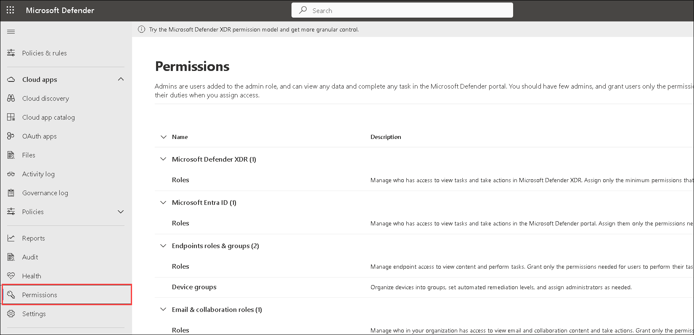
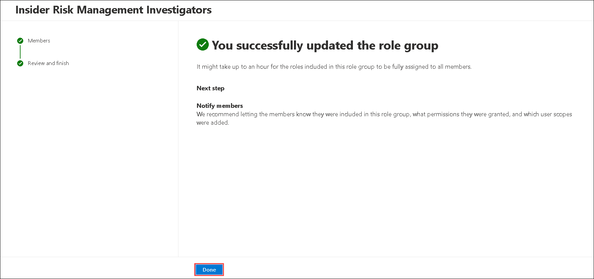
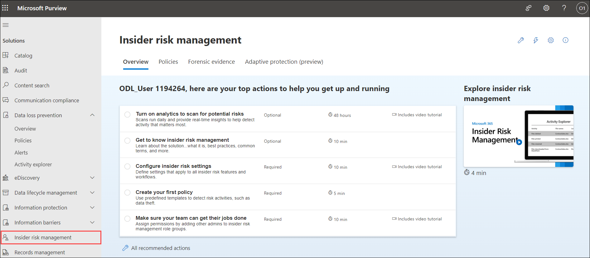
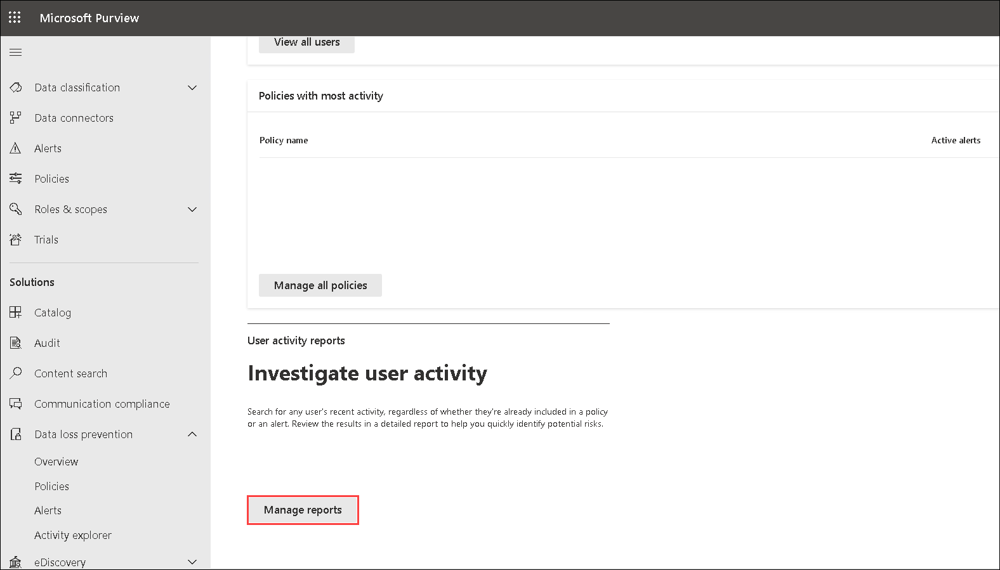
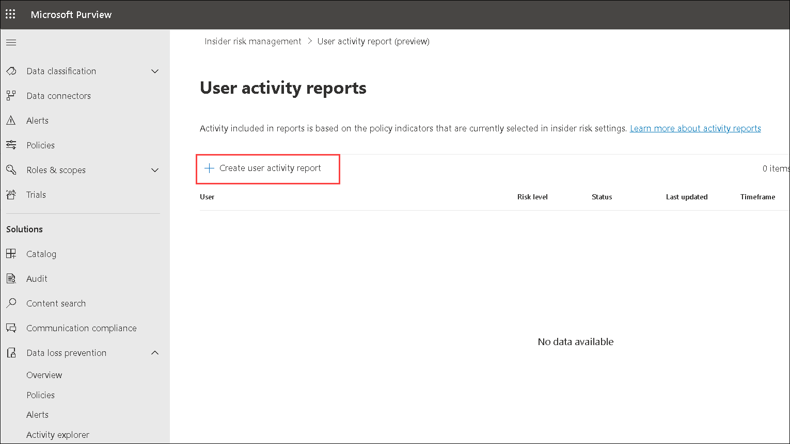
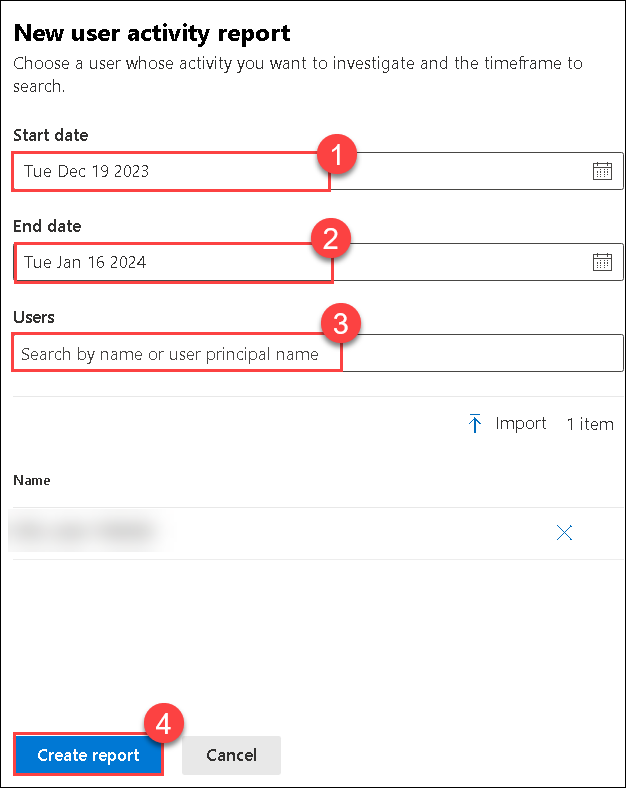
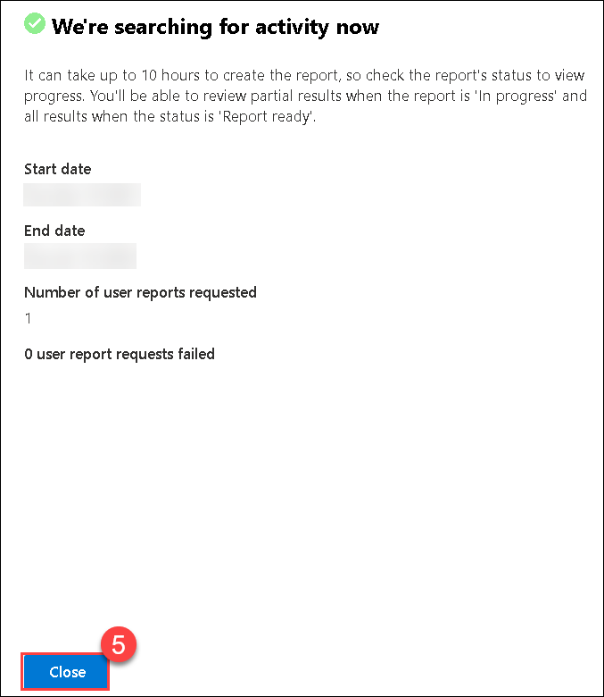
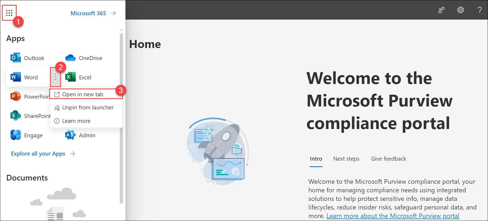

# Lab 12 - Investigate insider risk activities

## Lab Overview

Organizations employ insider risk investigation to proactively identify and respond to potential threats arising from within. Leveraging specialized tools, such as Microsoft Insider Risk Management, this process involves scrutinizing user activities, behaviors, and data access patterns. Security administrators and teams conduct detailed analyses to detect signs of IP theft, data leakage, or security violations.

## Lab scenario

In this lab, you'll set up individuals or roles within your organization to act as investigators for insider risk incidents. Investigators play a crucial role in analyzing and responding to potential insider threats and Investigating insider risk activities focuses on actively exploring and analyzing potential insider risk activities within the organization. 

## Lab objectives

In this lab, you will complete the following tasks:
+ Task 1: Create Insider Risk Management Investigators
+ Task 2: Create a User activity reports
+ Task 3: Investigate insider risk activities

## Estimated timing: 60 minutes

## Architecture diagram

### Task 1: Create Insider Risk Management Investigators

In this task, you, as the global administrator, will enable permissions for Insider Risk Management Investigators. Specifically, you will add users to the Insider Risk Management Investigators role group to ensure that designated users can access and manage insider risk management Investigators features.

1. Navigate to the [Microsoft 365 admin center](https://admin.microsoft.com/#/homepage).

    >**Note:** If it asks you for the **Sign in**, enter the following * Email/Username: **<inject key="AzureAdUserEmail"></inject>** and then click on **Next**. On **Enter Password** blade, enter the following * Password: **<inject key="AzureAdUserPassword"></inject>** and then click on **Sign in**.

1. From the left navigation pane of the Microsoft 365 admin center, select **Show all**.

    

1. Under Admin centers, select **Security**. A new browser page opens to the welcome page of the **Microsoft Defender** portal.

    

1. From the left navigation pane of the Microsoft 365 Defender portal, select **Permissions**. You may need to scroll down to see this option.

    

1. From the Permissions page, under **Email & collaboration roles (1)** select **Roles (2)**.

    

1. In the search bar, type **Insider risk (1)** and press enter. Notice the roles that show up. Each of these has different access levels. Select **Insider Risk Management (2)**.

    

1. In the window that opens, next to where it says Members, select **Edit**. You may need to scroll to find it.

    

1. On **Insider Risk Management Investigators** page, select **Choose users (1)** and select **ODL_User <inject key="DeploymentID" enableCopy="false"/> (2)** and then click on **Select (3)**.

    

1. Back on **Insider Risk Management Investigators** page and click on **Next**.
   
    

1. Review the role group and finish the page by clicking on **Save**.
   
   
  
1. On **You successfully updated the role group** page, click on **Done**.

    
  
### Task 2: Create a User activity reports

In this task, you'll Investigate insider risk activities.

1. In **Microsoft Edge**, navigate to the [Microsoft Purview](https://compliance.microsoft.com/insiderriskmgmt) portal. 

1. In the **Microsoft Purview** portal, in the left navigation pane, select **Insider risk management**.

    
 
1. On the **Insider risk management** overview page, scroll down and under the **User activity reports** select **Manage report**.

    

1. On the **User activity reports** window, select **+ Create user activity report**.

    

1. On the **New user activity report** window, set the **Start date (1)** and **End date (2)** and in **Users (3)** field search and select <inject key="AzureAdUserEmail"></inject>. Click on **Create report (4)**. Select **Close (5)**.

    

    

### Task 3: Investigate insider risk activities

In this task, you'll Investigate insider risk activities.

1. On the **Microsoft Purview** home page, select the **App launcher icon (1)**, on the **Word** select **Open context menu (2)** and select **Open in new tab (3)**. 

   
   
1. select **Black document** and create  two - three plain word document and save it.

1. Navigate back to the Microsoft Purview home page, From the Microsoft Purview home page, select **App launcher icon (1)**, on the **Outlook** select **Open context menu (2)** and select **Open in new tab (3)**.

    

1. Select **New Email** from the top left corner of the screen and send an email to an outside organisation person by attaching two Document's  which you created in first step of this task.

    

1. Repeat the above step at least *four to five* times to view more activities.   

1. Navigate to the **Insider risk management** page, select the Overview tab scroll down and select **Investigate user activity**, where you can view user activity.

1. From  **Insider risk management** page select **Users (1)** tab and select user **<inject key="AzureAdUserEmail"></inject> (2)** to view the User profile details.

      

   >**Note**: It will take up to 24 hours to reflect the user activities under the **User activity** blade and alerts, meanwhile you can proceed with the next exercise. 

1. Select **User activity** tab and review the details and notice **Exfiltration** then click on 1 Email link.

     

1. Review the user activity which includes Activity details, Location details and About this item.

       

    >**Note**: To change **Date** settings, kindly click on **Data(UTC)** then select **Start date** and **End data** to see latest user activity.
   
    >**Note**: Establishing Insider Risk Management Investigators ensures that designated individuals have the necessary access levels to investigate and respond to insider risk activities effectively. Investigating insider risk activities allows organizations to actively monitor user behavior, detect potential risks, and take timely actions to mitigate any threats.

    > **Congratulations** on completing the task! Now, it's time to validate it. Here are the steps:
   > - Navigate to the Lab Validation Page, from the upper right corner in the lab guide section.
   > - Hit the Validate button for the corresponding task. If you receive a success message, you can proceed to the next task. 
   > - If not, carefully read the error message and retry the step, following the instructions in the lab guide.
   > - If you need any assistance, please contact us at labs-support@spektrasystems.com. We are available 24/7 to help you out.

### Conclusion:
By completing these tasks, the organization sets up a team of investigators with the appropriate roles, empowering them to handle insider risk incidents efficiently. Simultaneously, users can actively monitor and investigate insider risk activities, aligning with a proactive security strategy.

### Review
During this lab, you've gained knowledge on the process of creating insider Risk Management Investigators and Investigate insider risk activities

## You have successfully completed the lab. Click on Next >>.
