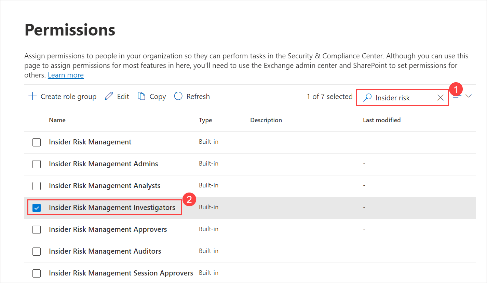
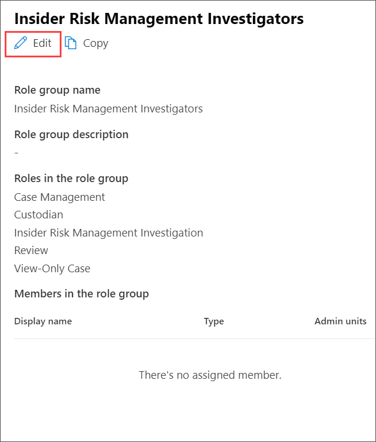
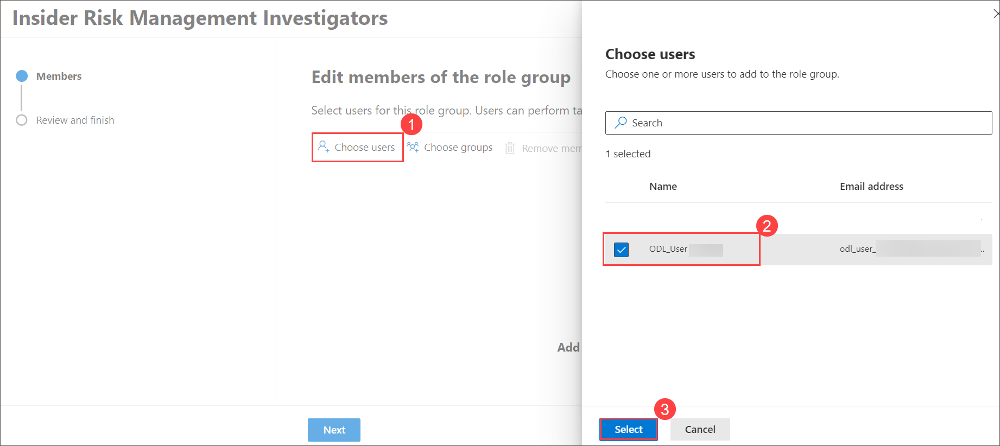
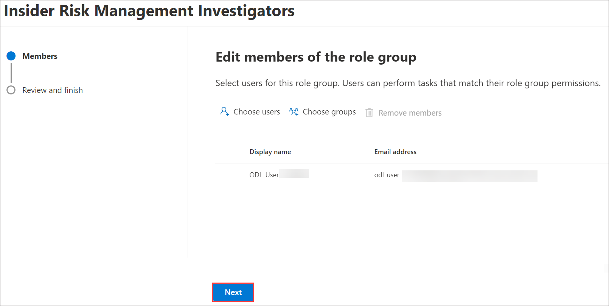
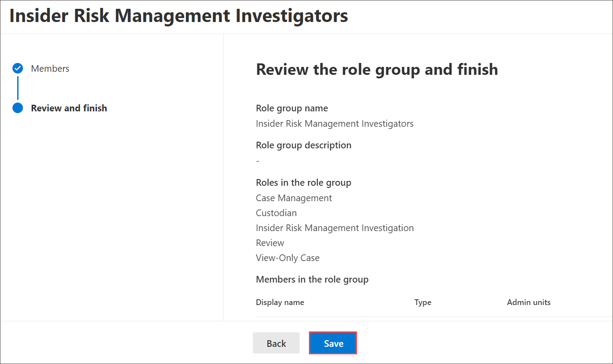

# Lab12 - Investigate insider risk activities

1. If you not already login to admin center, the address bar of Microsoft edge enter **admin.microsoft.com**.

1. On **Sign in** blade, you will see a login screen, in that enter the following email/username 
 
    * Email/Username: **<inject key="AzureAdUserEmail"></inject>** and then click on **Next**.
        
1. On **Enter Password** blade, enter the following password

    * Password: **<inject key="AzureAdUserPassword"></inject>** and then click on **signin**

1. From the left navigation pane of the Microsoft 365 admin center, select **Show all**.

    

1. Under Admin centers, select **Security**.  A new browser page opens to the welcome page of the Microsoft 365 Defender portal.

    

1. From the left navigation pane of the Microsoft 365 Defender portal, select **Permissions**.  You may need to scroll down to see this option.

1. From the Permissions page, under **Email & collaboration roles** select **Roles**.

    

1. In the search bar, enter **Insider risk** then select the search icon (magnifying glass).  Notice the five roles that show up.  Each of these has different access levels.  Select **Insider Risk Management Investigators**.

    

1. In the window that opens, next to where it says Members, select **Edit**. you may need to scroll to find it.

    

1. On **Insider Risk Management Investigators** page, select choose users and select **<inject key="AzureAdUserEmail"></inject>** and then click on **select**.

    

1. Back on **Insider Risk Management Investigators** page and click on **Next**.
   
    

1. Review the role group and finish page click on **save**.
   
   
  
1. On **You successfully updated the role group** page, click on **Done**.
  
   

1. Review the settings for your insider risk policy. The policy will take effect immediately after you create it, but may take up to 24 hours to start generating alerts. User productivity won't be impacted in any way. 
