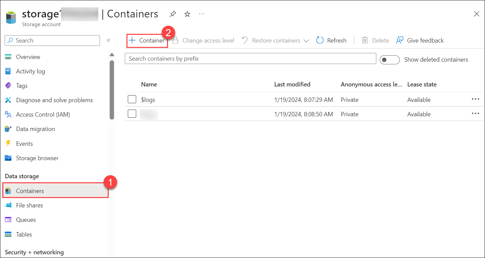
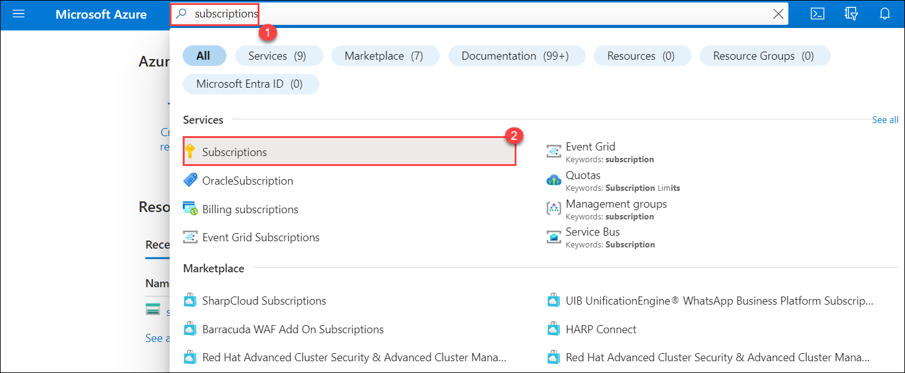

# Lab  14 - Azure Storage in-place data share with Microsoft Purview Data Sharing 

## Lab Overview

Implementing data sharing with Microsoft Purview is crucial for organizations to maintain data confidentiality, comply with regulations, and enable secure collaboration. The lab focuses on creating a Purview account, setting up a storage account, and initiating data-sharing processes. Such practices are essential for organizations dealing with sensitive information, ensuring secure collaboration and adherence to compliance standards.

## Lab scenario

In this lab, you'll configure Microsoft Purview Data Sharing, data providers can now share data in place from Azure Data Lake Storage Gen2 and Azure Storage accounts, both within and across organizations. Share data directly with users and partners without data duplication and centrally manage your sharing activities from within Microsoft Purview.

A data provider creates a share by selecting a data source that is registered in Microsoft Purview, choosing which files and folders to share, and who to share them with. Microsoft Purview then sends an invitation to each data consumer.

## Lab objectives

In this lab, you will complete the following tasks:
+ Task 1: Create a Purview account in the Azure Portal
+ Task 2: Create a Storage account in the Azure Portal
+ Task 3: Azure Storage in-place data sharing with Microsoft Purview
+ Task 4: Azure Storage in-place data Receive share with Microsoft Purview (Read Only)
+ Task 5: Update received share (Read Only)
+ Task 6: Delete Microsoft Purview Account

## Estimated timing: 60 minutes

## Architecture diagram

### Task 1: Create a Purview account in the Azure Portal

In this lab, you'll create a purview account on the Azure Portal

1. Within **cvm-<inject key="DeploymentID" enableCopy="false"/>** RDP session, double click on the **Azure Portal** shortcut, and sign in with following credentials:
   
    * Email/Username: <inject key="AzureAdUserEmail"></inject>
   
    * Password: <inject key="AzureAdUserPassword"></inject>

      

1. On the Azure Portal page, in the **Search resources, services and docs** box at the top of the portal, enter **Microsoft Purview (1)**, and then select **Microsoft Purview accounts (2)** under services.
   
   

1. Select **+ Create** on Microsoft Purview accounts page.

   

1. On the Basics tab specify the following details and click **Review + Create (5)**.

    
     |   **Option**                           | **Value**                      |
     | ---------------------------------------| ------------------------------ | 
     | Subscription                           | Accept the default             |
     | Resource Group                         | **Purview-rg (2)**                     | 
     | Microsoft cover your account name      | **purview-account1-<inject key="DeploymentID" enableCopy="false"/>** **(3)**              | 
     |    location                            | **West us (4)**                       |
     |||

    

1.  Validation is passed. Click on **Create**.
   
### Task 2: Create a Storage account in the Azure Portal

In this task, you'll create a storage account and container

1. On Azure Portal page, in **Search resources, services and docs** box at the top of the portal, enter **Storage accounts (1)**, and then select  **Storage accounts (2)** under services.

   

1. On the **Storage accounts** page, click on **+ Create**.

   

1. On the Basics tab specify the following details and click **Next : Advance > (6)**.

    
     |   **Option** | **Value** *        |
     | ------------ | ------------------ | 
     | Subscription | Accept the default     |
     | Resource Group  | **Purview-rg (2)**     | 
     | Storage account name | **storage<inject key="DeploymentID" enableCopy="false"/> (3)** |  
     | Region         | **West us (4)**   |
     | Redundancy    |     **Locally-redundant storage (LRS) (5)**|
     |||

    

1. On the Advanced tab, select **Enable hierarchical namespace (1)** and click on **Review (2)**.

   

1. Once validation is passed click on **Create**.

1. Once the storage account is created, click on the storage account which you created.
   
1. From the left navigation pane, under the Data Storage section, select the **Containers (1)** option and click on **+ Container (2)**. Provide some name and click on **Create**.

     

1. Open the File Explorer and create some text files.

1. Back on the **Storage account** window, select the container which you created and click on the **Upload**, select browse for the files select the text file which you created and click on **Upload**.

### Task 3: Azure Storage in-place data sharing with Microsoft Purview

In this task, you'll work on Azure Storage in-place data sharing with Microsoft Purview

1. In **Microsoft Edge**, open a new tab, and sign in to Purview (https://purview.microsoft.com/).

1. On **Welcome to the new Microsoft Purview portal!** pop-up, select both the checkboxes, and select **Try now**.

1. On the Microsoft Purview portal from the left navigation Pane, select **Data Map**. in the Data sources click on the **Register icon (2)**.

   

1. In the **Data sources (1)** tab, click on the **Register icon (2)**.

   

1. On **Register Data Source** window, in the search bar, search and select **Azure Data Lake Storage Gen2 (1)** and click on **Continue (2)**.

     

1. On the **Registered data source (Azure Data Lake storage Gen2)**, specify the following and click on **Register (4)**.   

     |   **Option** | **Value** *        |
     | ------------ | ------------------ | 
     | Data source name | leave default **(1)**     |
     |  Azure subscription  | **OTU subscription (2)**   | 
     | Storage account name | **storage<inject key="DeploymentID" enableCopy="false"/> (3)**            | 
     |||

    

1. Navigate back to the **Azure portal**, in the search bar, search for **subscriptions (1)** select **Subscriptions (2)**,  and select the subscriptions which is listed.

   

1. Under the Settings section, select the **Preview features** option.

   

1. In Search bar search for **AllowData (1)**, select **AllowDataSharingInheroRegion (2)** and **AllowDataSharing (2)**, click on **+ Register (3)**.

   

1. Under the Setting section, select **Resource providers (1)** and in the search bar search for **storage (2)** and select **Microsoft.StorageActions (3)**,  and click on **Register (4)**. Now, select ****Microsoft.StorageTasks**, and click on **Register**.

   

1. Navigate back to **[Microsoft Purview](https://purview.microsoft.com/)**.

1. Select **Data Catalog**, Under Data Sharing section, select **Shares** and click on **+ New share**.

     

     

1. On the **New share** window, for type select **Azure Data Lake Storage Gen2 (1)** from the drop-down and select a source to choose the storage account **storage<inject key="DeploymentID" enableCopy="false"/> (2)** and click on **Continue (3)**.

   

1. On **New share** window provide some text to **Share name** and click on **Continue**.

1. On the Add Assets window expand the container select the text file and click on **Continue**.

1. Again click on **Continue** on Add assets window.

1. On **Add recipients** enter your personal email and click on **Create and share**

1. Back on shares notice Sent shares.

    

   > **Congratulations** on completing the task! Now, it's time to validate it. Here are the steps:
   > - Navigate to the Lab Validation Page, from the upper right corner in the lab guide section.
   > - Hit the Validate button for the corresponding task. If you receive a success message, you can proceed to the next task. 
   > - If not, carefully read the error message and retry the step, following the instructions in the lab guide.
   > - If you need any assistance, please contact us at labs-support@spektrasystems.com. We are available 24/7 to help you out.

### Task 4: Azure Storage in-place data Receive share with Microsoft Purview (Read Only)

In this task, you can view shared invitations in any Microsoft Purview account

1. In the Microsoft Purview portal, select the Data Map icon from the left navigation. In the new portal, navigate to the Data Catalog application.

1. Select Share invites. If you received an email invitation, you can also select the View Share invite link in the email to select a Microsoft Purview account.

   >**Note**: If you're a guest user of a tenant, you'll be asked to verify your email address for the tenant before viewing the share invitation for the first time. You can see our guide for steps. Once verified, it's valid for 12 months.

   >**Note**: Alternately, within the Microsoft Purview portal, find the Azure Storage or Azure Data Lake Storage (ADLS) Gen 2 data asset you would like to receive the share into using either the data catalog search or browse. Select the Data Share button. You can see all the invitations in the Share Invites tab.

1. Select the name of the share to view or configure.

### Task 5: Update received share (Read Only)

In this task, you'll update the Received share

1. You can edit the Received share name, and select a Storage account name for a target storage account in the same region as the source. You can choose to Register a new storage account to attach the share in the drop-down as well.

   >**Note**: The target storage account needs to be in the same Azure region as the source storage account.

1. Configure the Path (either a new container name, or the name of an existing share container) and, New folder (a new folder name for the share within in your container).

1. Select Attach to target.

1. On the Manage data shares page, you'll see the new share with the status of Attaching until it has been completed and is attached.

   >**Note**: You can access shared data from the target storage account through the Azure portal, Azure Storage Explorer, Azure Storage SDK, PowerShell or CLI. You can also analyze the shared data by connecting your storage account to Azure Synapse Analytics Spark or Databricks.

## Task 6: Delete Microsoft Purview Account
 
In this task, you will remove the Microsoft Purview account created earlier to manage data governance. Deleting the Purview account ensures that resources are not unnecessarily consumed and helps maintain a clean Azure environment.
 
1. Navigate to the Azure Portal homepage.
 
1. In the Search resources, services and docs box at the top of the portal, enter Microsoft purview accounts, and then select Microsoft purview accounts under services.
 
1. Select the Purview account you created for this lab.
 
1. In the Purview account blade, locate and click on Delete.
 
1. Follow the prompts to confirm the deletion of the Purview account.
 
1. Wait for the deletion process to complete.

### Conclusion
Through these tasks, Joni demonstrates the practical implementation of Azure services, showcasing how organizations can efficiently manage data sharing and access control. The lab ensures that data is shared securely and adheres to compliance standards, providing a foundation for secure collaboration within the organization.

### Review
During this lab, you've gained knowledge on the following: 

+ Task 1: Created Purview account in the Azure Portal
+ Task 2: Created Storage account in the Azure Portal
+ Task 3: Azure Storage in-place data sharing with Microsoft Purview
+ Task 4: Azure Storage in-place data Receive share with Microsoft Purview (Read Only)
+ Task 5: Updated received share (Read Only)
+ Task 6: Delete Microsoft Purview Account

## You have successfully completed the lab. Click on Next >>.
