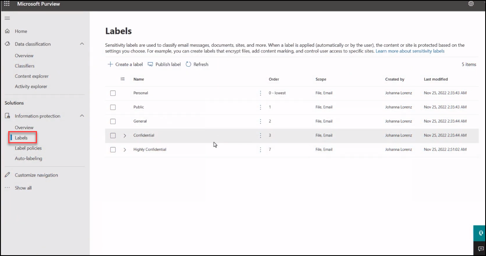
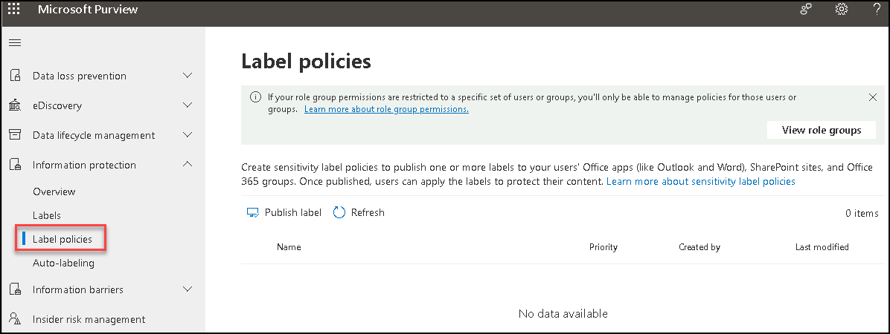
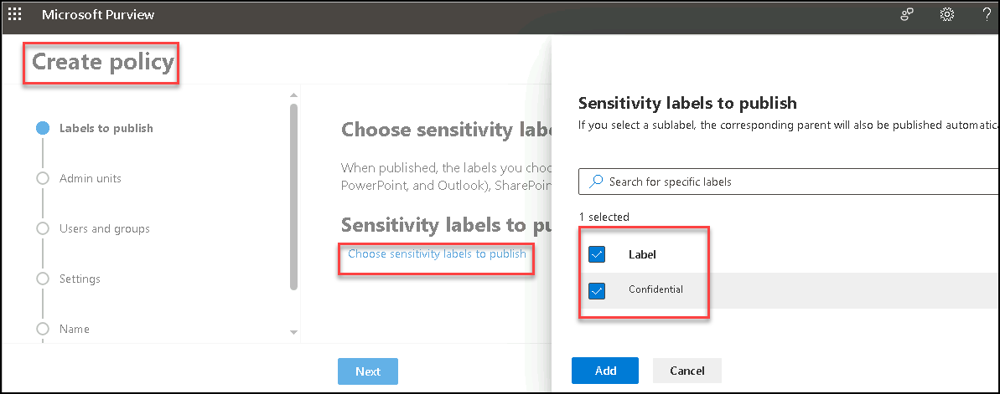
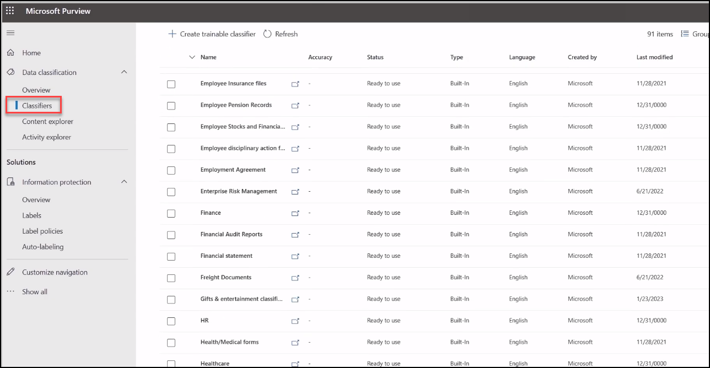

# Part-1 lab 1 - Protect Sensitive Data 

## Lab scenario
In this lab, you will get know how on what are the basic primary steps to protect the sensitive data.

## Lab objectives

In this lab, you will complete the following tasks:

+ Task 1: know how on sensitivity labels
+ Task 2: Classification on sensitive data

### Protecting your data using Microsoft Purview 

1. In the Search bar of the browser, type *https://compliance.microsoft.com/homepage*, then  sign in using the **credentials** provided to you duing the lab.

1. you can protect your sensitive data using **Sensitivity label, Encryption messages and documents, Microsoft Defender, Microsoft Information Protection SDK extension for web browser, Data classification**.

We will take a look into how they work in preceding labs and providing brief information about the steps to configure.

### Task 1: Know how sensitivity label 

In this task, you will create a sensitivity label to protect the data.

1. Navigate to the lable section to create a label which you want to apply to your data

   

1. After creating the label you also need to **publish** it so it can gets applied to your intended data.

1. Select the **Label Policies** create a policy.

   

1. Select **Label** to apply the policy to and provide the respective details to complete the policy.

    

### Task 2: Classification on sensitive data

In this task, you will be able to classify the sensitive data to detect it, protect it, retain it. Classifiers used to detect the specific contents  like budget, hr records, medical forms, credit card info, etc.

 

In the next Labs you will get to know more on how to protect the sensitive data using the Microsoft Purview.
