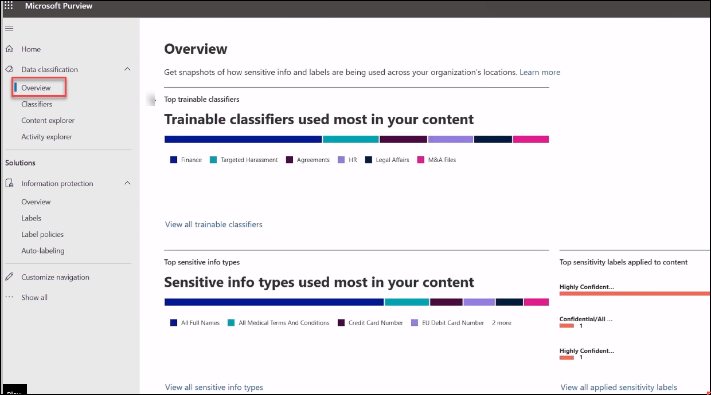
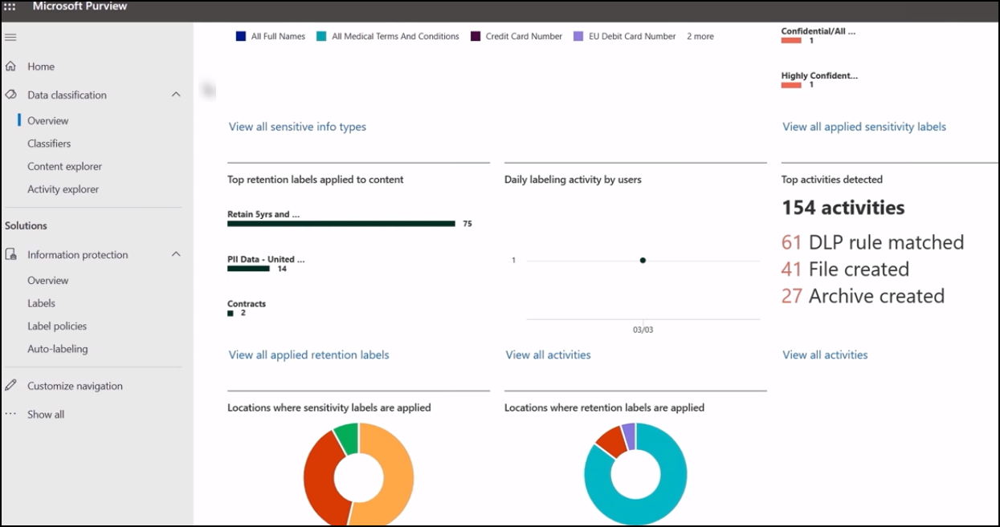
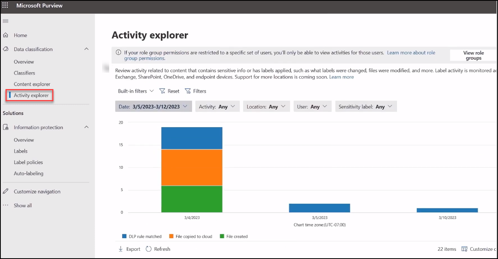

# Part:2 lab 01 - Protect Sensitive Data 

## Lab scenario
In this lab, you will explore the Overview and Activity explorer to gives to itemized list of activities performed against your sensitive content.

## Lab objectives

In this lab, you will complete the following tasks:

+ Task 1: Overview and Activity Explorer

### Protecting your data using Microsoft Purview 

1. In the Search bar of the browser, type *https://compliance.microsoft.com/homepage*, then  sign in using the **credentials** provided to you duing the lab.

1. you can protect your sensitive data using **Sensitivity label, Encryption messages and documents, Microsoft Defender, Microsoft Information Protection SDK extension for web browser, Data classification**.

We will take a look into how they work in preceding labs and providing brief information about the steps to configure.

### Task 1: Overview and Activity Explorer

In this task, you will see how to get the insights from the security applied to your data.

1. You should be back at the **overview** area of the Microsoft Purview Portal.

   

   

1. Select **Activity Explorer** gives to itemized list of activities performed against your sensitive content.

   

## Review
In this lab, you will complete the following tasks:
+ Overview and Activity Explorer
